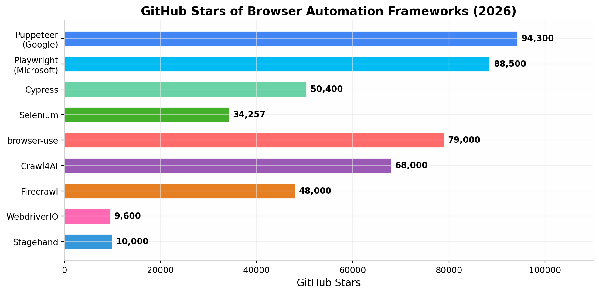
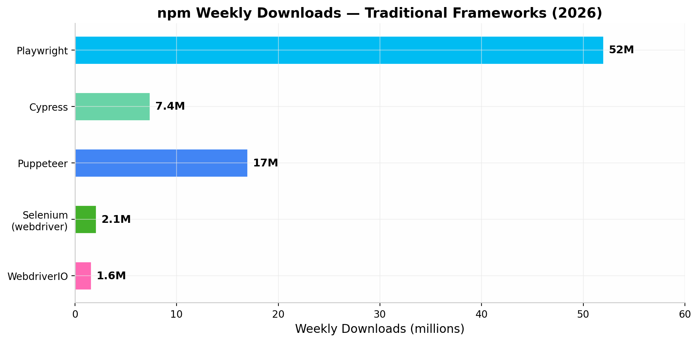
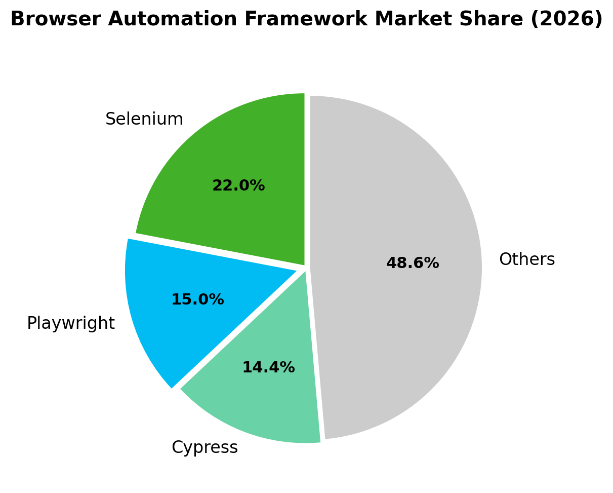

## 1. 概述与研究方法

### 1.1 研究背景与目标

#### 1.1.1 AI Agent时代对浏览器控制和桌面操作的需求爆发

2024年至2026年间，AI Agent从实验性工具迅速演进为生产级系统架构的核心组件，催生了对浏览器控制和桌面操作能力的爆发式需求。AI浏览器代理市场预计从2024年的45亿美元增长至2034年的768亿美元，CAGR达32.8%  [(csdn.net)](https://gitcode.csdn.net/69b0e6bd0a2f6a37c5968cfb.html) 。在这一背景下，Playwright的npm周下载量从2021年的不足100万激增至2026年初的超过3,300万  [(OpenClaw Desktop)](https://openclawdesktop.com/blog/n8n-vs-openclaw.html) ；browser-use作为AI原生浏览器框架在3个月内获得50,000+ GitHub stars  [(Github)](https://github.com/e2b-dev) ；Windows桌面自动化库pywinauto（6,100+ stars）和uiautomation（3,521+ stars）也因Agent集成需求而重获关注。传统的测试自动化框架正被重新定位为AI Agent的"手脚"，而非仅用于测试。

#### 1.1.2 研究范围：覆盖四大来源

本研究为Windows环境下构建桌面操作Agent软件的开发者提供技术选型参考，覆盖四大来源领域。

| 来源领域 | 覆盖内容 | 代表项目 | 调研深度 |
|---------|---------|---------|---------|
| GitHub开源项目 | 浏览器框架、Windows UI库、Agent框架、VLM方案、Electron自动化、安全沙箱 | Playwright  [(Agensi)](https://www.agensi.io/skills/windows-desk-automation) 、browser-use  [(Github)](https://github.com/e2b-dev) 、UI-TARS、E2B | 250+ stars重点项目 |
| Claude Code Skill | Computer Use API、browser skill、HandsOn Plugin、社区SKILL.md | Computer Use  [(hidekazu-konishi.com)](https://hidekazu-konishi.com/entry/anthropic_claude_model_release_timeline.html) 、Playwright MCP  [(Github)](https://github.com/FlorianBruniaux/claude-code-ultimate-guide/blob/main/guide/security/sandbox-isolation.md)  | 官方文档+社区生态 |
| Codex CLI Skill | 官方插件、MCP集成、社区SKILL.md方案 | browser-use/chrome插件  [(openai.com)](https://developers.openai.com/codex/skills) 、browser-harness | 官方文档+社区资源 |
| OpenClaw Skill | Skill架构、浏览器/桌面Skill、ClawHub生态 | OpenClaw  [(Github)](https://github.com/openclaw/openclaw) 、5,700+ community skills  [(MCP Servers)](https://mcpmarket.com/tools/skills/local-desktop-automation)  | 核心仓库+Skill市场 |

四个来源通过MCP协议和SKILL.md标准形成交叉连接。Claude Code、Codex CLI和OpenClaw均支持相同的SKILL.md格式  [(openai.com)](https://developers.openai.com/codex/skills) ，MCP协议已被OpenAI、Google、Microsoft采纳  [(articles)](https://articles.testndev.com/testing/300-web-app-testing-tools-benchmark-popularity.html) ，成为连接Agent与工具的事实标准。

### 1.2 研究方法

#### 1.2.1 十维度并行深度调研方法论

本报告采用十维度并行深度调研方法论，覆盖从底层控制框架到上层安全架构的全技术栈。

| 维度 | 研究主题 | 搜索次数 |
|------|---------|---------|
| Dim01 | 浏览器控制开源框架（Playwright/Selenium/Puppeteer等） | 25+ |
| Dim02 | Windows桌面UI自动化库（pyautogui/pywinauto/uiautomation等） | 25+ |
| Dim03 | Claude Code Skill生态（Computer Use API、内置skill等） | 25+ |
| Dim04 | OpenClaw Skill生态（Skill架构、ClawHub marketplace等） | 20+ |
| Dim05 | Codex CLI Skill生态（官方插件、社区SKILL.md等） | 20+ |
| Dim06 | 综合性AI桌面Agent框架（Cradle/UI-TARS/OpenInterpreter等） | 20+ |
| Dim07 | MCP生态系统（Playwright MCP/Windows-MCP等） | 25+ |
| Dim08 | VLM视觉感知方案（OmniParser/Set-of-Marks等） | 25+ |
| Dim09 | Electron应用自动化（CDP协议控制方案） | 25+ |
| Dim10 | 安全沙箱与权限控制（沙箱隔离、权限控制等） | 24+ |

每个维度遵循"框架发现→能力映射→代码验证→交叉比对"的四步流程，共完成240+次独立搜索。

#### 1.2.2 数据来源与验证标准

数据来源按可信度分为三级：T1（GitHub官方仓库、官方文档、权威技术博客如Microsoft Developer Blog  [(Github)](https://github.com/FlorianBruniaux/claude-code-ultimate-guide/blob/main/guide/security/sandbox-isolation.md) ）、T2（技术社区、知名开发者博客、评测文章）、T3（新闻报道、社交媒体）。关键数据点需从两个以上独立维度确认方可标记为"High Confidence"，所有框架信息均标注了验证日期（2025年7月至2026年7月），GitHub stars等动态数据标注了采集时间点。在交叉验证基础上，最终形成了覆盖10个维度、8大跨维度洞察的研究成果。
## 2. 浏览器控制开源框架

浏览器自动化是AI Agent与Web世界交互的核心通道。从2004年Selenium诞生至今，这一领域经历了从HTTP轮询到WebSocket双向通信、从单一浏览器到跨浏览器覆盖、从脚本驱动到AI原生控制的三次技术跃迁。2025-2026年，以Playwright MCP和browser-use为代表的AI原生框架正在重新定义浏览器控制的范式，将传统的"逐步指令驱动"转向"自然语言目标驱动"。本章将系统梳理主流框架的技术架构、生态规模与AI集成能力，为Agent开发者提供选型依据。

### 2.1 主流浏览器自动化框架

#### 2.1.1 Playwright：Microsoft官方，88,500+ stars，AI原生MCP支持，当前首选

Playwright由Microsoft于2020年1月发布，其核心开发团队来自原Puppeteer项目组  [(MCP Servers)](https://mcpmarket.com/tools/skills/computer-use-agent-framework-1) 。截至2026年5月，Playwright的GitHub仓库已获得88,500+ stars，拥有720+活跃贡献者，npm周下载量达到3,700万至5,200万（含@playwright/test子包的1,100万） [(Agensi)](https://www.agensi.io/skills/windows-desk-automation) 。2025年State of JavaScript调查显示，Playwright以45.1%的采用率和94%的开发者留存率成为当前最广泛使用的浏览器测试框架  [(QASkills.sh)](https://qaskills.sh/blog/state-of-js-2025-testing-frameworks-results) 。2024年底，Playwright的npm总下载量正式超越Cypress  [(OpenClaw Desktop)](https://openclawdesktop.com/blog/n8n-vs-openclaw.html) ，从2021年的不足100万周下载量增长至2026年初的3,300万以上，五年间增长约3,200%  [(OpenClaw Desktop)](https://openclawdesktop.com/blog/n8n-vs-openclaw.html) 。

Playwright的技术优势源于其架构设计：通过WebSocket直接与浏览器引擎通信，绕过传统WebDriver的HTTP中间层，使用修改版CDP（Chrome DevTools Protocol）控制Chromium，同时为Firefox和WebKit实现了类似的底层协议  [(MCP Servers)](https://mcpmarket.com/tools/skills/computer-use-agent-framework-1) 。这种设计带来了三个显著效果：冷启动时间仅需2-4秒，平均端到端测试耗时3-8秒，flaky test率在各框架中最低  [(DevPress官方社区)](https://devpress.csdn.net/v1/article/detail/158922305) 。Playwright支持Chromium、Firefox、WebKit三大浏览器引擎，提供JavaScript/TypeScript、Python、.NET（C#）和Java四种语言绑定，并内置了自动等待、网络拦截、Trace Viewer、Codegen录制等高级功能  [(OpenClaw Easy)](https://openclaw-easy.com/skills/self-evolving-skill.html) 。

在AI Agent集成方面，Playwright MCP（Model Context Protocol）是2025年3月发布的最重要方案之一  [(Github)](https://github.com/FlorianBruniaux/claude-code-ultimate-guide/blob/main/guide/security/sandbox-isolation.md) 。与传统截图+视觉模型的方案不同，Playwright MCP通过无障碍树（accessibility tree）快照让AI Agent与页面交互，结构化地提供元素角色、名称和引用信息，实现"确定性、无歧义"的控制，无需视觉模型参与  [(Github)](https://github.com/FlorianBruniaux/claude-code-ultimate-guide/blob/main/guide/security/sandbox-isolation.md) 。该方案提供23+核心工具，已被GitHub Copilot Coding Agent内置使用  [(Use Agents)](https://opencua.xlang.ai/) 。同时，Playwright也支持Vision模式作为fallback，在无障碍数据不足的页面回退到截图方案  [(Github)](https://github.com/FlorianBruniaux/claude-code-ultimate-guide/blob/main/guide/security/sandbox-isolation.md) 。这种"无障碍树优先、视觉兜底"的分层架构正在成为AI浏览器控制的最佳实践。

#### 2.1.2 Selenium WebDriver：W3C标准，21年历史，正在向BiDi演进

Selenium是浏览器自动化领域历史最悠久的项目，自2004年创建以来已持续演进21年，累计33,753次提交、935位贡献者  [(GitHub Trending Analytics)](https://refft.com/en/simular-ai_Agent-S.html) 。截至2026年7月，Selenium GitHub仓库拥有34,257 stars  [(Github)](https://github.com/marklabz/agent-s) 。作为唯一成为W3C标准的浏览器自动化协议，Selenium被72%的Fortune 500公司使用  [(GitHub Trending Analytics)](https://refft.com/en/simular-ai_Agent-S.html) ，在企业级市场拥有最广泛的部署基础。然而，其市场份额正呈下降趋势——2026年数据显示Selenium占据约22%的市场份额，同比下降8%，而Playwright同期增长235%  [(OpenClaw Desktop)](https://openclawdesktop.com/blog/n8n-vs-openclaw.html) 。

Selenium的传统架构基于HTTP请求/响应模式，通过浏览器驱动（ChromeDriver、GeckoDriver等）与浏览器通信。这种模式存在固有延迟：测试脚本需要显式等待元素加载，导致flaky test率较高，平均端到端测试耗时10-20秒  [(DevPress官方社区)](https://devpress.csdn.net/v1/article/detail/158922305) 。2025-2026年，Selenium正在进行一次重大架构迁移——向WebDriver BiDi（Bidirectional Protocol）转型  [(MCP.Directory)](https://mcp.directory/blog/claude-codex-cli-skill-guide) 。BiDi基于WebSocket双向通信，支持浏览器事件流式传输（控制台日志、网络请求、DOM变更），使浏览器能够主动向测试运行器推送事件，从根本上解决了传统HTTP轮询的延迟问题  [(MCP.Directory)](https://mcp.directory/blog/claude-codex-cli-skill-guide) 。Selenium 5版本将以BiDi为核心架构，预计功能性将达到与Playwright相近的水平  [(GitHub Trending Analytics)](https://refft.com/en/simular-ai_Agent-S.html) 。在AI Agent集成方面，Selenium的原生支持尚不如Playwright MCP成熟，可通过第三方MCP服务器或Healenium等AI辅助库实现Agent集成。

#### 2.1.3 Puppeteer：Google官方，CDP深度集成，Chromium专用

Puppeteer由Google Chrome DevTools团队于2017年创建，是通过CDP直接控制Chromium浏览器的Node.js库  [(MCP Servers)](https://mcpmarket.com/tools/skills/codex-cli-integration-1773679885973) 。截至2026年5月，Puppeteer拥有94,300 stars，与Playwright处于同一数量级  [(MCP Servers)](https://mcpmarket.com/tools/skills/codex-cli-integration-1773679885973) 。其npm周下载量约为600万（含puppeteer-core的1,100万），是Chromium生态中最成熟的自动化方案  [(MCP Servers)](https://mcpmarket.com/tools/skills/windows-desktop-automation) 。

Puppeteer的核心竞争力在于CDP的深度集成。由于CDP是Chromium内部的调试协议，Puppeteer可以访问浏览器的内部功能，实现精细的网络控制、性能分析和内存剖析  [(MCP Servers)](https://mcpmarket.com/tools/skills/windows-desktop-automation) 。puppeteer-extra插件生态系统进一步增强了其能力，其中puppeteer-extra-plugin-stealth插件在反机器人检测绕过方面表现突出。与Playwright相比，Puppeteer更加轻量（仅支持单一浏览器引擎），但其局限性也十分明显：主要限于Chromium浏览器，仅支持JavaScript/Node.js，且自动等待机制不如Playwright成熟。在AI Agent集成方面，Google官方发布的Chrome DevTools MCP服务器在2026年4月登上GitHub Trending第一名，累计33,000+ stars，提供26+工具用于浏览器自动化、调试和性能分析  [(MCP Servers)](https://mcpmarket.com/tools/skills/electron-app-automation-1) 。该MCP服务器的autoConnect功能允许Agent附加到用户已有的Chrome窗口，是Puppeteer生态在AI Agent方向的重要补充。

#### 2.1.4 Cypress与WebdriverIO：特定场景的选择

Cypress是一款专注于前端开发者体验的端到端测试框架，截至2026年4月拥有50,400+ stars，npm周下载量约670万至740万  [(CSDN博客)](https://blog.csdn.net/qq_53597256/article/details/155227542) 。Cypress的核心差异化在于其"in-browser"执行架构——测试代码直接在浏览器内部运行，而非通过外部驱动控制浏览器  [(What Are Agent Skills?)](https://awesomeskill.ai/) 。这种设计赋予了Cypress出色的开发者体验：实时重载、time travel调试回放、自动等待机制。然而，Cypress的跨浏览器支持有限（不支持Safari），多标签页/多窗口支持不足，且仅支持JavaScript/TypeScript。在AI Agent集成方面，Cypress目前缺乏原生MCP支持，相比Playwright MCP处于落后位置。

WebdriverIO是一个支持WebDriver和CDP双协议的JavaScript测试框架，拥有9,600+ stars和642位贡献者  [(nutjs.dev)](https://nutjs.dev/e2e-monitoring) 。其最大特点是灵活性——可在同一测试中无缝切换WebDriver和CDP协议，并支持Mocha、Jasmine、Cucumber等多种测试框架  [(nutjs.dev)](https://nutjs.dev/e2e-monitoring) 。WebdriverIO还支持Native mobile应用（iOS/Android）和Native desktop应用（Electron.js）的测试，是少数同时覆盖浏览器和桌面端的JavaScript框架。不过，其相对较低的社区活跃度和手动配置需求限制了其在AI Agent场景中的竞争力。

### 2.2 AI原生浏览器控制框架

2025年起，一批以LLM为核心的AI原生浏览器框架快速崛起，它们不再面向测试用例编写，而是接受自然语言目标（如"帮我预订一张去纽约的机票"），由LLM自主规划执行步骤。这种范式转变正在催生新的浏览器控制生态。



上图展示了传统框架与AI原生框架的GitHub stars对比。值得注意的是，browser-use（79,000+ stars）和Crawl4AI（68,000+ stars）作为2024-2025年才出现的新项目，其社区热度已迅速逼近甚至超越部分传统框架，反映出AI原生方向的高速增长势头。

#### 2.2.1 browser-use：79K+ stars，自然语言目标驱动，增长最快

browser-use是当前增长最快的AI浏览器自动化开源项目。该项目于2024年10月首次公开发布，截至2026年4月已累计79,000+ GitHub stars，并获得了Y Combinator Winter 2025批次支持  [(ai-shift.co.jp)](https://www.ai-shift.co.jp/techblog/5515) 。2025年3月，browser-use完成了由Felicis Ventures领投的1,700万美元种子轮融资，参投方包括Y Combinator、Paul Graham、Greylock等知名机构  [(Github)](https://github.com/e2b-dev) 。

从技术架构看，browser-use的核心依赖是Playwright + LangChain。它通过DOM分析和视觉识别双模式理解页面，使用XPath-based LLM Action机制让LLM自主决定操作步骤  [(ai-shift.co.jp)](https://www.ai-shift.co.jp/techblog/5515) 。其核心功能包括自动多标签页管理、结构化和非结构化内容提取、支持OpenAI/Anthropic/Google/本地模型等多LLM提供商  [(ai-shift.co.jp)](https://www.ai-shift.co.jp/techblog/5515) 。browser-use的商业模式为开源核心（MIT许可证）+ 付费云服务（30美元/月），后者提供隐形浏览器、代理轮换和CAPTCHA解决等企业级功能  [(Github)](https://github.com/e2b-dev) 。对于AI Agent开发者而言，browser-use代表了一种"完整Agent"模式——开发者只需描述目标，框架自主完成从规划到执行的全流程。

#### 2.2.2 Stagehand：混合AI+代码方案，Browserbase出品

Stagehand是由Browserbase创建的AI浏览器自动化SDK，在Playwright之上封装了三个AI原语：act()、extract()和observe()  [(Github)](https://github.com/amd/gaia/issues/691) 。截至2026年初，Stagehand拥有10,000+ stars，采用MIT许可证开源  [(Github)](https://github.com/amd/gaia/issues/691) 。与browser-use的"全AI"模式不同，Stagehand采用混合架构——确定性代码操作与AI自然语言操作可灵活切换，开发者可以针对稳定部分使用标准Playwright代码，针对动态部分使用AI驱动操作。

Stagehand的核心创新在于Auto-caching和Self-healing机制：可重复操作被自动缓存以减少LLM API调用成本，当网站UI发生变化时框架自动调用AI修复定位器  [(Github)](https://github.com/amd/gaia/issues/691) 。v2.0版本新增的agent()函数支持自主多步任务执行，进一步扩展了自动化能力  [(Github)](https://github.com/amd/gaia/issues/691) 。Stagehand的商业模式为免费SDK + Browserbase云服务，其TypeScript/JavaScript技术栈使其更易于融入现有的前端工程化流程。

#### 2.2.3 Crawl4AI、Firecrawl、Skyvern等其他AI原生方案

Crawl4AI是2024年中期发布的开源LLM友好型网页爬虫，不到一年获得68,000+ GitHub stars，曾登上GitHub Trending第一名  [(CSDN博客)](https://blog.csdn.net/m0_57545130/article/details/154058353) 。该项目主打"本地优先"——完全离线运行，无API费用，通过Ollama支持本地LLM，采用BM25算法进行查询相关的内容过滤  [(CSDN博客)](https://blog.csdn.net/m0_57545130/article/details/154058353) 。对于需要大规模数据提取且关注隐私和成本的场景，Crawl4AI是一个高性价比选择。

Firecrawl是Y Combinator支持的网页数据API平台，获得1,450万美元A轮融资（Nexus Venture Partners领投），服务于350,000+开发者，客户包括Zapier、Shopify和Replit  [(Github)](https://github.com/openai/codex/issues/14454) 。Firecrawl的核心价值是将任意网站转换为LLM就绪的Markdown格式，过去一年增长15倍  [(Github)](https://github.com/openai/codex/issues/14454) 。其开源版本采用AGPL-3.0许可证，与Crawl4AI的Apache 2.0许可证相比，商业使用需注意合规要求。

Skyvern由YC S23孵化，使用LLM和计算机视觉与网站交互，采用Planner-Actor-Validator三阶段任务执行架构  [(Github)](https://github.com/skyvern-ai/skyvern) 。Skyvern提供Playwright-compatible SDK，内置CAPTCHA解决和代理网络支持，在复杂工作流（如表单填写、认证处理）场景中表现突出  [(Github)](https://github.com/skyvern-ai/skyvern) 。

### 2.3 框架对比与选型建议

#### 2.3.1 功能、性能、生态综合对比表

下表从社区规模、技术特性、AI集成三个维度对六大框架进行全面对比：

| 指标 | Playwright | Selenium | Puppeteer | Cypress | browser-use | Stagehand |
|------|------------|----------|-----------|---------|-------------|-----------|
| **GitHub Stars** | 88,500+  [(Agensi)](https://www.agensi.io/skills/windows-desk-automation)  | 34,257  [(Github)](https://github.com/marklabz/agent-s)  | 94,300  [(MCP Servers)](https://mcpmarket.com/tools/skills/codex-cli-integration-1773679885973)  | 50,400+  [(CSDN博客)](https://blog.csdn.net/qq_53597256/article/details/155227542)  | 79,000+  [(ai-shift.co.jp)](https://www.ai-shift.co.jp/techblog/5515)  | 10,000+  [(Github)](https://github.com/amd/gaia/issues/691)  |
| **npm周下载量** | 37-52M  [(OpenClaw Easy)](https://openclaw-easy.com/skills/self-evolving-skill.html)  | ~2.1M  [(GitHub Trending Analytics)](https://refft.com/en/simular-ai_Agent-S.html)  | 17M  [(MCP Servers)](https://mcpmarket.com/tools/skills/windows-desktop-automation)  | 6.7-7.4M  [(MCP Servers)](https://mcpmarket.com/tools/skills/codex-cli-bridge-6)  | N/A (PyPI) | N/A (npm) |
| **首次发布** | 2020年 | 2004年 | 2017年 | ~2015年 | 2024年10月 | 2024年 |
| **维护者** | Microsoft | 社区(SeleniumHQ) | Google | Cypress.io | YC W2025 | Browserbase |
| **语言支持** | JS/TS, Py, Java, C# | Java, Py, C#, Ruby, JS, KT | JS/TS (Node) | JS/TS | Python | TypeScript |
| **跨浏览器** | Chromium/Firefox/WebKit | 几乎所有浏览器 | 仅Chromium | Chromium/Firefox/Edge | 依赖Playwright | 依赖Playwright |
| **冷启动时间** | 2-4s  [(DevPress官方社区)](https://devpress.csdn.net/v1/article/detail/158922305)  | 6-10s  [(DevPress官方社区)](https://devpress.csdn.net/v1/article/detail/158922305)  | 2-3s | 3-6s  [(DevPress官方社区)](https://devpress.csdn.net/v1/article/detail/158922305)  | 依赖LLM | 依赖LLM |
| **Flaky Test率** | 最低  [(DevPress官方社区)](https://devpress.csdn.net/v1/article/detail/158922305)  | 较高  [(DevPress官方社区)](https://devpress.csdn.net/v1/article/detail/158922305)  | 低 | 低  [(DevPress官方社区)](https://devpress.csdn.net/v1/article/detail/158922305)  | N/A | N/A |
| **AI Agent支持** | MCP原生  [(Github)](https://github.com/FlorianBruniaux/claude-code-ultimate-guide/blob/main/guide/security/sandbox-isolation.md)  | BiDi(演进中)  [(MCP.Directory)](https://mcp.directory/blog/claude-codex-cli-skill-guide)  | CDP MCP  [(MCP Servers)](https://mcpmarket.com/tools/skills/electron-app-automation-1)  | 有限 | 完整Agent  [(ai-shift.co.jp)](https://www.ai-shift.co.jp/techblog/5515)  | 混合模式  [(Github)](https://github.com/amd/gaia/issues/691)  |
| **底层引擎** | WebSocket+CDP | HTTP WebDriver | CDP | In-Browser | Playwright | Playwright |
| **开源许可证** | Apache 2.0 | Apache 2.0 | Apache 2.0 | MIT | MIT | MIT |

从表中可以提炼出三个关键结论。第一，Playwright在下载量维度呈现出压倒性优势——其52M的周下载量是Cypress的7倍、Selenium的25倍  [(OpenClaw Desktop)](https://openclawdesktop.com/blog/n8n-vs-openclaw.html) ，这种生态规模的指数级差距意味着更丰富的社区资源、更活跃的插件开发和更快的问题响应。第二，browser-use和Stagehand作为AI原生框架，虽然在stars数量上表现亮眼，但其底层均依赖Playwright，这印证了Playwright在浏览器控制层的技术领先地位。第三，Selenium的21年历史积累使其在企业级市场仍保持最大份额（22%），但Playwright以235%的同比增长率正在快速追赶  [(OpenClaw Desktop)](https://openclawdesktop.com/blog/n8n-vs-openclaw.html) 。



上图清晰展示了传统框架在npm生态中的下载量级差异。Playwright的52M周下载量不仅远超浏览器自动化领域内的竞争对手，在整个JavaScript生态中也属于头部水平。



#### 2.3.2 AI Agent场景下的推荐选型路径

AI Agent的浏览器控制选型需要根据任务类型、技术栈和成本约束进行分层决策。以下为基于当前技术生态的推荐路径：

**确定性控制层：Playwright是首选基础。** 无论上层使用何种AI框架，Playwright作为底层浏览器控制引擎是当前最可靠的选择。其MCP服务器提供无障碍树快照模式，相比纯视觉方案可减少82.5%的token消耗，同时保证控制的确定性  [(Github)](https://github.com/FlorianBruniaux/claude-code-ultimate-guide/blob/main/guide/security/sandbox-isolation.md) 。对于需要同时控制浏览器和Electron桌面应用的场景，Playwright的_electron模块可以实现技术栈完全复用。

**AI Agent编排层：根据控制粒度选择。** 如果Agent需要完整的自主决策能力（如"帮我完成购物全流程"），browser-use是最成熟的方案，其自然语言目标输入和自主步骤规划能力经过了79,000+ stars社区的验证  [(ai-shift.co.jp)](https://www.ai-shift.co.jp/techblog/5515) 。如果Agent需要更精细的控制（如"先点击搜索框，再AI辅助填写表单"），Stagehand的混合模式提供了代码与AI之间的灵活切换  [(Github)](https://github.com/amd/gaia/issues/691) ，其Auto-caching机制还能显著降低LLM API调用成本。

**数据提取层：关注隐私与成本的平衡。** Crawl4AI的本地优先架构适合对数据隐私敏感或需要避免API费用的场景  [(CSDN博客)](https://blog.csdn.net/m0_57545130/article/details/154058353) ；Firecrawl的云服务则在处理大规模、高并发的网页数据转换时更具优势  [(Github)](https://github.com/openai/codex/issues/14454) 。

**遗留系统兼容：Selenium的过渡策略。** 对于已有大量Selenium测试资产的企业，建议采用渐进式迁移路径：短期通过WebDriver BiDi获取部分双向通信能力  [(MCP.Directory)](https://mcp.directory/blog/claude-codex-cli-skill-guide) ，中期在新增测试场景中引入Playwright，长期评估全面迁移的可行性。完全替换Selenium的成本需要与BiDi成熟后的功能增益进行权衡。

AI Agent浏览器框架市场预计将从2024年的45亿美元增长到2034年的768亿美元，CAGR达32.8%，79%的企业已采用某种形式的AI Agent技术  [(csdn.net)](https://gitcode.csdn.net/69b0e6bd0a2f6a37c5968cfb.html) 。在这一趋势下，Playwright MCP和browser-use分别代表了"确定性控制+AI决策"和"全自主Agent"两条演进路线，Agent开发者应根据任务的确定性程度和可靠性要求进行选择。
## 3. Windows桌面UI自动化库

Windows桌面应用的UI自动化面临比浏览器控制更严峻的技术碎片化挑战。桌面应用涵盖从MFC到UWP的数十年技术栈，其可访问性支持差异巨大：现代UWP/WinUI应用提供完整的UI Automation（UIA）控件树；传统Win32应用暴露部分UIA信息；而游戏、CAD等自定义渲染应用几乎不提供结构化控件数据  [(MCP Servers)](https://mcpmarket.com/tools/skills/ui-element-operations) 。这种异质性决定了Windows桌面自动化必须采用多技术路径并行策略。

### 3.1 四大技术路径总览

#### 3.1.1 坐标模拟、UIA控件树、图像识别、CDP协议四大路径对比

当前Windows桌面UI自动化可归纳为四条核心技术路径。坐标模拟通过Win32 API的SendInput()直接注入输入事件，零侵入但依赖屏幕坐标，在分辨率变化下极脆弱。UIA控件树路径利用微软内置于系统的UI Automation框架，通过查询控件的Name、AutomationID等属性实现精准定位，有效性取决于目标应用是否实现了UIA接口。图像识别路径通过OpenCV在截图中匹配图像模板来定位元素，适用于无法获取控件信息的场景。CDP协议路径针对Electron应用——通过`--remote-debugging-port`暴露Chrome DevTools Protocol接口，使Playwright等浏览器工具直接控制桌面应用  [(MCP Servers)](https://mcpmarket.com/tools/skills/ui-element-operations) 。

| 维度 | 坐标模拟 | UIA控件树 | 图像识别 | CDP协议 |
|------|---------|----------|---------|--------|
| **核心原理** | Win32 API模拟鼠标/键盘输入 | 查询Microsoft UI Automation控件树 | OpenCV模板匹配屏幕截图 | Chrome DevTools Protocol |
| **定位精度** | 低（像素级坐标，受DPI影响） | 高（控件级，属性稳定） | 中（受图像变化影响） | 高（DOM选择器级） |
| **执行速度** | 快（直接API调用） | 中（控件树遍历开销） | 慢（截图+匹配计算） | 快（WebSocket通信） |
| **跨分辨率稳定性** | 低 | 高 | 中 | 高 |
| **现代应用支持** | 中 | 高（WPF/UWP/Qt） | 高 | 仅Electron应用 |
| **游戏/DirectX支持** | 中（需pydirectinput） | 低 | 高 | 无 |
| **学习曲线** | 低 | 高（需理解控件树概念） | 低 | 中 |
| **代表工具** | PyAutoGUI, AutoPy | pywinauto, uiautomation | Airtest, SikuliX | Playwright |

坐标模拟和图像识别属于"盲操作"——工具不知道屏幕上的元素构成，只能通过坐标或图像模板执行动作。UIA路径属于"知情操作"——工具可以读取控件的文本、状态、层次关系并做出条件判断。CDP协议在Electron应用上实现了精确控制与浏览器生态复用的结合。对于AI Agent，CDP路径正成为控制Electron应用的首选；UIA路径是控制原生Windows应用的黄金标准；当两者均不可用时，才退回到坐标模拟或图像识别作为fallback  [(MCP Servers)](https://mcpmarket.com/tools/skills/ui-element-operations) 。

### 3.2 基于坐标模拟的工具

坐标模拟工具的共同特征是通过操作系统底层API注入输入事件，优势在于零侵入性——不需要目标应用暴露任何接口。

**PyAutoGUI** 是该类别最流行的选择，GitHub Stars达12,611  [(lobehub.com)](https://lobehub.com/skills/aradotso-trending-skills-qclaw-openclaw-desktop) ，以BSD-3-Clause协议开源。核心通过ctypes调用Windows API、macOS Cocoa API和Linux X11 API实现跨平台鼠标键盘模拟  [(Powered AI Test Case Generation | AI Test Automation Hub)](https://www.aitestplaybook.com/blog/playwright-interview-questions-sdet-2026) 。API设计简洁，`pyautogui.click(200, 220)`完成指定坐标点击，`pyautogui.write('Hello world!', interval=0.25)`以25毫秒字符间隔模拟人工输入节奏。同时集成了基于Pillow的屏幕截图和图像定位，`locateOnScreen()`可在屏幕上查找指定图像并返回坐标  [(Powered AI Test Case Generation | AI Test Automation Hub)](https://www.aitestplaybook.com/blog/playwright-interview-questions-sdet-2026) 。

PyAutoGUI的关键限制包括：仅支持主显示器可靠操作；583个Open Issues反映出图像识别在复杂背景下的不稳定；分辨率变化或窗口位置调整均会导致脚本失效；更关键的是无法访问控件属性，脚本对应用内部状态完全无感知  [(SkillsLLM)](https://skillsllm.com/skill/openclaw-desktop) 。这些限制使其更适合快速原型而非生产环境长期维护。

**AutoPy** 采用Rust重写的底层核心，GitHub Stars 981  [(OpenClaw Easy)](https://openclaw-easy.com/openclaw-skills.html) 。Rust实现带来更低系统调用延迟，适合高频鼠标操作场景。但社区规模小、功能集基础、原始仓库不再维护，使其更适合作为性能敏感场景的专用库  [(KDnuggets)](https://www.kdnuggets.com/10-github-repositories-to-master-openclaw) 。

**pydirectinput** 及其分支 **pydirectinput-rgx** 针对DirectX游戏优化。传统工具使用Virtual Key Codes，而DirectInput直接读取硬件扫描码导致标准模拟失效。pydirectinput改用SendInput()配合Scan Codes，显著提升了DirectX兼容性  [(lobehub.com)](https://lobehub.com/skills/openclaw-skills-browserautomation-skill) 。支持`attempt_pixel_perfect=True`实现像素级精确定位，是游戏自动化的必要补充。

### 3.3 基于Windows UIA的工具

UIA控件树路径通过微软UIAutomationCore.dll查询和操作控件树，可读取控件的名称、类型、值、状态等丰富属性，实现基于控件逻辑身份而非屏幕坐标的精准操作。这一路径的可靠性直接取决于目标应用对UIA协议的实现完整度——这也是Windows桌面Agent的核心瓶颈所在  [(MCP Servers)](https://mcpmarket.com/tools/skills/ui-element-operations) 。

**pywinauto** 是Python生态最全面的Windows自动化库，GitHub Stars 6,100  [(MCP Servers)](https://mcpmarket.com/tools/skills/ui-element-operations) 。其双后端架构是核心设计：`backend="win32"`适合MFC、VB6等传统应用；`backend="uia"`处理WPF、UWP、Qt等现代UI框架  [(博客园)](https://www.cnblogs.com/memento/p/19826589) 。脚本风格接近自然语言，`dlg.window(title_re=".*Notepad").Edit.type_keys("Hello!", with_spaces=True)`即可完成输入  [(MCP Servers)](https://mcpmarket.com/tools/skills/macos-accessibility-automation-1) 。双后端选择增加决策成本——Win32后端快但信息有限，UIA后端丰富但有性能开销  [(lws.academy)](https://lws.academy/blog/best-claude-code-plugins) 。535个Open Issues反映在DirectUI/CustomControl自定义控件上仍面临识别失败问题。

**uiautomation**（yinkaisheng开发）GitHub Stars 3,521  [(mdskills.ai)](https://www.mdskills.ai/mcp-servers/mcp-browser-agent) ，通过comtypes直接封装UIAutomationCore.dll原生接口  [(MCP Servers)](https://mcpmarket.com/tools/skills/electron-app-automation-4) 。在国内企业应用环境中兼容性更好，尤其对钉钉、企业微信等国产软件控件识别率较高。内置的`automation.py`工具可打印完整控件树，极大简化调试  [(MCP Servers)](https://mcpmarket.com/tools/skills/macos-desktop-automation-hammerspoon) 。C++ DLL还提供高性能Bitmap图像操作。缺点是SendKeys在中文输入法下偶有编码问题，某些Python版本下comtypes存在兼容性故障  [(MCP Servers)](https://mcpmarket.com/tools/skills/electron-app-automation-4) 。

**FlaUI** 面向.NET生态，GitHub Stars 3,027  [(MCP Servers)](https://mcpmarket.com/tools/skills/electron-app-automation-2) ，支持UIA2和UIA3接口。API设计现代干净，支持XPath语法定位控件，配套FlaUInspect工具提供可视化控件树查看  [(MCP Servers)](https://mcpmarket.com/tools/skills/electron-app-automation) 。Python开发者可通过pythonnet或robotframework-flaui库使用  [(MCP Servers)](https://mcpmarket.com/tools/skills/computer-use-agents) 。局限在于.NET深度绑定，纯Python项目引入需额外运行时依赖，且不支持远程执行。

**WinAppDriver** 是微软官方Windows应用驱动，实现Selenium WebDriver协议  [(Awesome Skills)](https://www.awesomeskills.dev/en/skill/aqilaapril4330-hermes-agent-desktop) 。支持AccessibilityId、ClassName、XPath等标准定位器，内置UI Recorder可录制操作生成脚本。通过Appium Windows Driver集成，Python开发者可使用Appium客户端库开发  [(skywork.ai)](https://skywork.ai/skypage/en/ultimate-guide-openclaw-skills-github/2052375319504957440) 。但更新频率低（最新RC于2021年发布），需开启开发者模式，仅支持Windows 10+，社区活跃度呈下降趋势。

### 3.4 基于图像识别的工具

当目标应用不提供控件信息时（游戏、自绘UI工业软件），图像识别路径成为唯一可行方案。

**Airtest** 由网易开源（Apache-2.0），GitHub Stars约5,000+  [(Github)](https://github.com/dimascior/Claude_Automation) 。核心创新是跨平台自动化框架：同一套图像识别脚本可在Android、iOS和Windows运行。`touch("image_of_button.png")` API接受图像文件路径，框架自动搜索匹配并执行点击  [(Github)](https://github.com/VoltAgent/awesome-openclaw-skills) 。AirtestIDE提供可视化开发环境；Poco框架在Unity3D、Cocos2dx等应用上支持直接访问UI控件层次，实现图像与控件驱动的混合使用。但图像模板需随UI变更维护，匹配计算开销使执行速度明显慢于UIA路径。

**SikuliX**（现更名OculiX）是该领域开创性项目，基于Java和OpenCV  [(Github)](https://github.com/3spky5u-oss/HandsOn) 。项目已迁移至OculiX继续维护，新增MCP Server支持。但Java环境依赖、图像维护成本高、执行速度慢，使其在新项目中逐渐被替代。

**lackey** 是Sikuli的纯Python替代，基于OpenCV图像模式匹配，无需Java运行时  [(mdskills.ai)](https://www.mdskills.ai/skills/ios-simulator-skill) 。社区规模小、维护状态不确定，更适合轻量级视觉任务的快速解决方案。

### 3.5 综合对比与选型建议

#### 3.5.1 十二工具功能对比矩阵

| 工具 | Stars | 语言 | 技术路径 | 跨平台 | Python集成 | 控件属性访问 | 图像识别 | 维护状态 | 适用场景 |
|------|-------|------|---------|--------|-----------|-------------|---------|---------|---------|
| PyAutoGUI  [(lobehub.com)](https://lobehub.com/skills/aradotso-trending-skills-qclaw-openclaw-desktop)  | 12,611 | Python | 坐标模拟 | Win/Mac/Lin | Native | 否 | 是 | 活跃 | 快速原型、简单脚本 |
| AutoPy  [(OpenClaw Easy)](https://openclaw-easy.com/openclaw-skills.html)  | 981 | Rust+C | 坐标模拟 | Win/Mac/Lin | 绑定 | 否 | 是 | 缓慢 | 性能敏感轻量任务 |
| pydirectinput  [(lobehub.com)](https://lobehub.com/skills/openclaw-skills-browserautomation-skill)  | N/A | Python | 坐标模拟(DirectInput) | Win | Native | 否 | 否 | 活跃 | DirectX游戏自动化 |
| pywinauto  [(MCP Servers)](https://mcpmarket.com/tools/skills/ui-element-operations)  | 6,100 | Python | UIA+Win32 | Win(主)/Lin(实验) | Native | 是 | 否 | 活跃 | 复杂Windows企业应用 |
| uiautomation  [(mdskills.ai)](https://www.mdskills.ai/mcp-servers/mcp-browser-agent)  | 3,521 | Python+C++ | UIA | Win | Native | 是 | 是(内置Bitmap) | 活跃 | 中文环境企业应用 |
| FlaUI  [(MCP Servers)](https://mcpmarket.com/tools/skills/electron-app-automation-2)  | 3,027 | C# | UIA2/UIA3 | Win | 间接(pythonnet) | 是 | 否 | 活跃 | .NET生态UI测试 |
| WinAppDriver  [(Awesome Skills)](https://www.awesomeskills.dev/en/skill/aqilaapril4330-hermes-agent-desktop)  | ~4,000 | C++ | WebDriver协议 | Win | 通过Appium | 是 | 否 | 缓慢 | Selenium团队Windows测试 |
| Airtest  [(Github)](https://github.com/dimascior/Claude_Automation)  | ~5,000 | Python | 图像识别 | 五平台 | Native | 是(Poco) | 是 | 活跃 | 游戏、跨平台移动测试 |
| SikuliX  [(Github)](https://github.com/3spky5u-oss/HandsOn)  | N/A | Java | 图像识别 | Win/Mac/Lin | Jython | 否 | 是 | 迁移中 | 视觉自动化遗产项目 |
| lackey  [(mdskills.ai)](https://www.mdskills.ai/skills/ios-simulator-skill)  | N/A | Python | 图像识别 | Win/Mac/Lin | Native | 否 | 是 | 不确定 | 轻量级视觉任务 |
| pynput  [(MCP Servers)](https://mcpmarket.com/zh/tools/skills/computer-use-agents-1)  | N/A | Python | 输入控制 | Win/Mac/Lin | Native | 否 | 否 | 活跃 | 输入监听+控制 |
| keyboard  [(mdskills.ai)](https://www.mdskills.ai/skills/github)  | ~4,000 | Python | 全局钩子 | Win/Lin | Native | 否 | 否 | 已归档 | 热键监听(存量系统) |

矩阵揭示了三个关键选型维度。跨平台需求直接排除仅支持Windows的UIA类工具，选择范围缩小至PyAutoGUI、Airtest和pynput。Python原生集成度影响开发效率——FlaUI和WinAppDriver需要桥接层，增加环境配置复杂度。控件属性访问能力是区分"精确控制"与"盲操作"的分水岭：仅UIA路径工具能读取控件状态并做出条件判断，这对复杂自动化流程至关重要。维护状态不可忽视：keyboard库已于2026年2月归档  [(mdskills.ai)](https://www.mdskills.ai/skills/github) ，新项目应避免依赖。

#### 3.5.2 不同场景下的推荐选择

选型决策遵循"优先精确控制，fallback到视觉方案"的层级策略。**决策树第一层**判断目标应用类型：若是Electron应用（VS Code、Slack、Discord、Notion等），首选CDP协议路径——通过`--remote-debugging-port`暴露DevTools接口，使用Playwright控制，与浏览器自动化共享技术栈。

**决策树第二层**评估原生Windows应用的控件树覆盖率——使用Inspect.exe检查UIA控件树完整性。若控件信息完整（UWP/WinUI、标准WPF/Qt），**pywinauto（UIA后端）** 是Python生态首选，6,100 Stars验证了社区广泛认可  [(MCP Servers)](https://mcpmarket.com/tools/skills/ui-element-operations) ；若目标为国内企业软件，**uiautomation** 兼容性更优  [(mdskills.ai)](https://www.mdskills.ai/mcp-servers/mcp-browser-agent) ；.NET团队选**FlaUI**  [(MCP Servers)](https://mcpmarket.com/tools/skills/electron-app-automation-2) ；已有Selenium基础设施选**WinAppDriver**  [(Awesome Skills)](https://www.awesomeskills.dev/en/skill/aqilaapril4330-hermes-agent-desktop) 。

**决策树第三层**应对控件树覆盖不足的场景（旧版Win32、自定义渲染UI、游戏）。**Airtest**是游戏测试首选  [(Github)](https://github.com/dimascior/Claude_Automation) ；PyAutoGUI适合简单视觉场景  [(lobehub.com)](https://lobehub.com/skills/aradotso-trending-skills-qclaw-openclaw-desktop) ；**pydirectinput**解决DirectX游戏输入兼容性  [(lobehub.com)](https://lobehub.com/skills/openclaw-skills-browserautomation-skill) 。

在AI Agent架构中，单一工具往往无法满足复杂场景需求。生产级方案通常采用混合策略：优先UIA路径获取控件结构化信息，失败时退回到截图+OCR+VLM理解的视觉路径，最终通过PyAutoGUI或pynput执行物理输入。这种"VLM理解层 + 确定性控制层"的分层架构正成为技术共识  [(Github)](https://github.com/YijiaDuan/build-managed-agents) ——UIA控件树提供精确、低延迟的确定性控制，VLM处理识别失败时的异常恢复和复杂语义理解，两者互补而非替代。控件树覆盖率由此成为评估Windows桌面Agent能力的核心瓶颈指标：目标应用的UIA信息越完整，自动化流程的可靠性和token效率就越高。
## 4. Claude Code官方Computer Use与浏览器Skill

Anthropic在桌面自动化领域呈现"API底层能力 + Skill生态扩展 + 产品层消费化"的三层架构：Computer Use API提供通用桌面控制基座，Claude Code Skill系统构建模块化扩展，Claude Cowork封装为零配置消费产品。本章逐层解析该技术栈的完整图景。

### 4.1 Anthropic Computer Use API

#### 4.1.1 发展历程：从2024年10月Beta到2026年4月GA

Computer Use API的演进经历了约18个月的迭代周期。2024年10月22日，Anthropic随Claude 3.5 Sonnet (new) 首次以public beta形式发布Computer Use能力 [(hidekazu-konishi.com)](https://hidekazu-konishi.com/entry/anthropic_claude_model_release_timeline.html) ，这是主流大模型厂商首次推出面向开发者的桌面控制API。此后，该能力与Claude模型同步迭代：2025年2月Claude 3.7 Sonnet发布时同期推出Claude Code research preview；2025年5月Claude 4代发布之际Claude Code进入GA；2025年10月Skills系统正式发布，标志着从单一API向生态化扩展的转型。

进入2026年后，Anthropic加快了消费者层面的推进。2026年1月12日，Claude Cowork以research preview形态首发macOS Max订阅者 [(Emergent Mind)](https://www.emergentmind.com/topics/screenspot-v2) ；3月23日Computer Use在Cowork中向Pro和Max用户推出，无需Docker或SDK配置；4月9日实现Cowork GA并覆盖Windows平台。这一定位清晰反映了"开发者先行、消费者跟进"的产品策略。

从架构角度看，Computer Use并非独立模型，而是标准Claude模型上的工具使用（tool use）能力扩展 [(lobehub.com)](https://lobehub.com/skills/curiositech-some_claude_skills-playwright-screenshot-inspector) 。它通过`computer`、`bash`、`text_editor`三类工具与虚拟桌面交互。Anthropic在GitHub维护的核心仓库包括`anthropics/claude-quickstarts`（Docker容器化参考实现和macOS原生最佳实践） [(chatpaper.com)](https://chatpaper.com/zh-CN/paper/167154) 以及`anthropics/skills`（17个官方Skill，获超120,000 stars） [(e2b.dev)](https://e2b.dev/docs/use-cases/coding-agents) 。

#### 4.1.2 Perception-Reasoning-Action循环架构详解

Computer Use API的核心运行模型是经典的感知-推理-动作（Perception-Reasoning-Action，PRA）循环 [(Vercel)](https://vercel.com/docs/agent-resources/vercel-mcp) ，其工作流程如下：Claude向客户端请求屏幕截图，客户端以base64编码PNG返回；Claude对UI元素进行像素级分析，识别交互元素坐标；发出结构化动作指令（如`left_click([x, y])`、`type("text")`）；客户端通过pyautogui或xdotool执行；循环直至任务完成。

这一架构将计算机操作转化为序列决策过程。Claude在每个时间步接收视觉观测，基于世界模型推理并输出动作决策。该设计使Computer Use能处理动态GUI环境，但也带来较高token消耗——每轮截图约1,500-2,000 tokens，30步复杂任务可达数万tokens [(context7.com)](https://context7.com/websites/opencua_xlang_ai) 。2026年推出的prompt caching机制对重复大上下文调用可节省高达90%成本 [(context7.com)](https://context7.com/websites/opencua_xlang_ai) ，Anthropic推荐在成本敏感场景使用Sonnet 4.6作为默认模型。

#### 4.1.3 支持的操作类型与API使用方式

Computer Use工具的操作集经历了三次版本迭代，操作能力逐步扩展。以下是按版本分层的完整操作清单：

| 操作 | 说明 | computer_20250124 | computer_20251124 |
|------|------|:---:|:---:|
| `screenshot` | 捕获当前显示 | ✓ | ✓ |
| `mouse_move` | 移动光标到指定坐标 | ✓ | ✓ |
| `left_click` | 在[x, y]处左键点击 | ✓ | ✓ |
| `right_click` | 右键点击 | ✓ | ✓ |
| `middle_click` | 中键点击 | ✓ | ✓ |
| `double_click` | 双击 | ✓ | ✓ |
| `triple_click` | 三击 | ✓ | ✓ |
| `left_click_drag` | 点击并拖拽 | ✓ | ✓ |
| `left_mouse_down` / `left_mouse_up` | 精细点击控制 | ✓ | ✓ |
| `type` | 输入文本字符串 | ✓ | ✓ |
| `key` | 按键组合（如`ctrl+s`） | ✓ | ✓ |
| `hold_key` | 按住键一段时间 | ✓ | ✓ |
| `scroll` | 向指定方向滚动 | ✓（新增） | ✓ |
| `wait` | 暂停指定秒数 | ✓（新增） | ✓ |
| `zoom` | 查看区域全分辨率细节 | — | ✓（新增） |

*数据来源：Anthropic官方API文档 [(Github)](https://github.com/showlab/awesome-gui-agent) *

`zoom`操作是computer_20251124版本的关键新增能力，专门解决小字体或高密度UI元素在常规截图中不可读的问题。当Claude检测到屏幕某区域包含过小文字时，可调用`zoom`获取该区域的全分辨率细节，显著提升了对复杂界面的解析精度。

API调用必须通过beta header显式启用，标准Messages API会直接拒绝`computer_*`工具类型 [(Github)](https://github.com/bytedance/UI-TARS/blob/main) 。不同工具版本对应不同的beta header和支持模型：computer_20250124对应`computer-use-2025-01-24` header，支持Claude 3.5和3.7系列；computer_20251124对应`computer-use-2025-11-24` header，支持Claude Opus 4.5+、Sonnet 4.5+和Haiku 4.5+。以下是基于Python SDK的完整调用示例 [(Github)](https://github.com/bytedance/UI-TARS/blob/main/README.md) ：

```python
import anthropic

client = anthropic.Anthropic()

response = client.beta.messages.create(
    model="claude-opus-4-7",
    max_tokens=1024,
    tools=[
        {
            "type": "computer_20251124",
            "name": "computer",
            "display_width_px": 1024,
            "display_height_px": 768,
            "display_number": 1,
            "enable_zoom": True  # 启用zoom动作
        },
        {"type": "text_editor_20250728", "name": "str_replace_based_edit_tool"},
        {"type": "bash_20250124", "name": "bash"},
    ],
    messages=[{"role": "user", "content": "打开Firefox浏览器并搜索Anthropic"}],
    betas=["computer-use-2025-11-24"],  # Beta header必需
)
```

Anthropic提供官方Docker容器化demo作为快速启动方案 [(Github)](https://github.com/xlang-ai/OSWorld/milestones) 。该镜像基于Ubuntu 22.04 + XFCE桌面环境，内置Firefox浏览器、参考工具实现、Python环境以及Streamlit Web UI（端口8080）和VNC访问（端口5900/6080），使开发者可在数分钟内搭建完整的Computer Use实验环境。

安全方面，Anthropic采取了多层防护措施 [(TutorialsPoint)](https://www.tutorialspoint.com/article/how-to-control-your-mouse-and-keyboard-using-the-pynput-library-in-python) ：Docker沙箱隔离真实文件系统、敏感目录保护（仅挂载`~/.anthropic`配置目录）、迭代上限防止失控循环、显式opt-in要求用户确认启用、敏感应用屏蔽（银行应用和密码管理器可加入blocklist）、完整操作日志审查，以及内置的prompt注入攻击分类器。性能基准测试显示，Claude Opus 4.7在XBOW视觉敏锐度基准上达到98.5%，在OSWorld桌面基准上与GPT-5.5并列达到78% [(CSDN博客)](https://blog.csdn.net/m0_57545130/article/details/154058353) ，高分辨率图像支持是其性能跃升的关键。

### 4.2 Claude Code内置浏览器/桌面Skill

#### 4.2.1 webapp-testing与playwright-cli官方Skill

Claude Code将浏览器自动化能力封装为Skill模块，既包括Anthropic官方维护的Skill，也兼容社区和微软等第三方贡献的Skill。截至2026年4月，Claude Code内置5个bundled skills [(arXiv.org)](https://arxiv.org/html/2507.23779v1) （`/batch`、`/claude-api`、`/debug`、`/loop`、`/simplify`），这些属于通用开发辅助能力。浏览器和桌面自动化相关的Skill则需要通过官方marketplace额外安装。

**webapp-testing**是Anthropic官方维护的浏览器测试Skill，用于通过Playwright与本地Web应用交互 [(The Agent Post)](https://theagentpost.co/posts/review-cua) 。其核心功能包括：基于Python sync_playwright的浏览器控制、前端功能验证、截图捕获、控制台日志查看，以及服务器生命周期管理。该Skill采用"侦察-行动"（reconnaissance-then-action）模式——执行操作前通过动态DOM检查获取页面状态，结合截图和日志综合分析 [(arcade.dev)](https://www.arcade.dev/blog/using-docker-sandboxes-with-claude-code/) 。

**playwright-cli**是微软官方的Playwright CLI Skill [(VentureBeat)](https://venturebeat.com/business/opencuas-open-source-computer-use-agents-rival-proprietary-models-from-openai-and-anthropic) ，通过命令行直接控制浏览器，token效率优势显著。其核心设计将页面快照保存为YAML文件，基于accessibility tree的Ref ID系统引用元素。单页面快照仅需约200 tokens（对比Playwright MCP的15,000 tokens，节省98.7%）；10步自动化约27,000 tokens（对比114,000 tokens，节省76.3%） [(VentureBeat)](https://venturebeat.com/business/opencuas-open-source-computer-use-agents-rival-proprietary-models-from-openai-and-anthropic) 。两者关键区别在于会话管理：webapp-testing的每个测试是全新脚本，适合一次性测试；Playwright MCP保持长生命周期会话，适合需跨turn维持状态的持久交互 [(xugj520.cn)](https://www.xugj520.cn/en/archives/opencua-framework-computer-use-agents.html) 。

#### 4.2.2 Skill安装与使用方式

Claude Code的Skill系统基于Agent Skills开放标准 [(arXiv.org)](https://arxiv.org/html/2606.30119) ，Skill本质上是`SKILL.md`文件（包含知识描述和工作流定义）加上可选的`scripts/`和`references/`目录，而Plugin则是多个Skill的打包分发容器，附加`plugin.json`和可选的hooks/agents/MCP配置 [(Testdino)](https://testdino.com/blog/testing-framework-trends) 。

安装浏览器/桌面自动化Skill可通过以下途径实现：

```bash
# 方式1：Claude Code内置plugin系统
/plugin marketplace add anthropics/skills
/plugin install example-skills@anthropic-agent-skills
/plugin install document-skills@anthropic-agent-skills

# 方式2：命令行安装（npx skills）
npx skills add anthropics/skills --skill webapp-testing --agent claude-code

# 方式3：手动安装（Git clone）
git clone https://github.com/anthropics/skills.git
# 复制skill文件夹到 ~/.claude/skills/ 或 .claude/skills/
```

`anthropics/skills`仓库包含17个官方Skill，分为Creative & Design、Development & Technical、Enterprise & Communication、Document Skills四大类 [(e2b.dev)](https://e2b.dev/docs/use-cases/coding-agents) 。以下是与浏览器/桌面自动化相关的Skill完整清单：

| Skill名称 | 类别 | 核心功能 | 来源 |
|-----------|------|----------|------|
| webapp-testing | Development | Playwright Web应用测试，侦察-行动模式 | Anthropic官方 [(The Agent Post)](https://theagentpost.co/posts/review-cua)  |
| playwright-cli | Development | 命令行Playwright控制，极高token效率 | Microsoft官方 [(VentureBeat)](https://venturebeat.com/business/opencuas-open-source-computer-use-agents-rival-proprietary-models-from-openai-and-anthropic)  |
| mcp-builder | Development | 构建自定义MCP服务器 | Anthropic官方 [(e2b.dev)](https://e2b.dev/docs/use-cases/coding-agents)  |
| skill-creator | Meta | 创建新Skill的元Skill | Anthropic官方 [(Github)](https://github.com/VoltAgent/awesome-openclaw-skills/issues/403)  |
| Electron App Automation | Development | Electron应用CDP控制 | 社区 [(mdskills.ai)](https://www.mdskills.ai/skills/playwright-skill)  |
| macOS Accessibility Automation | Development | AXUIElement API原生macOS控制 | 社区 [(MCP Servers)](https://mcpmarket.com/tools/skills/macos-accessibility-automation-1)  |
| UI Element Operations | Development | 视觉解析+OCR桌面元素检测 | 社区 [(MCP Servers)](https://mcpmarket.com/tools/skills/ui-element-operations)  |
| Playwright CLI Operations | Development | 完整npx playwright命令执行 | 社区 [(MCP Servers)](https://mcpmarket.com/tools/skills/windows-desktop-automation)  |
| Playwright Best Practices | Development | 弹性测试模式最佳实践 | 社区 [(MCP Servers)](https://mcpmarket.com/tools/skills/computer-use-agent-framework-1)  |

*注：前四项来自`anthropics/skills`官方仓库，后五项来自社区贡献（含alirezarezvani/claude-skills等社区集合 [(mdskills.ai)](https://www.mdskills.ai/skills/playwright-skill) ）*

这一Skill清单体现了洞察2所述的"技能共享生态"正在形成 [(arXiv.org)](https://arxiv.org/html/2606.30119) ——Anthropic在2025年10月发布Skills并在12月将其开放为标准格式后，Claude Code、Codex CLI、OpenClaw等多个平台均已兼容SKILL.md格式。为一个平台开发的浏览器自动化Skill可在其他平台直接复用，开发者的技能投资因此具有跨平台保值性。

### 4.3 MCP Browser Agent与HandsOn Plugin

#### 4.3.1 MCP Browser Agent：多平台支持的浏览器自动化

MCP Browser Agent是通过Model Context Protocol为Claude Code提供自主浏览器自动化能力的通用架构 [(qingkeai.online)](https://qingkeai.online/archives/OpenCUA) 。其工作原理遵循MCP标准：MCP Server暴露浏览器工具（navigate、click、fill等），Claude Code作为MCP Client发现这些工具后，由Claude决定何时调用哪个工具，工具执行结果返回给Claude进行下一步推理。这种架构将"决策层"（Claude的推理能力）与"执行层"（浏览器控制工具）解耦，使两者可独立演进。

当前主流实现及其特点如下表所示：

| 实现方案 | 开发者 | Token效率 | 浏览器支持 | 最佳适用场景 |
|----------|--------|-----------|-----------|-------------|
| Playwright MCP | Microsoft | 中（每turn约13,700定义tokens） | Chromium, Firefox, WebKit | QA测试、CI/CD [(What Are Agent Skills?)](https://awesomeskill.ai/skill/sickn33-antigravity-awesome-skills-browser-automation)  |
| Playwright CLI | Microsoft | 极高（比MCP节省76%） | Chromium | 长任务、token敏感场景 [(VentureBeat)](https://venturebeat.com/business/opencuas-open-source-computer-use-agents-rival-proprietary-models-from-openai-and-anthropic)  |
| Agent Browser | Vercel Labs | 极高（比MCP减少82.5%） | Chromium | 快速浏览、简单交互 |
| Browser-use | 开源社区 | 高（文件化存储） | Chrome profile、云、本地 | 认证会话、并行抓取 |
| Safari MCP | 社区 | 中 | Safari | macOS原生浏览器控制 |

这一格局印证了洞察3所述的"VLM理解层 + 确定性控制层"分层趋势 [(Vercel)](https://vercel.com/docs/agent-resources/vercel-mcp) 。Playwright MCP使用accessibility tree实现元素定位，无需vision model介入即可获得确定性交互能力 [(What Are Agent Skills?)](https://awesomeskill.ai/skill/sickn33-antigravity-awesome-skills-browser-automation) 。accessibility tree提供结构化控件信息，比视觉方案更精确且token消耗极低——Agent Browser通过Rust实现实现了82.5%的token减少。最佳实践正在形成：VLM负责高层次任务理解和异常处理，确定性控制层负责常规交互，纯视觉方案退居"fallback"角色。

#### 4.3.2 HandsOn Plugin：34工具覆盖屏幕捕获与桌面自动化

HandsOn是一个社区开发的Claude Code插件，为Claude提供屏幕捕获和桌面自动化能力，其GitHub仓库`3spky5u-oss/HandsOn`由开发者3spky5u维护 [(Github)](https://github.com/3spky5u-oss/HandsOn) 。该插件提供34个工具，跨越12个功能类别，是当前社区中最为全面的桌面自动化Plugin之一。

其工具架构按功能类别组织如下：

| 功能类别 | 工具数量 | 代表性工具 | 核心能力 |
|----------|----------|-----------|----------|
| Vision | 3 | screenshot, wait_for_change, get_screen_size | 屏幕捕获与变化检测 |
| Visual Diff | 2 | screenshot_baseline, screenshot_diff | 前后截图差异对比（红色高亮） |
| Input | 8 | click, type_text, send_keys, scroll, drag, hover | 完整鼠标键盘模拟控制 |
| Accessibility | 5 | find_element, click_element, list_elements, smart_find | Windows accessibility tree元素操作 |
| OCR | 2 | find_text, click_text | 屏幕文字OCR识别与交互 |
| Framework | 1 | detect_framework | UI工具包识别 |
| Windows | 5 | list_windows, focus_window, launch_app, set_target_window | 窗口生命周期管理 |
| Monitoring | 3 | start_watcher, stop_watcher, get_notifications | 后台事件监控 |
| Automation | 1 | batch_actions | 批量动作链（减少round trip） |
| Desktop | 1 | virtual_desktop | 创建隔离虚拟桌面 |
| Utility | 2 | clipboard, manage_screenshots | 剪贴板读写与截图管理 |
| System | 1 | configure_uac | UAC提示抑制 |

*数据来源：HandsOn GitHub仓库 [(Github)](https://github.com/3spky5u-oss/HandsOn) *

HandsOn的架构设计直接回应了桌面自动化的核心挑战——控件树覆盖率。当accessibility tree无法识别目标元素时（常见于游戏、自定义widget、canvas应用），`smart_find`工具自动fallback到OCR识别 [(Github)](https://github.com/3spky5u-oss/HandsOn) 。大量旧版Windows应用不提供完整UIA信息，基于控件树的方案在此类场景完全失效，HandsOn通过"accessibility tree优先 + OCR fallback"的混合策略在精确性与覆盖率间取得平衡。

此外，HandsOn支持虚拟桌面创建（Claude可在隔离桌面环境中不打扰用户地工作），内置Playwright桥接机制可在检测到浏览器任务时自动委托处理 [(Github)](https://github.com/3spky5u-oss/HandsOn) 。该插件支持Windows 10/11和macOS 12+，通过`/plugin marketplace add 3spky5u-oss/HandsOn`和`/plugin install handson@handson`安装。

#### 4.3.3 UI Element Operations Skill：视觉解析方案

UI Element Operations是一个面向Claude Code的社区Skill，通过视觉解析使Claude感知和与桌面应用交互 [(MCP Servers)](https://mcpmarket.com/tools/skills/ui-element-operations) 。与HandsOn的混合方案不同，该Skill采用纯视觉路线——将截图转换为包含元素类型、OCR文本和边界框（bounding boxes）的机器可读JSON，使Claude基于视觉信息精确操作。其功能覆盖六个方面：视觉UI元素检测、OCR文本提取、多显示器和高DPI坐标校准、自动化桌面操作、动态元素查询，以及模型权重管理 [(MCP Servers)](https://mcpmarket.com/tools/skills/ui-element-operations) 。典型场景包括自动化缺乏API的遗留软件、从视觉仪表板提取数据、以及GUI端到端视觉测试。

从技术定位看，UI Element Operations代表"纯视觉方案"路线，与HandsOn的"accessibility tree + OCR fallback"路线形成互补。在控件树完整的现代应用（UWP、WinUI、Electron）中，HandsOn的确定性控制更为可靠；在控件树缺失的旧版应用或自定义渲染场景中，UI Element Operations的视觉解析成为唯一可行选择。这种多路线并存反映了桌面自动化领域尚无单一方案能覆盖所有应用类型的现实。

### 4.4 Claude Cowork桌面自动化

#### 4.4.1 Cowork的Computer Use能力与使用方式

Claude Cowork是Anthropic将桌面Agent能力推向终端消费者的产品形态，其核心定位是"为知识工作者提供的AI同事" [(llm-stats.com)](https://llm-stats.com/benchmarks/screenspot-pro) 。Cowork并非面向开发者的编程接口，而是一个安装在用户本地计算机上的桌面应用，通过自然语言对话即可委派复杂的桌面任务。

Cowork的发展路径清晰呈现了从开发者工具到消费产品的演进。2026年1月12日首发macOS research preview（Max订阅者）；1月16日扩展到所有Pro订阅者；2月10日发布Windows版本；3月23日集成Computer Use能力 [(Github)](https://github.com/api-evangelist/e2b) ；4月9日全面GA。Computer Use在Cowork中的推出比API beta晚了约17个月，反映出Anthropic对消费级产品安全性的审慎——与洞察5所述"安全是桌面Agent从Demo到生产的最大鸿沟"高度一致 [(TutorialsPoint)](https://www.tutorialspoint.com/article/how-to-control-your-mouse-and-keyboard-using-the-pynput-library-in-python) 。

Cowork的核心特点包括：沙箱执行（仅挂载用户授权文件夹）、本地对话存储（数据不保存在Anthropic服务器）、多平台连接器（Slack、Notion、Figma、Jira、Microsoft 365等）、Computer Use驱动的鼠标/键盘控制，以及Dispatch功能（允许从手机远程控制桌面Cowork会话）。

与Computer Use API相比，Cowork在多个维度上呈现出面向消费者的差异化设计：

| 维度 | Claude Cowork | Computer Use API |
|------|--------------|------------------|
| 目标用户 | 知识工作者（非技术背景） | 开发者和工程师 |
| 运行平台 | macOS + Windows（原生应用） | Docker容器（macOS/Windows/Linux） |
| 设置复杂度 | 零设置，内置开箱即用 | 需要Docker配置和SDK集成 |
| 定价模式 | Pro订阅（$20/月）或Max订阅 | API按token使用量付费 |
| 交互方式 | 自然语言描述任务目标 | 编程方式调用API |
| 安全模型 | 本地沙箱 + 用户授权 | Docker容器隔离 + 显式opt-in |

*数据来源：Anthropic官方产品文档 [(llm-stats.com)](https://llm-stats.com/benchmarks/screenspot-pro) *

Cowork的Computer Use能力与API层共享相同核心技术——PRA循环、截图分析和像素级坐标控制，但增加了一层产品化封装：自动化环境配置、图形化任务监控、企业连接器数据流转和面向终端用户的权限管理。这种"相同内核、不同外壳"的策略使Anthropic在保持技术一致性的同时分别服务开发者和消费市场。对非技术用户而言，Cowork消除了所有配置门槛，使桌面自动化能力首次真正走向大众。
## 5. OpenClaw Skill生态中的浏览器与桌面自动化

### 5.1 OpenClaw概述与Skill系统

#### 5.1.1 OpenClaw项目简介

OpenClaw是由Peter Steinberger于2025年11月首次发布的自托管开源AI Agent框架（初名Clawdbot），采用MIT协议以TypeScript开发  [(Github)](https://github.com/openclaw/openclaw) 。该项目定位为"本地优先的个人AI助手框架"，所有数据在本地处理，截至2026年4月GitHub stars数已达354,000+  [(GitHub Trending Analytics)](https://refft.com/en/simular-ai_Agent-S.html)   [(towardsai.net)](https://pub.towardsai.net/e2b-ai-sandboxes-features-applications-real-world-impact-75e949ded8a7)   [(Bing)](https://www.bing.com/ck/a?!&&p=1c5e954b0ad87467ed17f993702c2b29b96fc0bfe46f53989630141c092b541fJmltdHM9MTc0NzYxMjgwMA&ptn=3&ver=2&hsh=4&fclid=28aa6e7b-2bf8-6fb8-19de-7b8a2ad76e59&u=a1aHR0cHM6Ly93d3cuYWktc2hpZnQuY28uanAvdGVjaGJsb2cvNTUxNQ&ntb=1) 。OpenClaw采用五层架构设计：Gateway（WebSocket服务器，端口18789）、Brain（ReAct模式编排）、Memory（Markdown持久化）、Skills（模块化扩展）和Heartbeat（15-30分钟间隔调度器） [(MCP Servers)](https://mcpmarket.com/tools/skills/local-desktop-automation)   [(nutjs.dev)](https://nutjs.dev/pricing/free) 。

OpenClaw支持Claude、GPT-4o、DeepSeek、Gemini及Ollama本地模型  [(Github)](https://github.com/openclaw/openclaw)   [(MCP Servers)](https://mcpmarket.com/tools/skills/computer-use-agent-framework-1) ，并原生接入WhatsApp、Telegram、Slack等25个以上消息平台。其Skill生态规模从早期的3,000余个增长至2026年4月的33,000+个 community skills  [(Github)](https://github.com/fcakyon/claude-codex-settings)   [(What Are Agent Skills?)](https://awesomeskill.ai/skill/web-infra-dev-midscene-skills-browser-automation) ，同时兼容9,600+ MCP服务器  [(OpenClaw Desktop)](https://openclawdesktop.com/blog/n8n-vs-openclaw.html) 。在内置能力方面，OpenClaw已集成文件管理、Shell执行、Web研究和基于Chromium CDP的浏览器自动化（支持导航、点击、表单填写、截图、会话管理等） [(The Agent Post)](https://theagentpost.co/posts/review-cua)   [(Github)](https://github.com/0xsatoshis/ai-agent-repos-analysis) 。

OpenClaw的Skill采用独特的"双模态"设计：每个Skill是包含SKILL.md文件的文件夹，YAML frontmatter声明能力契约，Markdown body描述执行逻辑  [(csdn.net)](https://gitcode.csdn.net/69b0e6bd0a2f6a37c5968cfb.html) 。Skill不是代码库或二进制插件，而是声明式能力封装，可被LLM在运行时理解执行。这种设计的最大优势是跨平台兼容性——为OpenClaw编写的Skill可在Claude Code、Codex CLI等同样支持SKILL.md的平台上运行  [(MCP Servers)](https://mcpmarket.com/tools/skills/computer-use-agents-5)   [(MCP Servers)](https://mcpmarket.com/zh/tools/skills/linux-desktop-automation-testing) 。

#### 5.1.2 Skill安装方式

OpenClaw提供六种Skill安装方法  [(chatpaper.com)](https://chatpaper.com/zh-CN/paper/167154) 。ClawHub CLI是最推荐的方式，通过`npm i -g clawhub`安装后，使用`clawhub install <skill-name>`即可从marketplace下载，支持`--version`指定版本和`--workdir`自定义目录。OpenClaw CLI用户可直接使用`openclaw skill install <skill-name>`。偏好无全局安装的用户可通过`npx clawhub@latest install <skill-name>`实现零依赖安装。此外，用户可在聊天界面粘贴GitHub仓库链接让Agent自动处理，或通过`git clone`手动安装到`~/.openclaw/skills/`目录。LeoYeAI集合还提供了批量安装脚本  [(MCP Servers)](https://mcpmarket.com/tools/skills/electron-app-automation-1) 。

| 安装方式 | 命令示例 | 适用场景 | 前提条件 |
|:---:|:---|:---|:---|
| ClawHub CLI | `clawhub install <skill>` | 日常安装，推荐方式 | npm全局安装clawhub |
| OpenClaw CLI | `openclaw skill install <skill>` | 已运行OpenClaw的用户 | OpenClaw已安装 |
| npx无全局安装 | `npx clawhub@latest install <skill>` | 临时使用 | Node.js环境 |
| GitHub链接粘贴 | 聊天中粘贴仓库URL | 安装未发布到ClawHub的Skill | OpenClaw运行中 |
| 手动安装 | `git clone`到`~/.openclaw/skills/` | 开发调试 | Git工具 |
| LeoYeAI集合 | 复制集合中的Skill目录 | 批量获取1,209+ Skill  [(MCP Servers)](https://mcpmarket.com/tools/skills/electron-app-automation-1)  | Git克隆权限 |

Skill加载遵循明确的优先级规则：Workspace skills（`<workspace>/skills/`）> User skills（`~/.openclaw/skills/`）> Bundled skills > Extra directories  [(The Agent Post)](https://theagentpost.co/posts/review-cua)   [(testdriver.ai)](https://testdriver.ai/articles/top-12-alternatives-to-pyautogui-for-windows-macos-linux-testing) 。高优先级版本自动覆盖低优先级版本，允许用户在不修改原始文件的情况下fork和自定义任何bundled skill。

### 5.2 浏览器相关Skill

#### 5.2.1 browser-automation-skill生态

在33,000+ community skills中，浏览器自动化是最活跃的细分领域之一。这些Skill并非替代OpenClaw内置的Chromium浏览器引擎，而是提供更高层次、更专业化的控制能力。

| Skill名称 | 作者 | 下载量 | Stars | 核心依赖 | 功能定位 |
|:---|:---|:---:|:---:|:---|:---|
| agent-browser | TheSethRose | 58,600+  [(Github)](https://github.com/browser-use/browser-harness-js/blob/main/SKILL.md)  | 155 | Rust CLI + Node.js | 全功能headless浏览器，可访问性树快照 |
| browser-automation | peytoncasper | 13,335  [(博客园)](https://www.cnblogs.com/xguo/p/19607294)  | 16 | Puppeteer/MCP | 多版本浏览器自动化 |
| agent-browser-core | codedao12 | 3,599 | 155 | Playwright | 共享headless浏览器运行时 |
| agent-browser-stagehand | peytoncasper | 4,209  [(addROM)](https://addrom.com/how-to-build-ai-agents-that-control-real-computers-a-complete-guide-to-cua/)  | 4 | Stagehand CLI | 自然语言浏览器控制 |
| browser-use | shawnpana | N/A  [(Github)](https://github.com/browser-use/browser-harness-js/blob/main/README.md)  | N/A | browser-use CLI | 持久会话浏览器自动化 |
| playwright-browser-automation | spiceman161 | N/A  [(Github)](https://github.com/browser-use/plugins)  | N/A | Playwright | 直接Playwright API访问 |
| x-cdp | stwith | 116 | 5 | Chromium CDP | X/Twitter专用自动化 |
| twitter-browser-automation | andreasozzo | N/A  [(AI @ Sulat.com)](https://ai.sulat.com/openai-codex-now-controls-your-computer-feb59479501f)  | N/A | browser-relay MCP | Twitter浏览器控制 |
| weibo-manager | hmyaoyuan | N/A  [(dapingtime.com)](https://www.dapingtime.com/article/1718.html)  | N/A | Puppeteer | 微博管理（强制审批工作流） |
| browser-automation-2 | femto | 162 | 2 | MCP + Puppeteer | Chrome DevTools MCP控制 |
| super-browser | 整合版 | N/A  [(CSDN文库)](https://wenku.csdn.net/answer/1fbe2qh4a2)  | N/A | 多技能合并 | 统一浏览器自动化框架 |
| stagehand-browser-cli | peytoncasper | N/A  [(e2b.dev)](https://e2b.dev/docs/use-cases/coding-agents)  | N/A | Stagehand CLI | 本地/远程双模式 |

`agent-browser`以58,600+下载量占据绝对领先地位，由TheSethRose开发，采用Rust CLI并附带Node.js fallback，核心设计亮点是使用可访问性树快照模型替代CSS选择器，为交互元素分配唯一引用（如@e1、@e2） [(Github)](https://github.com/browser-use/browser-harness-js/blob/main/SKILL.md)   [(博客园)](https://www.cnblogs.com/xguo/p/19607294) 。`browser-use`聚焦于持久会话场景，支持headless Chromium、真实Chrome及云托管远程浏览器三种模式，使复杂工作流可增量构建  [(Github)](https://github.com/browser-use/browser-harness-js/blob/main/README.md)   [(skyvern.com)](https://www.skyvern.com/blog/browser-use-reviews-and-alternatives-in-2025/) 。`stagehand-browser-cli`和`agent-browser-stagehand`基于Stagehand CLI实现自然语言驱动控制，支持本地Chrome和远程Browserbase双模架构，前者适合开发场景，后者支持隐身浏览和CAPTCHA处理  [(e2b.dev)](https://e2b.dev/docs/use-cases/coding-agents)   [(towardsai.net)](https://pub.towardsai.net/e2b-ai-sandboxes-features-applications-real-world-impact-75e949ded8a7) 。

在社交媒体自动化方面，`x-cdp`通过CDP协议控制X（Twitter），利用真实浏览器会话无需API key即可绕过每月200美元的X API费用  [(Codersera)](https://codersera.com/blog/run-microsoft-omniparser-v2-on-windows-step-by-step-guide/) 。`weibo-manager`采用Puppeteer技术栈并通过强制人工审批工作流（`Request -> Approve -> Execute`）防止自主发布，同时禁止读取微博评论以防御提示注入攻击  [(SkillsLLM)](https://skillsllm.com/skill/e2b) 。`super-browser`则合并了agent-browser（评分3.672）、browser-automation（3.590）、browser-use（3.538）等8个顶级browser skill的最佳实践，形成统一框架  [(CSDN文库)](https://wenku.csdn.net/answer/1fbe2qh4a2) 。

#### 5.2.2 LeoYeAI/openclaw-master-skills：2,080 stars，1,209+ skills集合

LeoYeAI/openclaw-master-skills是OpenClaw生态中规模最大的社区Skill集合之一，GitHub stars达2,080+，forks 309个，由MyClaw.ai团队维护并保持每周更新  [(MCP Servers)](https://mcpmarket.com/tools/skills/electron-app-automation-1) 。该集合收录1,209+个Skill（最新声称达2,009+），主要使用Python编写  [(Github)](https://github.com/microsoft/playwright-mcp) 。在已索引的561个Skill中，与浏览器和桌面自动化相关的分布于多个分类  [(e2b.dev)](https://e2b.dev/docs/use-cases/computer-use)   [(Github)](https://github.com/microsoft/playwright-mcp)   [(Github)](https://github.com/openai/codex/issues/16696) ：AI & LLM Tools分类（50个）包含agent-browser、browser-use、computer-use、playwright、playwright-mcp等9个浏览器Skill；Smart Home & IoT分类中的desktop-control和peekaboo涉及桌面控制；Other分类中的browser（Puppeteer headless）、chrome-devtools（Chrome DevTools MCP专家级自动化）也与浏览器能力密切相关。该集合中的`autoglm-browser-agent`设计遵循严格原子能力原则，仅执行浏览器操作，非浏览器任务委托给其他Skill处理  [(CSDN博客)](https://blog.csdn.net/qq_20236937/article/details/160592787) 。

### 5.3 桌面相关Skill

#### 5.3.1 desktop-control skill：15,864下载，118 stars

`desktop-control`是OpenClaw生态中下载量最高的桌面自动化Skill，由matagul开发，累计15,864次下载和118 stars  [(clawbot)](https://clawbot.ai/skills/desktop-control.html)   [(OpenClaw Directory)](https://openclawdir.com/skills/desktop-control-piueld)   [(Skills Playground)](https://skillsplayground.com/skills/openai-skills-screenshot/) 。基于PyAutoGUI、Pillow、OpenCV和PyGetWindow构建，提供跨平台鼠标控制（绝对/相对/平滑移动、多种点击、拖放、滚动）、键盘控制（文本输入、热键组合、特殊键、可配置WPM打字速度）、屏幕操作（截图、OpenCV图像识别、颜色检测、多显示器支持）和窗口管理（列出窗口、激活、获取信息、最小化/最大化）四大模块  [(OpenClaw Directory)](https://openclawdir.com/skills/desktop-control-piueld) 。

安全设计是该Skill的重要考量，内置多层安全机制：故障安全（鼠标移至屏幕角落即刻中止）、暂停控制（紧急停止）、审批模式（操作需用户确认）、边界检查（防止超出屏幕）和完整日志记录  [(OpenClaw Directory)](https://openclawdir.com/skills/desktop-control-piueld) 。

其他桌面Skill覆盖了差异化场景：`midscene-computer-automation`（724下载，基于Midscene.js）使用自然语言和屏幕截图控制桌面，不依赖DOM或无障碍标签  [(kernel — OpenClaw Skill | ClawSkills)](https://clawskills.sh/skills/quanru-midscene-computer-automation)   [(clawbot)](https://clawbot.ai/skills/midscene-computer-automation.html) ；`turix-cua`（2,608下载，6 stars，macOS专用）基于TuriX执行视觉任务  [(Github)](https://github.com/jqueryscript/anthropic-claude-timeline) ；`peekaboox`（219下载）专注Linux X11桌面GUI控制  [(clawbot)](https://clawbot.ai/skills/peekaboox.html) ；`desktop-guardian`（基于Hammerspoon）提供带安全护栏的全功能macOS GUI访问和主动桌面监控，通过YAML规则执行可配置的桌面策略并记录审计跟踪  [(Github)](https://github.com/browser-use/browser-harness/blob/main/agent-workspace/domain-skills/browser-use-cloud/cloud.md)   [(hidekazu-konishi.com)](https://hidekazu-konishi.com/entry/anthropic_claude_model_release_timeline.html) ；`virtual-remote-desktop`（基于KasmVNC）为Linux headless服务器提供虚拟远程桌面，设计目标是AI自动化大部分步骤，仅在验证码/MFA时由用户远程接管  [(What Are Agent Skills?)](https://awesomeskill.ai/blog/browser-automation-skills-2026)   [(Level Up Coding)](https://levelup.gitconnected.com/browser-use-unlock-web-automation-superpowers-for-your-ai-agents-in-2025-d2f489097ab9) 。

#### 5.3.2 openclaw-desktop：Electron客户端方案

OpenClaw提供基于Electron的桌面客户端`openclaw-desktop`，作为图形化前端使用户通过桌面应用与Agent交互。Electron架构天然集成Chromium渲染引擎，与OpenClaw的浏览器自动化能力形成技术协同。通过`--remote-debugging-port`参数暴露的CDP接口，允许OpenClaw Skill像控制浏览器一样控制桌面客户端本身，实现了"浏览器 inside 桌面"的自动化闭环。

### 5.4 与Claude Code Skill的兼容性

#### 5.4.1 SKILL.md开放格式的跨平台复用

OpenClaw与Claude Code采用完全相同的SKILL.md开放格式，正如社区总结所言："Both OpenClaw and Claude Code use the SKILL.md format for agent customization. The skills are cross-compatible, but the agents handle them slightly differently"  [(MCP Servers)](https://mcpmarket.com/tools/skills/computer-use-agents-5) 。Claude Code的个人Skill存放于`~/.claude/skills/`，项目级Skill存放于`.claude/skills/`；OpenClaw对应的路径分别为`~/.openclaw/skills/`和`.openclaw/skills/`  [(MCP Servers)](https://mcpmarket.com/zh/tools/skills/linux-desktop-automation-testing)   [(Design from Failure Up)](https://shanedeconinck.be/posts/docker-sandbox-coding-agents/) 。社区推荐的共享方法是通过符号链接建立单一真相源：`ln -s ~/.claude/skills ~/.openclaw/skills`  [(Vercel)](https://vercel.com/docs/agent-resources/vercel-mcp)   [(Design from Failure Up)](https://shanedeconinck.be/posts/docker-sandbox-coding-agents/) 。OpenClaw官方维护的`openclaw/agent-skills`仓库包含agent-transcript、autoreview等Skill，设计目标明确为"写一次工作流，到处复用"  [(Vercel)](https://vercel.com/docs/agent-resources/vercel-mcp) 。

| 维度 | OpenClaw | Claude Code |
|:---|:---|:---|
| 个人Skill路径 | `~/.openclaw/skills/`  [(MCP Servers)](https://mcpmarket.com/zh/tools/skills/linux-desktop-automation-testing)  | `~/.claude/skills/`  [(Design from Failure Up)](https://shanedeconinck.be/posts/docker-sandbox-coding-agents/)  |
| 项目Skill路径 | `.openclaw/skills/` | `.claude/skills/` |
| 执行模型 | 持久运行（24/7） [(MCP Servers)](https://mcpmarket.com/zh/tools/skills/linux-desktop-automation-testing)  | 基于会话 |
| Skill发现机制 | 会话开始时扫描描述 | 基于触发器加载 |
| 主要交互接口 | 聊天应用（25+平台） [(Github)](https://github.com/openclaw/openclaw)  | 终端CLI |
| 记忆持久化 | 内置（文件/Telegram） [(Github)](https://github.com/FlorianBruniaux/claude-code-ultimate-guide/blob/main/guide/security/sandbox-native.md)  | 仅会话内 |
| 运行环境 | 本地优先 | 本地/云端 |

尽管格式相同，两者处理Skill的方式存在差异  [(MCP Servers)](https://mcpmarket.com/zh/tools/skills/linux-desktop-automation-testing)   [(Github)](https://github.com/FlorianBruniaux/claude-code-ultimate-guide/blob/main/guide/security/sandbox-native.md) 。OpenClaw作为7×24持久运行服务，在会话开始时扫描所有Skill描述并保持可用；Claude Code基于会话按需加载。在交互接口上，OpenClaw核心是25+聊天应用，Claude Code面向终端CLI。在记忆能力上，OpenClaw通过SOUL.md等文件实现跨会话持久记忆，Claude Code记忆限定在单一会话内。这些差异意味着跨平台Skill在功能层面完全兼容，但在用户体验层面可能因Agent行为模式不同而产生细微差异。OpenClaw生态中33,000+ community skills构成了庞大的技能资源池  [(What Are Agent Skills?)](https://awesomeskill.ai/skill/web-infra-dev-midscene-skills-browser-automation) ，Claude Code用户可直接受益于其中丰富的浏览器自动化和桌面控制Skill，反之亦然，形成正向循环的技能共享效应。
## 6. Codex CLI的浏览器与桌面操作能力

Codex CLI在浏览器控制与桌面操作方面采用"官方插件 + MCP生态 + 社区Skills"的三层架构。与Claude Code依赖原生Computer Use方案不同，Codex CLI更多借助MCP协议将外部浏览器工具集成到工作流中，同时通过openai-bundled marketplace提供官方绑定的浏览器与桌面控制插件  [(Github)](https://github.com/openclaw/openclaw/issues/82216) 。这种架构在保留开放标准灵活性的同时，也在关键路径上提供了开箱即用的能力。

### 6.1 Codex CLI内置浏览器能力

#### 6.1.1 browser@openai-bundled与chrome@openai-bundled插件

Codex CLI和Codex Desktop应用附带openai-bundled marketplace，其中包含两款核心浏览器插件  [(Github)](https://github.com/openclaw/openclaw/issues/82216) 。`browser@openai-bundled`（In-App Browser）在Codex Desktop内提供共享的渲染页面视图，支持本地开发服务器（如`localhost:3000`）和公开页面的预览与交互；`chrome@openai-bundled`（Chrome Extension）通过Chrome扩展配合Native Messaging Host，利用Chrome DevTools Protocol（CDP）与外部Chrome浏览器通信，从而操控用户已登录的网站  [(openai.com)](https://developers.openai.com/codex/app/browser) 。两款插件的配置均存储在`~/.codex/config.toml`中，通过`enabled = true`开关激活  [(Github)](https://github.com/openai/codex/issues/25758) 。

| 插件ID | 名称 | 控制对象 | 认证支持 | 适用场景 |
|--------|------|----------|----------|----------|
| `browser@openai-bundled` | In-App Browser | Codex内嵌浏览器 | 不支持登录页面 | 本地开发预览、公开页面测试 |
| `chrome@openai-bundled` | Chrome Extension | 外部Chrome浏览器 | 复用Chrome现有cookies | 需登录的站点操作、复杂DOM任务 |

两个插件的定位存在明确分工：In-App Browser适用于无需身份验证的快速预览和验证场景，例如前端开发中的页面修复确认；Chrome Extension则面向需要登录状态的真实用户工作流，例如操作已登录的SaaS后台。值得注意的是，Chrome Extension在纯CLI模式下存在限制——CLI无法获取extension backend，仅在Codex Desktop App的UI路径中可用  [(Github)](https://github.com/openai/codex/issues/26820) 。

#### 6.1.2 支持的操作：导航、点击、截图、DOM操作

In-App Browser支持完整的页面交互操作集，包括点击、文本输入、渲染状态检查、截图（支持完整页面和可见区域）、页面资源下载以及只读JavaScript执行  [(openai.com)](https://developers.openai.com/codex/app/browser) 。用户可通过`@Browser`快捷指令触发这些能力。Chrome Extension在此基础上增加了标签页管理和通过Playwright API进行的高级DOM操作，例如`tab.playwright.screenshot()`和`tab.goto()`  [(Github)](https://github.com/openai/codex/issues/21727) 。不过，In-App Browser存在若干明确限制：不支持认证流程和登录页面，不支持浏览器扩展，也不复用用户现有的浏览器配置文件和cookies，页面内容被视为不可信上下文  [(openai.com)](https://developers.openai.com/codex/app/browser) 。这些限制使其更适合开发调试场景，而非端到端的用户工作流自动化。

### 6.2 Computer Use支持

#### 6.2.1 macOS后台并行与Windows前台支持

Codex于2026年4月发布Background Computer Use功能，最初仅支持macOS平台  [(AI @ Sulat.com)](https://ai.sulat.com/openai-codex-now-controls-your-computer-feb59479501f) 。该功能的核心差异化在于"后台并行"——Codex使用独立光标在后台操控应用，不抢占前台焦点，且多个agent可同时并行运行  [(AI @ Sulat.com)](https://ai.sulat.com/openai-codex-now-controls-your-computer-feb59479501f) 。这与Claude Code的Cowork模式形成鲜明对比，后者需要前台关注且通常为单agent执行。

| 平台 | 支持状态 | 运行模式 | 发布日期 | 权限要求 |
|------|----------|----------|----------|----------|
| macOS | ✅ 已支持 | 后台并行 | 2026年4月 | Screen Recording + Accessibility |
| Windows | ✅ 已支持 | 前台模式 | 2026年5月29日  [(llm-stats.com)](https://llm-stats.com/benchmarks/screenspot-pro)  | 系统级辅助权限 |
| Linux | ❌ 未支持 | — | — | — |
| EU/UK/瑞士 | ❌ 暂不可用 | — | — | 法律合规审查中 |

macOS是Computer Use的首发和主战场，后台并行能力是Codex相对于竞品的核心优势；Windows版本于2026年5月29日随v26.527推出，但仅支持前台模式  [(llm-stats.com)](https://llm-stats.com/benchmarks/screenspot-pro) ，用户在使用Computer Use时无法同时进行其他桌面操作。Linux尚未获得支持，EU/UK/瑞士地区因法律合规审查暂不可用  [(llm-stats.com)](https://llm-stats.com/benchmarks/screenspot-pro) 。

#### 6.2.2 权限要求：屏幕录制+Accessibility

Computer Use在macOS上需要两项系统级权限：Screen Recording使Codex能够"看到"目标应用内容，Accessibility允许Codex发送点击和键盘事件  [(AI @ Sulat.com)](https://ai.sulat.com/openai-codex-now-controls-your-computer-feb59479501f) 。调用方式可通过`@Computer Use`显式提及，或直接引用目标应用名称（如`@Safari`） [(openai.com)](https://developers.openai.com/codex/app/computer-use) 。安全方面，Computer Use不能自动化终端应用或Codex自身，不能以管理员身份认证，且需要每应用/每会话的显式授权  [(openai.com)](https://developers.openai.com/codex/app/computer-use) 。

一个关键部署限制是：通过Homebrew安装的codex CLI无法使用Computer Use，原因是权限和代码签名问题，报错为`Apple event error -10000`。必须使用Codex.app-bundled CLI路径（`/Applications/Codex.app/Contents/Resources/codex`）才能正常工作  [(Github)](https://github.com/FlorianBruniaux/claude-code-ultimate-guide/blob/main/guide/security/sandbox-isolation.md) 。这表明Computer Use目前主要面向Desktop App用户，纯CLI环境的一等支持仍是社区feature request  [(MintMCP)](https://www.mintmcp.com/blog/sandbox-claude-code) 。

### 6.3 MCP生态集成

#### 6.3.1 Playwright MCP等浏览器MCP工具

Codex CLI通过Model Context Protocol（MCP）连接外部浏览器工具，配置存储在`~/.codex/config.toml`中，通过`codex mcp add/list/remove`命令管理  [(GitHub Trending Analytics)](https://refft.com/en/simular-ai_Agent-S.html) 。MCP生态是当前Codex CLI浏览器能力的最主要来源。

| MCP工具 | 维护方 | 核心能力 | 兼容范围 | 定价 |
|---------|--------|----------|----------|------|
| Playwright MCP  [(Github)](https://github.com/microsoft/playwright-mcp)  | Microsoft官方 | 导航、点击、截图、accessibility树、网络捕获 | 全平台 | 免费 |
| VibeBrowser MCP  [(Vibe AI Browser Co-Pilot)](https://www.vibebrowser.app/codex)  | VibeBrowser | 云浏览器、预认证会话、Markdown输出 | Codex/Claude/Gemini/Copilot | $9/月 |
| SideButton MCP  [(SideButton)](https://sidebutton.com/mcp/codex)  | SideButton | Chrome自动化、可安装知识包、完全本地处理 | Codex/Claude/Cursor | 免费 |
| browser-harness  [(Github)](https://github.com/browser-use/browser-harness/blob/main/AGENTS.md)  | Browser Use团队 | CDP直连、自愈能力、100+领域skills | Codex/Claude | 免费 |
| agent-browser  [(Github)](https://github.com/fcakyon/claude-codex-settings)  | Vercel Labs | Rust实现、100+命令、accessibility树引用 | 全平台 | 免费 |
| Firecrawl  [(firecrawl.dev)](https://www.firecrawl.dev/blog/best-codex-skills)  | Firecrawl.dev | 实时搜索、页面提取、站点爬取 | 全平台 | 免费/付费 |
| Ego Browser  [(ego lite)](https://lite.ego.app/)  | Ego | 零配置共享浏览器、JS工具集 | Codex/Claude/Cursor/Gemini | 免费 |

Playwright MCP由Microsoft官方维护，是生态中最为成熟的选择，支持Chromium/Firefox/WebKit三种引擎，并通过accessibility tree快照提供结构化页面数据  [(Github)](https://github.com/microsoft/playwright-mcp) 。VibeBrowser MCP的独特价值在于云浏览器架构——浏览器24/7运行在云端，输出1-2KB结构化Markdown，相比原始HTML（200-400KB）减少约99%的上下文体积  [(Github)](https://github.com/e2b-dev) 。browser-harness以约592行Python代码实现最小化CDP控制层，其"自愈能力"允许agent在运行时编辑helpers.py添加缺失功能  [(博客园)](https://www.cnblogs.com/itech/p/20045683) 。agent-browser采用Rust原生实现，安装包仅7MB，通过可访问性树快照进行元素引用，比Playwright MCP减少93%的上下文使用  [(Github)](https://github.com/fcakyon/claude-codex-settings) 。

#### 6.3.2 社区browser-use-skill等Skills

除MCP工具外，社区提供了大量基于SKILL.md格式的浏览器和桌面自动化Skills。browser-use-skill（Alisha2420/browser-use-skill）简化了复杂浏览器自动化的多步任务控制，兼容Claude Code、Codex CLI和Cursor  [(Awesome Skills)](https://www.awesomeskills.dev/en/skill/alisha2420-browser-use-skill) 。Playwright Skill（lackeyjb/playwright-skill）提供完整的Playwright浏览器自动化封装，兼容包括Codex在内的六种AI Agent平台  [(mdskills.ai)](https://www.mdskills.ai/skills/playwright-skill) 。desktop-controller-skill采用Win32 API + Playwright双引擎，专注于Windows桌面应用（如微信、钉钉）的控制  [(Github)](https://github.com/24kchengYe/desktop-controller-skill) 。OpenAI官方skills仓库还提供了screenshot skill，支持跨平台桌面和应用截图，安装命令为`$skill-installer screenshot`  [(Scheepy Blog)](https://scheepyang.com/posts/cua-cross-platform-ai-desktop-agent-sandbox/) 。

### 6.4 与Claude Code的对比

#### 6.4.1 Skill格式兼容性（SKILL.md）与平台差异

Codex CLI与Claude Code的差异根植于不同的架构哲学。Claude Code追求原生深度集成——Computer Use、Playwright和浏览器控制均作为内置功能直接提供；Codex CLI则采用开放生态策略，核心能力通过MCP协议和SKILL.md标准委托给社区和第三方工具  [(testdriver.ai)](https://testdriver.ai/articles/top-12-alternatives-to-pyautogui-for-windows-macos-linux-testing) 。

| 能力维度 | Codex CLI | Claude Code |
|----------|-----------|-------------|
| 官方浏览器插件 | ✅ browser@openai-bundled (in-app) | ❌ 无内置浏览器 |
| Chrome扩展控制 | ✅ chrome@openai-bundled | ✅ Claude for Chrome扩展 |
| Computer Use | ✅ macOS后台并行 + Windows前台 | ✅ macOS + Windows (via Cowork) |
| 后台多agent并行 | ✅ 支持 | ❌ 需要前台关注 |
| Playwright MCP | ✅ 通过MCP配置 | ✅ 原生支持更成熟 |
| MCP生态规模 | ~90 curated MCP | 3,000+ MCP集成 |
| 浏览器操作稳定性 | ⚠️ Windows/Bundled插件有已知问题 | ✅ 更成熟稳定 |
| Skill格式 | SKILL.md (开放标准) | SKILL.md (开放标准) |
| 开源许可 | Apache 2.0, 67k+ stars | 闭源 |
| 定价 | ChatGPT Plus $20/月 | Claude Pro/Max $100-200/月 |

两者在Skill格式层面完全兼容。SKILL.md是由Anthropic创建、OpenAI采用的开放标准  [(openai.com)](https://developers.openai.com/codex/skills) ，Skill可存放在`~/.agents/skills/`等通用路径，两个工具均可自动扫描和加载  [(Github)](https://github.com/DKeken/codex-skills-alternative) 。这种跨工具兼容性意味着为Claude Code开发的browser-automation-skill可直接在Codex CLI中使用，开发者的技能投资具有跨平台保值性。从能力对比看，Codex CLI的核心优势在于后台并行多agent执行和开源低门槛；Claude Code则在浏览器自动化成熟度和MCP生态规模上占据优势——3,000+ MCP集成相比Codex的约90个curated MCP差距显著。代码质量方面，Claude Code在盲测中胜率为67%，Codex CLI为25%  [(Emergent Mind)](https://www.emergentmind.com/topics/screenspot-v2) 。

#### 6.4.2 Windows WSL下的已知限制

Windows平台是Codex CLI浏览器和桌面操作能力的薄弱区域。在WSL环境下，Browser Use skill完全不可用，根本原因是Node REPL的`js` tool未注入到thread中，`js_repl` feature flag在WSL下被标记为`removed`而非`stable`  [(Github)](https://github.com/openai/codex/issues/20417) 。此外，bundled插件在Windows Codex Desktop中存在"消失"问题——App的plugin sync逻辑会重写bundled marketplace cache，导致已启用的插件在重启后不可用  [(Github)](https://github.com/openai/codex/issues/25758) 。Computer Use在Windows上的helper路径也存在问题，日志显示`platform=win32 reason=missing-helper-path status=skipped`  [(addROM)](https://addrom.com/how-to-build-ai-agents-that-control-real-computers-a-complete-guide-to-cua/) 。Playwright MCP在Windows上则可能遇到app-server路径兼容性问题  [(Github)](https://github.com/openai/codex/issues/16390) 。这些限制意味着Windows用户当前最可靠的路径是通过MCP配置Playwright MCP或VibeBrowser MCP等第三方工具，而非依赖官方bundled插件。
## 7. 综合性AI桌面Agent框架

综合性AI桌面Agent框架的核心范式遵循"视觉感知—LLM推理—动作执行"的闭环架构，目标是同时覆盖浏览器与桌面应用环境，提供统一的计算机控制能力。当前该领域呈现三条并行主线：以Cradle、OpenInterpreter为代表的通用控制框架，以UFO²、Windows Agent Arena为代表的Windows专用平台，以及以UI-TARS、ShowUI为代表的端到端视觉-语言-动作模型。三条主线在架构哲学上存在根本差异——通用框架强调模块化扩展性，Windows专用平台注重OS深度集成，端到端模型则将感知、推理和定位压缩进单一神经网络。以下对十二款代表性框架进行系统性分析。

### 7.1 通用计算机控制Agent

#### 7.1.1 Cradle：BAAI出品，6大模块架构，扩展性强但维护Inactive

Cradle由北京智源人工智能研究院（BAAI）开发，GitHub约2,500 stars  [(Neura Market)](https://www.neura.market/directories/chatgpt/blog/5-free-browser-tools-to-supercharge-your-llm-experiments-in-2025) ，采用MIT License，最后活跃时间为2024年11月。其架构采用六大模块循环结构  [(Claude Code Marketplace)](https://www.claudemarketplace.net/skills/agent-browser) ：信息提取与理解（通过GPT-4V识别截图中的视觉元素和文本）、自我反思（评估动作执行结果并分析失败原因）、任务推断与规划（确定优先级任务并制定动作序列）、技能生成与更新（以代码函数形式动态生成可复用技能）、动作执行（基于坐标的鼠标和键盘操作），以及记忆管理（长短期记忆维护）。

Cradle的核心特点是纯视觉感知加键鼠模拟的通用控制方式，不依赖特定API，理论上可控制任意桌面应用，包括AAA游戏  [(Github)](https://github.com/browser-use/browser-harness-js/blob/main/SKILL.md) 。但这种设计存在固有局限：每轮推理需传递截图base64编码导致token消耗巨大，VLM对高分辨率屏幕的理解精度有限，坐标级操作容错率极低。结合洞察3所述的"VLM理解层+确定性控制层"分层趋势，Cradle的纯视觉路径已被后续框架的混合架构超越。

#### 7.1.2 OpenInterpreter：64,300+ stars，开源个人AI助手

OpenInterpreter是社区影响力最大的综合框架，GitHub stars约64,300  [(lobehub.com)](https://lobehub.com/zh/skills/curiositech-windags-skills-playwright-screenshot-inspector) ，100+贡献者，AGPL-3.0许可证  [(Github)](https://github.com/openai/codex/issues/4179) 。其架构核心是通过LiteLLM接口层统一调用100余种LLM模型，并在本地环境执行Python、JavaScript、Bash等代码  [(Github)](https://github.com/openai/codex/issues/16696) 。当用户下达指令时，OpenInterpreter生成相应代码并在本地执行，而非直接输出鼠标坐标。

这种"代码作为交互中间表示"的设计赋予其两大优势：代码级操作具有确定性语义，可靠性远高于像素级操作；借助编程语言的表达能力可处理文件管理、数据处理等高层任务。OpenInterpreter跨平台支持Windows、macOS和Linux，具备完整的GUI控制和视觉分析能力。但AGPL许可证对商业使用存在潜在限制，本地代码执行的安全风险需用户自行管控  [(Github)](https://github.com/openai/codex/issues/4179) 。

#### 7.1.3 OSWorld：NeurIPS'24基准平台

OSWorld由HKU、Salesforce和CMU联合研究，论文发表于NeurIPS 2024  [(SideButton)](https://sidebutton.com/mcp/codex) ，GitHub约2,700 stars  [(Github)](https://github.com/xlang-ai/OSWorld/milestones) 。其定位是基准测试平台而非直接可用的Agent框架，架构围绕任务套件、虚拟机环境和自动评分系统构建  [(glama.ai)](https://glama.ai/mcp/servers?query=browser-automation-and-control-for-codex-cli) 。任务suite包含369个Ubuntu任务和43个Windows补充任务，配备134个基于执行结果的自动评分函数，通过检查文件状态、配置变更等指标判定完成度  [(Github)](https://github.com/Bad-Robots/Browser-Harness-CLI/blob/main/install.md) 。OSWorld-V2  [(Github)](https://github.com/openai/codex/issues/17021) 在任务多样性和评估粒度上进行了扩展。该平台的最大贡献是为Agent能力建立了可比较的性能坐标系——后续框架均以OSWorld得分作为核心宣传指标。

### 7.2 Windows专用Agent框架

#### 7.2.1 UFO/UFO²：Microsoft出品，7,000 stars，NAACL'25

UFO由Microsoft DKI团队开发，GitHub约7,000 stars  [(CSDN博客)](https://blog.csdn.net/gitblog_00010/article/details/151298946) ，论文发表于NAACL 2025  [(baserock.ai)](https://www.baserock.ai/blog/best-javascript-testing-framework) ，是第一个专门针对Windows的UI Agent。其分层双Agent架构包含三个核心组件  [(baserock.ai)](https://www.baserock.ai/blog/best-javascript-testing-framework) ：HostAgent负责任务分解与跨应用协调，将复杂任务（如"在Excel中统计数据并粘贴到PowerPoint"）拆分为子任务；AppAgent负责单个应用内的具体操作，通过Windows控件API实现精准交互；Control Automator基于Win32 API和UI Automation执行底层控件检测与自动点击。

UFO²在此基础上引入"AgentOS"概念，将Agent能力深度嵌入操作系统层面，支持自定义Agent创建  [(CSDN博客)](https://blog.csdn.net/gitblog_00010/article/details/151298946) 。UFO还集成RAG模块，支持Bing搜索和离线文档获取应用指导，并具备从人类演示中学习的能力。该框架已在9款以上热门Windows应用上完成测试，LLM后端兼容GPT-4V、GPT-4和Gemini  [(baserock.ai)](https://www.baserock.ai/blog/best-javascript-testing-framework) 。其局限在于仅支持Windows、依赖商业LLM API，且微软商标限制了部分商业使用场景。但对于目标平台明确为Windows的Agent软件，UFO代表了开源生态中工程成熟度最高的选择。

#### 7.2.2 Windows Agent Arena：微软研究平台

Windows Agent Arena（WAA）是Microsoft Research推出的评测基础设施，2024年9月发布  [(openai.com)](https://developers.openai.com/codex/app/computer-use) 。其架构基于Azure ML云基础设施，支持在Windows VM中大规模并行运行多个Agent，提供Normal/Hard难度分级，并集成OmniParser屏幕理解模型  [(openai.com)](https://developers.openai.com/codex/app/computer-use) 。WAA的主要贡献在于提供Windows专用评估基准，并通过OmniParser的开源发布促进了屏幕理解技术的标准化。其局限在于对Azure ML的依赖增加了使用门槛，且本身不直接提供Agent实现。

### 7.3 端到端GUI Agent模型

#### 7.3.1 UI-TARS：ByteDance出品，36,200+ stars，支持本地部署

UI-TARS由ByteDance开发，是端到端GUI Agent模型中最受关注的开源项目，UI-TARS-desktop获得约36,200 stars  [(Github)](https://github.com/bytedance/UI-TARS-desktop/pulls) 。其架构核心是一个端到端VLM，将感知（Perception）、推理（Reasoning）、定位（Grounding）和记忆（Memory）整合进单一神经网络  [(Github)](https://github.com/bytedance/UI-TARS?ref=skyvern.com) 。输入为屏幕截图，输出为包含推理过程和操作指令的结构化动作。这种设计的根本优势在于消除了模块化架构中各组件间的信息损耗——视觉特征直接参与推理，无需通过文本描述进行中间转换。

UI-TARS已发布多个迭代版本：UI-TARS-1.5引入强化学习增强推理，UI-TARS-1.5-7B提供消费级硬件可运行的开源版本，UI-TARS-2（2025年9月）将能力扩展到GUI+Game+Code一体化  [(Github)](https://github.com/bytedance/UI-TARS?ref=skyvern.com) 。性能方面，UI-TARS在OSWorld（100步）得分42.5，超越OpenAI CUA（36.4）和Claude 3.7（28）；ScreenSpot-V2零样本定位准确率达94.2%，领先OpenAI CUA的87.9%  [(ScreenshotOne)](https://screenshotone.com/blog/playwright-python-full-page-website-screenshots/) 。该框架支持Windows、macOS和Linux，提供2B/7B/72B三种模型规模，可通过vLLM或Ollama本地部署  [(Github)](https://github.com/bytedance/UI-TARS?ref=skyvern.com) 。

#### 7.3.2 ShowUI、ScreenAgent等视觉驱动方案

ShowUI由NUS Show Lab与Microsoft合作开发，论文发表于CVPR 2025  [(What Are Agent Skills?)](https://awesomeskill.ai/skill/sickn33-antigravity-awesome-skills-browser-automation) ，是一款2B参数的轻量级VLA模型  [(Github)](https://github.com/runapi-ai/cli-skill) 。其核心创新是"UI引导的视觉标记选择"——通过识别UI元素位置有选择地保留相关标记、丢弃冗余标记，实现33%的标记缩减和1.4倍性能提升。ShowUI还提出"交错视觉-语言-动作流"架构，统一编码导航过程中的视觉观察和动作历史，零样本GUI定位准确率达75.1%  [(Github)](https://github.com/runapi-ai/cli-skill) 。

ScreenAgent发表于IJCAI 2024  [(What Are Agent Skills?)](https://awesomeskill.ai/blog/browser-automation-skills-2026) ，采用规划-执行-反思三阶段循环，基于VNC协议实现跨平台桌面控制，并提供了手动标注的ScreenAgent数据集。从架构演进角度看，端到端VLM模型代表了重要技术趋势。结合洞察6所述的"AI原生控制范式"演进，UI-TARS和ShowUI正在创造基于自然语言目标而非逐步指令的控制方式——用户描述"预订一张去纽约的机票"，模型自主完成所有UI交互决策  [(Github)](https://github.com/bytedance/UI-TARS?ref=skyvern.com) 。

### 7.4 综合对比分析

#### 7.4.1 十二框架功能、架构、生态对比矩阵

下表从架构模式、生态指标、核心能力和适用场景四个维度进行对比。

| 框架 | 架构模式 | Stars | 维护方 | 顶会论文 | 浏览器 | 桌面 | 本地部署 |
|------|---------|-------|--------|---------|--------|------|---------|
| Cradle | 6模块循环 | ~2,500  [(Neura Market)](https://www.neura.market/directories/chatgpt/blog/5-free-browser-tools-to-supercharge-your-llm-experiments-in-2025)  | BAAI | — | 键鼠模拟 | 通用(含游戏) | 支持 |
| OpenInterpreter | 代码执行引擎 | ~64,300  [(lobehub.com)](https://lobehub.com/zh/skills/curiositech-windags-skills-playwright-screenshot-inspector)  | 社区 | — | 代码驱动 | 代码+GUI | 支持 |
| OSWorld | 基准评估平台 | ~2,700  [(Github)](https://github.com/xlang-ai/OSWorld/milestones)  | HKU+CMU | NeurIPS'24  [(SideButton)](https://sidebutton.com/mcp/codex)  | 评估套件 | VM环境 | 支持 |
| Anthropic CU | API工具调用 | N/A | Anthropic | — | Docker内 | Docker内 | 不支持 |
| ScreenAgent | 规划-执行-反思 | — | 学术 | IJCAI'24  [(What Are Agent Skills?)](https://awesomeskill.ai/blog/browser-automation-skills-2026)  | VNC协议 | VNC桌面 | 支持 |
| ShowUI | 端到端VLA | — | NUS+MS | CVPR'25  [(What Are Agent Skills?)](https://awesomeskill.ai/skill/sickn33-antigravity-awesome-skills-browser-automation)  | 2B模型 | 2B模型 | 支持 |
| WAA | 云基准平台 | — | MS Research | — | 含Edge | Win专用 | 支持 |
| UFO/UFO² | 分层双Agent | ~7,000  [(CSDN博客)](https://blog.csdn.net/gitblog_00010/article/details/151298946)  | Microsoft | NAACL'25  [(baserock.ai)](https://www.baserock.ai/blog/best-javascript-testing-framework)  | Edge/Chrome | Win控件API | 支持 |
| PC-Agent | 三层认知架构 | ~311  [(openai.com)](https://developers.openai.com/codex/app/browser)  | 上海交大 | arXiv  [(Github)](https://github.com/rexleimo/rex-cli)  | Chrome | Win+Mac | 支持 |
| UI-TARS | 端到端VLM | ~36,200  [(Github)](https://github.com/bytedance/UI-TARS-desktop/pulls)  | ByteDance | — | 完整支持 | 完整支持 | vLLM/Ollama |
| OS-Copilot | 通用Agent框架 | — | 上海AI Lab | arXiv  [(QASkills.sh)](https://qaskills.sh/blog/state-of-js-2025-testing-frameworks-results)  | 支持 | Excel/PPT | 支持 |
| AgentStudio | 全生命周期工具包 | — | NTU+ETH | ICLR'25  [(Tosea.ai)](https://tosea.ai/blog/ui-tars-desktop-complete-guide-2026)  | 支持 | VS Code | 支持 |

上表揭示了三个明显的梯队分化。第一梯队由OpenInterpreter（~64K stars）和UI-TARS（~36K）组成，分别代表"通用个人助手"和"端到端专用模型"两种社区路线。第二梯队包括UFO²（~7K）、OSWorld（~2.7K）和Cradle（~2.5K），背靠知名研究机构，在特定场景下具有不可替代的价值。第三梯队由PC-Agent（~311 stars）等新兴研究项目组成，社区规模有限但其创新架构（如三层认知设计）可能为下一代框架提供思路。

从架构模式看，十二款框架可归为四类：模块化循环架构（Cradle、ScreenAgent），扩展性强但系统复杂度高；代码执行架构（OpenInterpreter），可靠性高但受限于代码表达能力；分层Agent架构（UFO²、PC-Agent），适合复杂场景但协调开销大；端到端神经网络架构（UI-TARS、ShowUI），简洁高效但对模型规模要求极高。结合洞察1所述的"双轨并行架构"趋势，当前Windows桌面Agent的最佳实践并非依赖单一框架，而是组合Playwright MCP（浏览器控制）、Windows-MCP/UIA（桌面控件操作）和VLM（任务理解），在token效率、操作精度和可靠性上均优于纯视觉方案。

#### 7.4.2 技术趋势：从通用到专用，从云端到本地

综合十二款框架的演进轨迹，可识别出四个关键技术趋势。

**端到端VLM Agent模型快速崛起**。UI-TARS在OSWorld得分42.5超越OpenAI CUA（36.4）和Claude 3.7（28），ScreenSpot-V2定位准确率达94.2%  [(ScreenshotOne)](https://screenshotone.com/blog/playwright-python-full-page-website-screenshots/) ，表明端到端模型在GUI理解上已达到或超过商业闭源模型水平。ShowUI以2B参数实现轻量级部署可行性  [(Github)](https://github.com/runapi-ai/cli-skill) ，意味着GUI Agent的技术门槛正从系统工程能力向模型训练和推理能力转移。

**强化学习增强推理成为性能突破点**。UI-TARS-1.5引入RL-based推理后在多个基准实现显著跃升  [(Github)](https://github.com/bytedance/UI-TARS?ref=skyvern.com) 。相比监督学习，RL使模型能通过试错反馈优化长期决策策略，而非仅模仿训练数据中的单步操作。该技术路线预计将成为下一代模型的标准配置。

**从云端API向本地部署加速迁移**。UI-TARS提供2B/7B/72B三种规模并支持vLLM/Ollama本地推理，OpenInterpreter支持100余种本地模型，ShowUI的2B模型可在消费级GPU运行。结合洞察8所述的"浏览器/桌面边界消融"趋势——Electron应用通过CDP协议可被浏览器工具控制，PWA让浏览器应用获得桌面级能力——本地部署Agent将能同时覆盖浏览器和桌面场景，无需依赖云端API的延迟和成本。

**基准测试标准化推动技术迭代**。OSWorld和WAA为Agent能力提供了可量化的比较坐标系。在OSWorld上，人类基线约72%，Claude Opus 4.6达72.7%，开源模型UI-TARS-1.5为42.5%，差距约30个百分点  [(Github)](https://github.com/openai/codex/issues/19649) ，既反映了当前技术局限也指明了优化方向。

基于以上分析，针对不同场景的选型建议如下：追求社区生态和通用性的个人AI助手场景，OpenInterpreter凭借64K+ stars和100+模型支持是最稳妥选择；Windows环境下的自动化任务，UFO²的Win32控件API集成提供最高操作精度，UI-TARS Desktop在端到端智能和本地部署间取得最佳平衡；学术研究和基准测试，OSWorld和WAA提供标准化评估基础设施；需生产级API稳定和安全保障的企业场景，Anthropic Computer Use的Docker沙箱和SOC 2认证仍是最成熟选择；希望构建自托管Agent的开发者，UI-TARS的多种模型规模提供最大灵活性。
## 8. MCP生态中的浏览器与桌面工具

### 8.1 MCP协议概述

#### 8.1.1 MCP作为AI Agent与工具交互的事实标准

Model Context Protocol（MCP）是Anthropic于2024年11月推出的开放协议，旨在标准化LLM应用程序与外部数据源和工具的集成方式  [(articles)](https://articles.testndev.com/testing/300-web-app-testing-tools-benchmark-popularity.html) 。该协议采用JSON-RPC 2.0消息格式，在Host（LLM应用）、Client（连接器）和Server（提供上下文和能力的服务）之间建立三层通信架构  [(Github)](https://github.com/isaacgounton/agent-s) 。MCP Server通过标准化的接口暴露Tools（工具）、Resources（资源）和Prompts（提示模板），由模型自动发现和调用，无需人工编写调用逻辑  [(ai-shift.co.jp)](https://www.ai-shift.co.jp/techblog/5515) 。

MCP的行业采纳速度超出预期。OpenAI于2025年3月宣布ChatGPT和Agents SDK支持MCP；Google DeepMind在2025年4月确认Gemini接入该协议；Microsoft则于2025年中期在Copilot Studio、GitHub Copilot和Windows中添加了原生MCP支持  [(articles)](https://articles.testndev.com/testing/300-web-app-testing-tools-benchmark-popularity.html) 。截至2025年11月，MCP已迭代至稳定版（2025-11-25），引入了OpenID Connect Discovery、工具图标元数据、增量scope同意和Tasks支持等新特性  [(e2b.dev)](https://e2b.dev/) 。这一广泛的行业背书使MCP成为连接AI模型与工具的事实标准协议，为浏览器控制和桌面操作提供了统一的抽象层。

#### 8.1.2 主要MCP Registry平台

MCP生态的快速发展催生了多个Registry平台，用于发现、安装和管理MCP Server。Smithery是当前规模最大的集中式注册表，收录了超过5,000个MCP servers，提供语义搜索、能力过滤和版本管理功能  [(addROM)](https://addrom.com/how-to-build-ai-agents-that-control-real-computers-a-complete-guide-to-cua/) 。PulseMCP采用标准化注册方式，要求每个server提供包含安装说明、配置选项和使用指南的`server.json`文件  [(Github)](https://github.com/openai/codex/issues/15437) 。Glama则侧重服务器排名和趋势分析，提供工具统计和API访问能力  [(openai.com)](https://developers.openai.com/codex/app/computer-use) 。在Skills层面，mdskills.ai和LobeHub分别提供了浏览器自动化相关的skill市场，支持一键安装到Claude Code、Cursor、VS Code Copilot等主流客户端  [(mdskills.ai)](https://www.mdskills.ai/mcp-servers/mcp-browser-agent)   [(博客园)](https://www.cnblogs.com/rongfengliang/p/archive/2025/04/07) 。这些Registry平台共同降低了MCP Server的发现门槛，使开发者能够快速找到适合浏览器和桌面自动化场景的现成方案。

### 8.2 浏览器MCP Servers

#### 8.2.1 @playwright/mcp：Microsoft官方实现

Microsoft Playwright团队于2025年3月发布了`@playwright/mcp`，这是当前浏览器自动化MCP生态中影响力最大的实现。截至2026年6月，该仓库已获得31.2K+ stars和2.6K+ forks  [(openai.com)](https://developers.openai.com/codex/app/computer-use) ，最新版本为0.0.77  [(AI @ Sulat.com)](https://ai.sulat.com/openai-codex-now-controls-your-computer-feb59479501f) 。其核心设计哲学与基于截图的视觉方案截然不同：通过Playwright的accessibility tree获取页面结构信息，而非依赖像素级输入。这种方式使LLM能够在不消耗vision model token的情况下理解页面元素，实现了"确定性、无歧义"的页面交互  [(Github)](https://github.com/fcakyon/claude-codex-settings) 。

`@playwright/mcp`提供了一套完整的浏览器操作工具集，包括`browser_navigate`（导航）、`browser_click`（点击）、`browser_fill`（填充表单）、`browser_snapshot`（捕获DOM/accessibility tree）、`browser_evaluate`（执行JavaScript）等。安装方式极为简便，通过`npx @playwright/mcp@latest`即可一键启动，同时支持Docker容器化部署和SSE传输模式的程序化使用  [(AI @ Sulat.com)](https://ai.sulat.com/openai-codex-now-controls-your-computer-feb59479501f) 。与Playwright CLI的对比中，MCP模式更适合需要持久状态、丰富内省和迭代推理的专用agentic loop场景，而CLI+SKILLS模式则在coding agent场景下具有更高的token效率  [(Github)](https://github.com/fcakyon/claude-codex-settings) 。

值得注意的是，Anthropic官方的`@modelcontextprotocol/server-puppeteer`已被归档至`servers-archived`仓库，不再接收安全更新或bug修复  [(e2b.dev)](https://e2b.dev/docs/use-cases/coding-agents) ，这进一步巩固了`@playwright/mcp`在浏览器MCP生态中的主导地位。

#### 8.2.2 executeautomation/mcp-playwright：测试代码生成

`@executeautomation/mcp-playwright-server`是一个社区驱动的Playwright MCP实现，获得5,011 stars  [(arXiv.org)](https://arxiv.org/html/2510.20286v1) 。与Microsoft官方版本相比，该server更侧重于测试代码生成和网页内容抓取场景  [(What Are Agent Skills?)](https://awesomeskill.ai/skill/sickn33-antigravity-awesome-skills-browser-automation) 。它支持在真实浏览器环境中执行操作，提供截图、JavaScript执行等基础功能，并可通过npm、mcp-get或Smithery多种渠道安装。对于需要生成Playwright测试代码的开发者而言，该server提供了更贴近测试工作流的工具接口。

#### 8.2.3 其他browser MCP实现

除上述两个主流方案外，社区还涌现出多个具有差异化定位的browser MCP server。DrissionPage MCP基于高性能浏览器自动化框架DrissionPage构建，提供29个工具并附带完整的类型提示和Pydantic验证，面向Python生态用户  [(MCP Servers)](https://mcpmarket.com/tools/skills/electron-app-automation-3) 。MCP Browser Agent（imprvhub）为Claude Desktop提供自主浏览器自动化能力，支持Chrome、Firefox、Edge和WebKit多引擎  [(mdskills.ai)](https://www.mdskills.ai/mcp-servers/mcp-browser-agent) 。`@lars-hagen/mcp-playwright-cdp`则通过Chrome DevTools Protocol（CDP）连接到现有Chrome实例，适用于需要接管已打开浏览器的场景  [(Github)](https://github.com/Awesome-AI-Collections/awesome-cli-for-ai) 。SideButton采用独特的双组件架构——MCP Server提供40+ AI agent tools，Chrome Extension通过WebSocket实现真实DOM访问，并附带34+步骤类型的YAML工作流引擎和可安装的领域知识包  [(e2b.dev)](https://e2b.dev/docs/use-cases/computer-use)   [(Github)](https://github.com/microsoft/playwright-mcp) 。

| MCP Server | Stars | 维护者 | 技术方案 | 核心特点 | 适用场景 |
|:---|:---|:---|:---|:---|:---|
| @playwright/mcp | 31.2K+  [(openai.com)](https://developers.openai.com/codex/app/computer-use)  | Microsoft | Accessibility tree | 官方维护、确定性交互、无需vision model | 通用浏览器自动化首选 |
| executeautomation/mcp-playwright | 5,011  [(arXiv.org)](https://arxiv.org/html/2510.20286v1)  | 社区 | Playwright | 测试代码生成、web scraping | 测试开发工作流 |
| DrissionPage MCP | 增长中 | 社区 | 结构化数据 | 29工具、类型安全、95%测试覆盖率 | Python生态 |
| native-devtools-mcp | 增长中 | 社区 | CDP + AX | 多平台支持（macOS/Win/Android） | 跨平台浏览器+桌面 |
| SideButton | 增长中 | 社区 | CDP + Extension | 知识包、工作流引擎、40+ tools | 复杂agentic工作流 |
| MCP Browser Agent | 增长中 | imprvhub | Playwright | 多浏览器支持、自主能力 | Claude Desktop专用 |
| server-puppeteer（归档） | 270  [(Github)](https://github.com/rexleimo/rex-cli)  | Anthropic | Puppeteer | 不再维护  [(e2b.dev)](https://e2b.dev/docs/use-cases/coding-agents)  | 仅作参考 |

上表呈现了browser MCP server的完整竞争格局。Microsoft官方实现凭借31.2K+ stars的社区规模和accessibility tree的确定性方案占据主导地位，而社区项目则在特定维度形成差异化：native-devtools-mcp通过CDP协议将控制范围从浏览器延伸至桌面和移动设备；SideButton以知识包和工作流引擎满足复杂场景需求；DrissionPage MCP则以类型安全和丰富工具集吸引Python生态开发者。这种"官方主导+社区补充"的格局确保了不同需求的开发者都能找到匹配方案。

### 8.3 桌面MCP Servers

#### 8.3.1 Windows-MCP：UIA tree方案

Windows-MCP由CursorTouch团队开发，是当前Windows桌面自动化MCP生态中stars数量最高的实现，达到5,456  [(QASkills.sh)](https://qaskills.sh/blog/state-of-js-2025-testing-frameworks-results) 。其技术架构基于Microsoft UI Automation（UIA）框架，通过Win32 `SendInput`注入鼠标和键盘事件，`BitBlt`捕获屏幕截图，并将这些能力包装为JSON-RPC over stdio的MCP接口  [(Github)](https://github.com/0xsatoshis/ai-agent-repos-analysis) 。与基于视觉的方案不同，Windows-MCP直接读取应用的UIA tree获取元素ID、控件类型和可访问名称，使任何文本LLM即可驱动操作，无需vision model参与。

Windows-MCP提供了一套完整的桌面自动化工具，涵盖应用启动、窗口管理、控件交互、截图和PowerShell命令执行等功能。其延迟远低于视觉方案，因为每步操作无需进行图像捕获和VLM推理。然而，该方案的覆盖范围受限于目标应用的UIA实现质量——现代UWP/WinUI应用通常提供完整的UIA信息，而部分旧版Win32应用和自定义渲染应用可能存在信息缺失  [(Github)](https://github.com/0xsatoshis/ai-agent-repos-analysis) 。

#### 8.3.2 computer-use-mcp：跨平台Rust实现

`computer-use-mcp`（zavora-ai）是桌面MCP生态中唯一采用Rust NAPI + TypeScript架构的跨平台实现，一套代码同时覆盖macOS、Windows和Linux三大桌面操作系统  [(博客园)](https://www.cnblogs.com/xguo/p/19607294) 。在macOS端，它调用CoreGraphics/AppKit/AXUIElement；在Windows端使用SendInput/EnumWindows/IUIAutomation/DXGI；在Linux端则依赖X11/XTest/xdotool/wmctrl/scrot。这种统一架构使开发者无需为不同平台维护独立的自动化脚本。该server提供截图、鼠标、键盘、剪贴板和应用管理等核心工具，支持Claude Code、Codex CLI、Gemini CLI等十余种主流MCP client  [(博客园)](https://www.cnblogs.com/xguo/p/19607294) 。

#### 8.3.3 native-devtools-mcp：多平台devtools支持

`native-devtools-mcp`的独特价值在于其跨设备统一控制能力。该server不仅支持通过CDP协议控制Chrome浏览器和Electron应用，还提供macOS Accessibility tree精确操作（不移动鼠标）、Android设备ADB控制、屏幕截图+内置OCR、以及窗口管理等功能  [(MCP Servers)](https://mcpmarket.com/tools/skills/computer-use-agents-5) 。其能力对比矩阵显示，native-devtools-mcp是唯一同时覆盖Native macOS apps、Native Windows apps、Web/DOM automation、Electron apps和Android devices的MCP server  [(MCP Servers)](https://mcpmarket.com/tools/skills/cua-cloud-desktop-automation) 。对于需要同时控制浏览器、桌面应用和移动设备的Agent而言，该server提供了"一站式"的解决方案。

### 8.4 Electron应用MCP自动化

#### 8.4.1 通过CDP协议控制Electron应用

Electron应用是桌面自动化领域中最容易被忽视的"软目标"。大量主流桌面应用（VS Code、Slack、Discord、Notion、Figma、Spotify等）本质上是Chromium内核+Node.js运行时打包的网页应用，通过`--remote-debugging-port`参数启动时会暴露完整的Chrome DevTools Protocol（CDP）接口  [(MCP Servers)](https://mcpmarket.com/tools/skills/mirra-desktop-bridge)   [(clawbot)](https://clawbot.ai/wiki/apis/e2b-ai-agent-code-sandbox.html) 。这意味着控制Electron应用与控制浏览器在技术栈上完全复用——Playwright的`_electron`模块和native-devtools-mcp的18个CDP工具可直接用于DOM级操作  [(MCP Servers)](https://mcpmarket.com/tools/skills/computer-use-agents-5) 。

Electron Desktop Automation MCP Server（halilural）专门针对这一场景设计，无需修改应用代码即可实现实时UI自动化、视觉调试和深度DOM检查  [(MCP Servers)](https://mcpmarket.com/tools/skills/mirra-desktop-bridge) 。LobeHub Skills Marketplace上的Vercel Labs Electron Skill则提供了标准化的操作流程：启动Electron应用并开启远程调试端口，通过agent-browser连接CDP，执行snapshot → interact → re-snapshot的循环  [(towardsai.net)](https://pub.towardsai.net/e2b-ai-sandboxes-features-applications-real-world-impact-75e949ded8a7) 。这种"浏览器即桌面"的自动化范式大幅降低了主流应用的集成门槛。

#### 8.4.2 可自动化应用列表与使用方式

以下Electron应用已通过MCP工具链验证可实现自动化控制，覆盖开发协作、通信、设计和娱乐等多个领域：

| 应用 | 类别 | 启动命令示例 | CDP端口 | MCP工具支持 |
|:---|:---|:---|:---|:---|
| VS Code | 代码编辑器 | `code --remote-debugging-port=9222` | 9222 | native-devtools-mcp  [(MCP Servers)](https://mcpmarket.com/tools/skills/computer-use-agents-5) , Electron Desktop Automation  [(MCP Servers)](https://mcpmarket.com/tools/skills/mirra-desktop-bridge)  |
| Slack | 团队通信 | `open -a "Slack" --args --remote-debugging-port=9222` | 9222 | Vercel Labs Skill  [(towardsai.net)](https://pub.towardsai.net/e2b-ai-sandboxes-features-applications-real-world-impact-75e949ded8a7) , native-devtools-mcp  [(MCP Servers)](https://mcpmarket.com/tools/skills/computer-use-agents-5)  |
| Discord | 即时通信 | `--remote-debugging-port=9222` | 9222 | native-devtools-mcp  [(MCP Servers)](https://mcpmarket.com/tools/skills/computer-use-agents-5)  |
| Figma | 设计工具 | `--remote-debugging-port=9222` | 9222 | Vercel Labs Skill  [(towardsai.net)](https://pub.towardsai.net/e2b-ai-sandboxes-features-applications-real-world-impact-75e949ded8a7)  |
| Notion | 笔记/文档 | `--remote-debugging-port=9222` | 9222 | Vercel Labs Skill  [(towardsai.net)](https://pub.towardsai.net/e2b-ai-sandboxes-features-applications-real-world-impact-75e949ded8a7)  |
| Spotify | 音乐流媒体 | `--remote-debugging-port=9222` | 9222 | Vercel Labs Skill  [(towardsai.net)](https://pub.towardsai.net/e2b-ai-sandboxes-features-applications-real-world-impact-75e949ded8a7)  |
| Signal | 安全通信 | `--remote-debugging-port=9222` | 9222 | native-devtools-mcp  [(MCP Servers)](https://mcpmarket.com/tools/skills/computer-use-agents-5)  |

自动化Electron应用的标准工作流遵循三步模式：首先启动目标应用并指定`--remote-debugging-port`参数暴露CDP端点；随后通过`agent-browser connect <port>`或`cdp_connect(port=<port>)`建立MCP连接；最后使用与浏览器自动化完全相同的工具集执行操作，包括`cdp_navigate`、`cdp_find_elements`、`cdp_fill`、`cdp_click`等  [(MCP Servers)](https://mcpmarket.com/tools/skills/computer-use-agents-5)   [(towardsai.net)](https://pub.towardsai.net/e2b-ai-sandboxes-features-applications-real-world-impact-75e949ded8a7) 。

Electron应用的CDP自动化虽然降低了技术门槛，但也带来了安全风险：暴露的调试端口可能绕过Electron的安全沙箱，使恶意代码获得与应用相同的权限。因此，生产环境中应严格限制`--remote-debugging-port`的监听范围，并配合防火墙规则确保仅授权进程可访问CDP端点。

在更宏观的视角下，Electron应用的MCP自动化体现了浏览器控制与桌面控制边界的消融趋势。随着Electron在桌面应用市场的渗透率持续上升，以及MCP协议作为统一控制标准的成熟，开发者的浏览器自动化技能正自然延伸至桌面应用控制领域。这种"一次掌握，多处复用"的技能效应，结合Claude Code Skills、Codex CLI Skills和OpenClaw Skills共享的SKILL.md开放格式  [(e2b.dev)](https://e2b.dev/docs/use-cases/computer-use) ，正在加速一个跨平台、跨应用类型的自动化技能生态的形成。
## 9. 视觉感知与模拟操作技术方案

### 9.1 技术架构总览

#### 9.1.1 Perception-Reasoning-Action循环的标准实现

基于视觉语言模型（VLM）的桌面Agent采用**Perception-Reasoning-Action（PRA）**循环架构，这已成为AI Agent控制计算机的主流范式  [(skyvern.com)](https://www.skyvern.com/blog/browser-use-reviews-and-alternatives-in-2025/) 。该架构将Agent形式化为序列决策过程：在每一步$t$，Agent接收环境观察$o_t$（通常为屏幕截图），经VLM推理后选择动作$a_t$（鼠标点击、键盘输入等），环境状态转移后Agent再次感知新屏幕状态，形成闭环  [(skyvern.com)](https://www.skyvern.com/blog/browser-use-reviews-and-alternatives-in-2025/) 。

感知层承担屏幕状态捕获职能，涵盖截图获取、OCR文本提取、UI元素检测三项核心任务，部分实现还集成Set-of-Marks标注与Accessibility Tree解析以增强结构化理解  [(OpenClaw Easy)](https://openclaw-easy.com/openclaw-download.html) 。推理层由VLM驱动，通过Chain-of-Thought生成动作决策并具备错误纠正能力  [(Github)](https://github.com/yashwant/awesome-agentic-ai-resources) 。执行层将高层抽象动作转换为底层操作，包括鼠标移动与点击（坐标级精度）、键盘输入、滚动及拖拽  [(Testdino)](https://testdino.com/blog/playwright-market-share-2025/) 。在架构变体层面，VLM Agent通常组织为多层系统：最上层为Orchestrator Agent负责任务分解，其下为Specialized Agents处理专门职能，再向下为Vision Expert Models，最底层通过结构化"Action:"块实现工具调用  [(Github)](https://github.com/amd/gaia/issues/691) 。

#### 9.1.2 VLM理解层与确定性控制层的分层架构趋势

纯视觉方案（截图+VLM+鼠标模拟）正经历结构性演进——"VLM语义理解 + Accessibility Tree/UIA确定性控制"的分层架构逐步取代纯视觉方案的主导地位。驱动力来自三方面：纯视觉方案Token消耗极高（截图base64编码传输），而Accessibility Tree可降低82.5%以上Token消耗；确定性控制层消除了VLM视觉幻觉带来的坐标误差；结构化控件信息（元素类型、名称、状态）在复杂布局中定位更稳定  [(Github)](https://github.com/amd/gaia/issues/691) 。在这一架构中，VLM负责高层次任务理解与异常处理，确定性控制层负责常规交互的精确执行，纯视觉方案退居"fallback"角色，仅在控件树无法覆盖的场景（如自定义渲染应用、游戏界面）中启用  [(skyvern.com)](https://www.skyvern.com/blog/browser-use-reviews-and-alternatives-in-2025/) 。控件树覆盖率由此成为衡量桌面Agent可靠性的关键指标——现代UWP/WinUI应用通常提供完整UIA支持，而传统Win32应用和自定义渲染应用的UIA支持不完整甚至缺失，直接决定了Agent在"确定性控制"与"模糊控制"之间的切换比例。

### 9.2 核心工具链

#### 9.2.1 截图工具：MSS、Pillow ImageGrab与替代方案

截图是PRA循环中感知层的起点，工具选择直接影响Agent的响应延迟。Python MSS（Multi-Screen Shot）凭借30-60 FPS的捕获速度和原生多显示器支持成为高频场景的首选  [(ScreenshotOne)](https://screenshotone.com/blog/mss-python-screen-capture/) 。MSS采用C语言底层实现，跨Windows、macOS、Linux三平台运行，无复杂依赖。Pillow ImageGrab适合已有PIL生态依赖的项目，支持区域截图但速度不及MSS，在Linux需额外安装python3-xlib  [(CSDN博客)](https://blog.csdn.net/m0_57545130/article/details/154058353) 。PyAutoGUI内置截图功能与自动化操作无缝集成，支持图像识别定位，但速度较慢。

| 工具 | 捕获速度 | 多显示器 | 跨平台 | 依赖项 | 推荐场景 |
|------|----------|----------|--------|--------|----------|
| MSS | 30-60 FPS  [(ScreenshotOne)](https://screenshotone.com/blog/mss-python-screen-capture/)  | 原生支持 | Windows/macOS/Linux | 无 | 高频截图、实时捕获 |
| Pillow ImageGrab | 中等 | 需手动配置 | 全平台 | Pillow | 简单截图、PIL生态集成 |
| PyAutoGUI | 较慢 | 不支持 | 全平台 | PyAutoGUI | 结合自动化低频使用 |
| Playwright | 快 | 不适用 | 全平台 | Playwright | 浏览器页面截图 |

#### 9.2.2 OCR工具：RapidOCR、EasyOCR与Tesseract

OCR在桌面Agent中承担两项职能：为VLM提供辅助文本信息，以及独立提取屏幕文本进行日志记录。RapidOCR基于PaddleOCR与ONNX Runtime构建，以20-50ms/图像的处理速度和不足10MB的模型体积成为轻量部署首选，支持80+语言，后端可切换ONNX、OpenVINO、Paddle和PyTorch  [(Test Evolve)](https://www.testevolve.com/blog/top-javascript-test-automation-frameworks) 。

| 引擎 | 处理速度 | 准确率 | GPU支持 | 语言支持 | 模型体积 |
|------|----------|--------|---------|----------|----------|
| RapidOCR | 20-50ms  [(Bakry Abdelsalam)](https://bakry.site/comet-browser-review-perplexity-ai-developers/)  | 中高 | 有限（OpenCL） | 80+ | <10MB |
| EasyOCR | 150-400ms | 高 | CUDA加速 | 80+ | ~150MB |
| Tesseract | 100-300ms | 中 | 不支持 | 100+ | >50MB |
| macOS Vision | 快 | 高 | Apple MPS | 20+ | 系统集成 |

EasyOCR基于PyTorch架构，准确率略优于RapidOCR且支持GPU加速，但模型体积约150MB、CPU推理150-400ms，适合高准确率GPU场景  [(firecrawl.dev)](https://www.firecrawl.dev/alternatives/firecrawl-vs-scrapegraphai) 。Tesseract作为传统CV+LSTM混合方案支持100+语言，但在中文和复杂排版下准确率落后于深度学习方案。macOS Vision在Apple Silicon上通过MPS硬件加速表现优异，但局限于macOS生态。通用跨平台Agent推荐以RapidOCR为默认选项。

#### 9.2.3 UI解析：OmniParser v2的Set-of-Marks技术

OmniParser是Microsoft Research推出的纯视觉UI解析工具，GitHub获约23.6K stars，是当前最先进的通用UI解析方案  [(Aonan Guan)](https://oddguan.com/blog/microsoft-omniparser-gui-agent-computer-use-rce-cve-2025-55322/) 。其核心功能包括交互式图标检测、OCR文本提取、图标描述生成和结构化表示输出，将原始截图转换为包含元素类型、位置、文本和语义描述的JSON  [(OpenClaw Easy)](https://openclaw-easy.com/openclaw-download.html) 。在ScreenSpot Pro基准测试中，OmniParser v2配合GPT-4o达到39.6%平均分，而GPT-4o单独处理仅0.8%，体现了结构化UI解析对VLM grounding能力的巨大增益  [(Codersera)](https://codersera.com/blog/run-microsoft-omniparser-v2-on-windows-step-by-step-guide/) 。推理性能方面，OmniParser v2在A100上约0.6秒/帧，较v1提升60%；RTX 4090单卡fp16约0.8秒/帧  [(Codersera)](https://codersera.com/blog/run-microsoft-omniparser-v2-on-windows-step-by-step-guide/) 。

Set-of-Marks（SoM）Prompting是OmniParser采用的核心视觉提示技术，在原始截图上叠加唯一数字ID的边界框，VLM通过引用元素编号而非坐标值执行动作  [(Smacient)](https://smacient.com/top-ai-browser-agents/) 。传统坐标方案受分辨率差异、DPI缩放和窗口位置变化影响显著，SoM将动作空间从连续坐标离散化为元素ID，天然具备尺度不变性。SoM生成可依赖UIA Tree（桌面）、DOM Tree（浏览器）、OCR+图标检测（通用）或OmniParser本身  [(lobehub.com)](https://lobehub.com/skills/disruptionengineer-bupi-agents-openclaw-skill-writer) 。传统SoM局限于网页任务（依赖HTML提取边界框），纯桌面应用需CV-based方法生成SoM，这正是OmniParser解决的核心痛点  [(OpenClaw Desktop)](https://openclawdesktop.com/blog/n8n-vs-openclaw.html) 。OmniParser v2.0曾暴露CVE-2025-55322漏洞（CVSS 7.3），应升级至v2.0.1并绑定至127.0.0.1  [(Aonan Guan)](https://oddguan.com/blog/microsoft-omniparser-gui-agent-computer-use-rce-cve-2025-55322/) 。

### 9.3 动作执行

#### 9.3.1 鼠标键盘模拟：PyAutoGUI与nut.js

PyAutoGUI是Python生态中最广泛使用的跨平台自动化工具，支持鼠标控制（moveTo、click、dragTo等）、键盘输入（typewrite、hotkey）和基础图像识别，具备紧急停止功能（鼠标移至屏幕四角触发） [(Testdino)](https://testdino.com/blog/playwright-market-share-2025/) 。其API直观，适合快速原型，但底层基于操作系统图形事件队列，高频场景可能遇到时序精度限制。Node.js生态中，nut.js提供对等的功能集并增加了智能元素搜索（基于图像、文本、颜色和UI结构的多维度定位）和窗口管理  [(nutjs.dev)](https://nutjs.dev/) 。pynput的独特优势在于同时支持控制与监听，可捕获键盘鼠标事件用于操作录制  [(定年後のスローライフブログ)](https://yanai-ke.com/skyvern/) 。

#### 9.3.2 高级操作：滚动、拖拽与多指触控

滚动操作在网页浏览和文档处理中极为高频，PyAutoGUI的`scroll(units, x, y)`支持在指定坐标处模拟滚轮事件。拖拽涉及鼠标按下、移动、释放的复合序列，PyAutoGUI的`dragTo(x, y, duration)`通过duration参数控制拖拽速度以适配不同应用的时序敏感度  [(Testdino)](https://testdino.com/blog/playwright-market-share-2025/) 。对于移动端模拟，UI-TARS定义了统一跨平台动作空间，涵盖桌面操作（click、type、hotkey、scroll、drag）和移动操作（long_press、swipe、open_app），使同一Agent可跨Windows、macOS、Linux、Android和iOS运行  [(Local AI Master)](https://localaimaster.com/blog/ui-tars-desktop-automation) 。

### 9.4 开源实现方案

#### 9.4.1 UI-TARS、Cua、Agent-S等领先开源Agent

| 项目 | Stars | 组织 | 许可 | 核心架构 | 关键性能指标 | 最佳场景 |
|------|-------|------|------|----------|-------------|----------|
| UI-TARS | ~29.5K  [(Tosea.ai)](https://tosea.ai/blog/ui-tars-desktop-complete-guide-2026)  | ByteDance | Apache 2.0 | 纯视觉，675M ViT，Qwen2-VL骨干 | OSWorld 47.5%，坐标准确率94.2%  [(Local AI Master)](https://localaimaster.com/blog/ui-tars-desktop-automation)  | 通用GUI自动化、本地部署 |
| Cua | ~18.7K  [(Flowtivity)](https://flowtivity.ai/blog/cua-open-source-computer-use-agent/)  | trycua (YC) | MIT | 三层架构：Agent+SDK+Sandbox | Apple Silicon 97%原生CPU速度  [(The Agent Post)](https://theagentpost.co/posts/review-cua)  | 企业部署、多Agent并发 |
| Agent-S | ~8K  [(GitHub Trending Analytics)](https://refft.com/en/simular-ai_Agent-S.html)  | Simular AI | 开源 | LLM+grounding双层架构 | Behavior Best-of-N轨迹选择  [(Github)](https://github.com/isaacgounton/agent-s)  | 复杂长程任务 |
| OpenCUA | -  [(USGS Astrogeology Science Center)](https://astrogeology.usgs.gov/pygeoapi//opencua.xlang.ai/)  | HKU/Moonshot | 开源 | AgentNet数据集+端到端模型 | 72B: OSWorld 45.0%，ScreenSpot-Pro 60.8%  [(Github)](https://github.com/xlang-ai/OpenCUA)  | 研究、自定义Agent训练 |
| AGUVIS | -  [(Proceedings of Machine Learning Research)](https://proceedings.mlr.press/v267/xu25ae.html)  | HKU/Salesforce | 开源 | 完全自主视觉Agent，两阶段训练 | 720p下恒定1,196 tokens/步  [(chatpaper.com)](https://chatpaper.com/zh-CN/paper/167154)  | 学术研究 |
| browser-use | ~95K  [(Github)](https://github.com/bytedance/UI-TARS?ref=skyvern.com)  | browser-use | MIT | 浏览器专用，LLM直接控制 | 视觉+DOM双模理解 | 网页自动化 |

UI-TARS采用基于Qwen2-VL的675M参数Vision Transformer，核心创新在于纯视觉感知——仅处理原始截图，无需HTML或Accessibility Tree解析  [(Local AI Master)](https://localaimaster.com/blog/ui-tars-desktop-automation) 。提供2B、7B和72B三种规格，7B模型需16GB+ VRAM，OSWorld达47.5%（约Claude的两倍） [(Local AI Master)](https://localaimaster.com/blog/ui-tars-desktop-automation) 。Cua Framework采用Agent+SDK+Sandbox三层架构，其Cua Driver支持"背景电脑使用"（不抢占用户光标），并提供Anthropic/UI-TARS/OMNI三种Agent循环  [(Flowtivity)](https://flowtivity.ai/blog/cua-open-source-computer-use-agent/) 。OpenCUA（NeurIPS 2025 Spotlight）构建了AgentNet数据集（22,600+任务演示，覆盖3个OS和200+应用），OpenCUA-72B在OSWorld-Verified达45.0%（开源SOTA） [(USGS Astrogeology Science Center)](https://astrogeology.usgs.gov/pygeoapi//opencua.xlang.ai/) 。Agent-S采用LLM+grounding双层架构，通过Behavior Best-of-N选择高成功率轨迹；AGUVIS将每步Token从约4,000降至恒定的1,196个  [(chatpaper.com)](https://chatpaper.com/zh-CN/paper/167154) 。

#### 9.4.2 推荐技术栈：MVP方案到生产方案

**最小可行方案（MVP）**适用于概念验证：截图层MSS（30-60 FPS，零依赖）；OCR层RapidOCR（20-50ms，CPU运行）；动作执行PyAutoGUI（跨平台一体化）；VLM层调用GPT-4V或Claude API；循环控制由自定义Python脚本实现。该方案可在数小时内完成集成，快速验证Agent在目标工作流中的可行性。

**生产级方案**在MVP基础上增强可靠性与安全性：截图层保持MSS并增加区域裁剪优化（仅捕获目标窗口减少VLM负载）；OCR根据硬件选择RapidOCR（CPU）或EasyOCR（GPU）；UI解析引入OmniParser v2.0.1（需升级修复CVE-2025-55322  [(Aonan Guan)](https://oddguan.com/blog/microsoft-omniparser-gui-agent-computer-use-rce-cve-2025-55322/) ），为VLM提供结构化元素列表降低幻觉风险；动作执行以PyAutoGUI为主、pynput补充监听；VLM选择UI-TARS-7B本地部署（16GB+ VRAM）或Claude API；沙箱采用E2B Desktop或Cua Sandbox实现隔离；Agent框架选用Cua（OMNI Loop）获取多循环支持和沙箱集成  [(Flowtivity)](https://flowtivity.ai/blog/cua-open-source-computer-use-agent/) 。生产部署必须配备每步截图保存和动作日志记录以支持审计和故障排查。

技术选型的核心权衡在于"视觉泛化能力"与"结构化控制精度"之间。纯视觉方案不依赖应用API或DOM结构，可控制任何有GUI的应用包括遗留软件  [(Local AI Master)](https://localaimaster.com/blog/ui-tars-desktop-automation) ，但推理延迟较高（OmniParser v2需0.6-0.8秒/帧  [(Codersera)](https://codersera.com/blog/run-microsoft-omniparser-v2-on-windows-step-by-step-guide/) ），且存在VLM幻觉导致的坐标误差（ScreenSpot-Pro当前模型平均0.624分  [(llm-stats.com)](https://llm-stats.com/benchmarks/screenspot-pro) ）。结构化控制方案在Token消耗和定位精度上占优，但受限于控件树覆盖率——大量Windows旧版应用不提供完整UIA信息。混合策略（优先确定性控制、缺失时回退纯视觉）是当前生产环境的最佳实践。
## 10. 安全沙箱与权限控制

桌面Agent拥有文件读写、网络访问和UI控制的系统级权限，这使其在遭受攻击时具备远超纯文本Agent的破坏能力。Virtue AI的风险评估框架识别出桌面Agent面临超过50种安全风险，分为六大类别  [(Virtue AI)](https://blog.virtueai.com/2025/06/25/the-hidden-dangers-in-your-ai-agent-why-traditional-security-falls-short/) 。OWASP LLM Top 10 v2.0将Excessive Agency（过度代理权）列为2026年增长最快的风险  [(CVE OptiBot)](https://cve.optibot.re/blog/owasp-llm-top-10-2026) 。这些风险并非理论假设——从Pocket OS数据库被删到230万美元欺诈性电汇，安全事件已在持续发生。安全沙箱与权限控制是桌面Agent从实验走向生产部署必须跨越的核心鸿沟。

### 10.1 安全风险分析

#### 10.1.1 六大类安全风险

桌面Agent的安全风险可从攻击面和影响维度划分为六大类，涵盖从底层系统到高层决策的完整攻击链：

| 风险类别 | 典型攻击向量 | 潜在后果 | 严重程度 |
|---------|------------|---------|---------|
| 文件系统攻击 | 未授权文件读写、私钥窃取、目录遍历 | 数据丢失、凭证泄露、系统文件损坏 | 高 |
| 提示注入（Prompt Injection） | 恶意网页隐藏指令、邮件嵌入Payload | Agent执行攻击者意图操作 | 极高 |
| 过度代理权（Excessive Agency） | 访问不需要的功能、对下游系统过度授权 | 破坏性操作无需人类确认即执行 | 极高 |
| 远程代码执行（RCE） | 沙箱逃逸、权限提升、恶意配置文件 | 主机完全被控、持久化后门 | 极高 |
| 数据泄露（Data Exfiltration） | 敏感数据外传、API密钥窃取、隐私信息提取 | 合规违规、经济损失 | 高 |
| 通信劫持 | 操纵日历、发送钓鱼邮件、拦截消息 | 社会工程攻击扩散、声誉损害 | 中高 |

OWASP对过度代理权风险的定义揭示了三个根本原因：过度功能（访问不需要的功能）、过度权限（对下游系统的过度访问权）和过度自主（高影响操作无需人类确认） [(CVE OptiBot)](https://cve.optibot.re/blog/owasp-llm-top-10-2026) 。2025年12月至2026年2月，攻击者利用Claude和GPT-4.1作为自主Agent对墨西哥9个政府机构发起攻击，成功窃取1.95亿纳税人记录和2.2亿民事记录  [(CVE OptiBot)](https://cve.optibot.re/blog/owasp-llm-top-10-2026) ，这一事件标志着Agent级攻击已从实验室走向实战。

Simon Willison提出的"致命三元组"（Lethal Trifecta）进一步精炼了风险评估模型：当Agent同时满足"访问敏感数据"、"暴露于不可信内容"和"能够与外部通信"三个条件时，被攻击者利用窃取数据的概率急剧上升  [(LangChain)](https://www.langchain.com/blog/how-to-choose-the-right-sandbox-for-your-agent) 。Meta据此提出"二法则"（Rule of Two）：若三个条件均适用，Agent不应完全自主运行。

#### 10.1.2 已知安全事件

近期公开报道的安全事件揭示了桌面Agent在生产环境中面临的实际威胁：

**Pocket OS数据库删除事件**（2026年4月）：AI Agent在9秒内删除了整个公司数据库，原因是没有人类确认步骤且Agent持有DROP/DELETE/TRUNCATE权限  [(business20channel.tv)](https://business20channel.tv/ai-agent-wipes-pocket-os-database-9-seconds-27-april-2026) 。这一事件直接催生了"破坏性操作必须强制人类确认"的行业共识。

**ZombAIs攻击**（2025年）：安全研究员Johann Rehberger通过恶意网页中的隐藏提示注入载荷，使Claude Computer Use导航到目标页面后读取载荷、下载二进制文件、执行`chmod +x`并连接到C2服务器，主机在第一次尝试时就变成僵尸机  [(firecrawl.dev)](https://www.firecrawl.dev/blog/ai-agent-sandbox) 。该攻击链的完整成功证明了未使用沙箱隔离的Agent面临提示注入风险的严重性。

**金融机构AI助手欺诈**（2024年）：某大型金融机构遭受攻击，攻击者在邮件内容中嵌入隐藏指令，导致AI助手批准了总计230万美元的欺诈性电汇转账  [(fast.io)](https://fast.io/resources/ai-agent-security-files/) 。Agent持有文件访问权限以批准交易，但缺乏适当的沙箱保护。

**OpenClaw沙箱逃逸**（2026年4月）：安全研究员Vladimir Tokarev披露了OpenClaw沙箱中的4个关键漏洞，其中CVE-2026-44112（CVSS 9.6）利用时序缺陷实现权限提升和沙箱完全逃逸，攻击链的每个步骤在标准监控工具看来都像正常的Agent活动  [(AI Security Guard)](https://aisecurityguard.io/learn/comparison/what-is-an-ai-sandbox) 。

### 10.2 沙箱隔离方案

AI Agent沙箱存在三个形式和四个隔离层级  [(AI Security Guard)](https://aisecurityguard.io/learn/comparison/what-is-an-ai-sandbox) 。三种形式包括代码执行沙箱（运行AI生成的脚本）、聊天和实验沙箱（员工与LLM交互而不泄露敏感数据）以及监管沙箱（政府监督框架，如EU AI Act第57条定义）。四个隔离层级从标准Docker共享内核到Windows Session Isolation物理分离，防护强度递增。

#### 10.2.1 容器级隔离：Docker、gVisor

Docker容器提供毫秒级启动速度，适合基本进程分离场景，但所有容器共享同一操作系统内核，内核漏洞可直接影响主机  [(AI Security Guard)](https://aisecurityguard.io/learn/comparison/what-is-an-ai-sandbox) 。gVisor作为Google开发的用户空间内核，通过拦截系统调用防止直接访问主机内核，作为安全运行时插入应用和主机内核之间  [(editorNOM's IT Blog)](https://editornom.com/en/posts/gke-agent-sandbox-ai-security-innovation-vs-management-hell) 。gVisor在GKE Agent Sandbox中被采用，适用于大多数Agent任务，但GPU工作负载存在性能开销。Kubernetes SIGs的Agent Sandbox项目（`github.com/kubernetes-sigs/agent-sandbox`）提供Kubernetes-native的沙箱环境，同时支持gVisor和Kata Containers后端  [(Agent Sandbox)](https://agent-sandbox.sigs.k8s.io/) 。

#### 10.2.2 VM级隔离：Firecracker microVM、Kata、Windows Sandbox

Firecracker microVM由Amazon开发，每个工作负载在独立VM中运行自己的内核，启动时间约125毫秒，内存开销低于5MB，攻击面经过最小化设计  [(Northflank)](https://northflank.com/blog/what-is-aws-firecracker) 。E2B、Northflank等平台采用此技术。Kata Containers在轻量级VM中运行OCI兼容容器，支持QEMU、Cloud Hypervisor和Firecracker多种hypervisor后端，通过RuntimeClass与Kubernetes集成，适用于需要GPU直通的工作负载  [(Github)](https://github.com/lobu-ai/lobu/issues/496) 。

Windows Sandbox提供一次性桌面环境，Agent执行完成后即丢弃所有状态。Microsoft在Build 2026发布的Execution Containers（MXC）则是策略驱动的跨平台执行层，开发者声明Agent可访问的资源，运行时由OS强制执行边界，合作伙伴包括OpenAI、NVIDIA、Manus和Nous Research  [(Windows Blog)](https://blogs.windows.com/windowsdeveloper/2026/06/02/windows-platform-security-for-ai-agents/) 。

#### 10.2.3 进程级隔离：ProcessContainer、Bubblewrap

ProcessContainer和Bubblewrap提供更轻量的隔离方案，启动延迟为毫秒级，内存开销约10MB  [(Windows Blog)](https://blogs.windows.com/windowsdeveloper/2026/06/02/windows-platform-security-for-ai-agents/) 。Bubblewrap使用Linux namespaces和seccomp实现进程隔离，cap-drop=ALL配置下以零能力运行Agent。clampdown项目在此基础上进一步使用Landlock、SELinux和AppArmor，阻止约115个系统调用，强制OCI hooks在每个Agent生成的工具容器上执行安全策略  [(Github)](https://github.com/bureado/awesome-agent-runtime-security) 。

| 隔离层级 | 代表技术 | 启动延迟 | 内存开销 | 隔离强度 | 适用场景 |
|---------|---------|---------|---------|---------|---------|
| 进程级 | ProcessContainer / Bubblewrap | 毫秒级 | ~10MB | ★★ | 自动化脚本、工具调用 |
| 容器级 | Docker / LXC / gVisor | 秒级 | ~100MB | ★★★ | 多步骤Agent、包安装 |
| VM级 | Firecracker / Kata / Windows Sandbox | 125ms~数秒 | ~500MB+ | ★★★★ | 高风险代码、不可信第三方 |
| 会话级 | Windows Session Isolation | 秒级 | 依赖后端 | ★★★★★ | 企业级自主Agent |

上表清晰展示了隔离强度与资源开销之间的权衡关系。进程级隔离适合低风险的脚本执行和工具调用场景，其毫秒级启动延迟对交互式Agent体验影响最小。VM级隔离虽然启动时间和内存开销显著增加，但独立内核提供了最强的安全保障——即使Agent在VM内获得root权限也无法逃逸到宿主机。对于需要运行不可信第三方代码或处理敏感数据的生产场景，Firecracker microVM是当前业界推荐的最佳实践。会话级隔离则适用于对安全要求最严苛的企业级部署，Agent执行与物理桌面完全分离。

### 10.3 权限控制最佳实践

#### 10.3.1 最小权限原则与临时授权

最小权限原则要求限制每个Agent的工具访问、API权限和数据范围，仅授予其特定任务所需的最小权限集合  [(Cequence Security)](https://www.cequence.ai/blog/ai/ai-agent-least-privilege-access/) 。实施最小权限需要回答三个问题：Agent的具体工作是什么？该工作需要哪些工具和API？预期行为是什么（哪些操作、什么顺序、什么频率） [(Cequence Security)](https://www.cequence.ai/blog/ai/ai-agent-least-privilege-access/) 。

与传统访问控制相比，AI Agent的最小权限在多个维度上存在本质差异  [(Okta)](https://www.okta.com/en-au/identity-101/how-to-implement-least-privilege-for-ai-agents/) ：身份模型从人类用户和静态服务账户转变为一等Agent身份；访问范围从基于角色的广泛持久授权转变为任务范围、临时且上下文感知的授权；凭证生命周期从长期手动轮换转变为短期令牌自动过期；权限粒度从粗粒度转变为属性、关系和资源级别的细粒度控制；授权时机从配置时授予转变为任务开始时授予、完成时撤销。

实践数据表明，78%的生产MCP集成实际上只需要读访问  [(sfeir.com)](https://institute.sfeir.com/en/claude-code/claude-code-permissions-and-security/faq/) ，这意味着默认只读策略不会显著限制Agent的功能覆盖范围，但能大幅降低安全风险。

#### 10.3.2 用户确认机制：操作分级

确认门控（Confirmation Gates）是所有写入风险和破坏性操作的程序性防护措施，审批机制必须位于Agent外部以防止被绕过  [(Sangam Pandey)](https://sangampandey.info/blog/ai-agent-safety-production-permissions) 。操作按风险程度分为四级：

| 操作级别 | 说明 | 防护要求 | 示例 |
|---------|------|---------|------|
| Read | 只读操作 | 允许执行，记录审计日志 | 文件读取、数据库查询 |
| Write-safe | 安全写入 | 允许执行，带审计记录 | 日志写入、缓存更新 |
| Write-risky | 风险写入 | 需要用户确认后方可执行 | 文件修改、配置变更 |
| Destructive | 破坏性操作 | 强制人类审批，不可自动执行 | 数据删除、DROP/TRUNCATE |

Claude Code的权限模式为业界提供了参考实现  [(Claude Code Docs)](https://code.claude.com/docs/en/security) ：默认只读权限下编辑和执行需显式许可；acceptEdits模式自动批准文件编辑但Bash命令和网络调用仍需批准；Plan模式提供只读访问加推理能力但阻止源文件编辑和命令执行。权限白名单支持按用户、代码库和组织配置常用安全命令。三级权限决策架构包括：Tier 1内置安全工具白名单加用户设置、Tier 2项目内文件操作无需分类器调用、Tier 3转录分类器评估shell命令和web获取等外部工具  [(Anthropic)](https://www.anthropic.com/engineering/claude-code-auto-mode) 。

文件路径访问控制需要在工具执行层而非提示层强制执行，采用拒绝默认模式——仅显式允许的路径可访问  [(Github)](https://github.com/openclaw/openclaw/issues/12202) 。MCP工具级别的权限控制支持按工具粒度配置允许和拒绝列表，确保Agent A请求Agent B时Agent B的权限限制仍然适用  [(backslash.security)](https://www.backslash.security/blog/claude-code-security-best-practices) 。

#### 10.3.3 审计日志与Kill Switch

审计日志需捕获每个工具调用的完整上下文窗口、工具调用参数和结果，确保决策链在5分钟内可重建，保留期与合规要求一致  [(Sangam Pandey)](https://sangampandey.info/blog/ai-agent-safety-production-permissions) 。Kill Switch是一个在AI推理过程之外运行的机制，可以在AI系统行为不可预测或受攻击时暂停、隔离、撤销或回滚  [(sakurasky.com)](https://www.sakurasky.com/blog/missing-primitives-for-trustworthy-ai-part-6/) 。它必须是外部机制而非提示指令（可被AI忽略）、不是API超时（反应太慢）、也不是关闭基础设施（破坏性太大） [(miniOrange)](https://www.miniorange.com/blog/ai-kill-switch-architecture/) 。

Kill Switch架构包含两个核心层级：Layer 1基于身份的访问撤销，通过短期会话令牌实现Agent级精确关闭；Layer 2断路器和行为异常检测，连续分析Agent行为并在检测到过多API请求、异常token消耗、循环中的重复操作或对敏感系统的意外访问时触发  [(unimon.co.th)](https://unimon.co.th/en/blog/ai-agent-circuit-breaker) 。控制信封包含全局停止（`global_kill=true`）、租户停止（`tenant_kill=true`）、写入禁用模式和目标工具禁用列表等组件  [(Agent Patterns)](https://www.agentpatterns.tech/en/governance/kill-switch) 。KILLSWITCH.md标准定义了Agent绝不能跨越的安全边界，包含成本限制、错误阈值、禁止文件和操作，并提供throttle→pause→full stop三级升级路径  [(来源)](https://killswitch.md/) 。EU AI Act（2026年8月2日生效）要求高风险AI系统具备人类监督和关闭能力  [(来源)](https://killswitch.md/) 。

### 10.4 各框架安全实现对比

#### 10.4.1 Anthropic Computer Use：Docker沙箱与SOC 2 Type II

Anthropic Computer Use采用多层安全架构  [(AI Tools Atlas)](https://aitoolsatlas.ai/tools/anthropic-claude-computer-use/pros-cons) ：Claude在Anthropic服务器上的沙箱环境中运行，内置提示注入检测，屏幕数据通过端到端加密传输，仅处理匿名化截图且不持久访问，每次会话后控制权撤销。红队测试进行对抗性提示模拟，符合GDPR和CCPA合规要求。Anthropic在2026年3月获得了SOC 2 Type II认证，成为首批达到此合规水平的桌面Agent提供商。

Cowork产品进一步引入了计划预览、澄清问题和技能系统等防护措施  [(windowsforum.com)](https://windowsforum.com/threads/anthropic-cowork-claude-becomes-a-desktop-agent-for-folder-based-automation.400571/) ：沙箱隔离、澄清提示和内置破坏性操作确认构成第一层防护；范围文件夹访问减少横向移动可能性；云连接器（OneDrive、SharePoint、Teams）使用认证门控。

然而，Anthropic的产品并非没有漏洞。已披露的CVE包括：CVE-2025-54794/54795（InversePrompt，CVSS 8.7）通过构造提示将Claude变成数据窃取工具；CVE-2025-59536（CVSS 8.7）通过`.claude/settings.json`中的恶意hook实现RCE；CVE-2025-59828/65099（CVSS 7.7）通过Yarn配置文件实现RCE  [(How to Harden)](https://howtoharden.com/guides/anthropic-claude/) 。2026年2月Snyk发现的ToxicSkills事件更为严重：在4,000个公开技能中，534个（13.4%）存在关键安全问题，76个确认包含恶意载荷  [(How to Harden)](https://howtoharden.com/guides/anthropic-claude/) 。

#### 10.4.2 Microsoft MXC：四级隔离体系

Microsoft Execution Containers（MXC）在Build 2026发布，是专为AI Agent安全隔离设计的策略驱动执行层  [(Windows Blog)](https://blogs.windows.com/windowsdeveloper/2026/06/02/windows-platform-security-for-ai-agents/) 。MXC的核心创新在于开发者声明Agent可访问的资源，运行时由OS强制执行边界——安全策略不再是建议而是强制约束。该框架跨平台支持Windows和WSL，提供四级隔离体系：进程级（ProcessContainer/Bubblewrap，2星强度）、容器级（LXC/WSLC，3星强度）、VM级（MicroVM/HyperLight/Windows Sandbox，4星强度）和会话级（IsolationSession，5星强度） [(Windows Blog)](https://blogs.windows.com/windowsdeveloper/2026/06/02/windows-platform-security-for-ai-agents/) 。

Windows 365 for Agents提供了完整的Cloud PC环境，Agent在Intune管理的Cloud PC中运行，与用户机器完全分离，由Microsoft Entra ID、Intune和Conditional Access治理  [(Microsoft Community)](https://techcommunity.microsoft.com/blog/microsoft-security-blog/securing-the-new-risk-surface-local-agents-claws-and-open-runtimes/4524602) 。这一方案适用于需要完整OS环境的企业级Agent工作负载，但基础设施成本显著高于容器化方案。

#### 10.4.3 开源方案：OpenSandbox、E2B等

OpenSandbox（`github.com/alibaba/OpenSandbox`，~9,000 stars，Apache 2.0，CNCF Landscape收录）提供多语言SDK（Python、Java/Kotlin、JS/TS、C#/.NET、Go）和三种强隔离后端（gVisor、Kata Containers、Firecracker microVM） [(Github)](https://github.com/alibaba/OpenSandbox) 。其核心安全特性包括沙箱协议（生命周期管理和执行API）、网络策略（统一入口网关加每个沙箱的出口控制）和凭证保险库（安全凭证注入，工作负载不接触真实密钥） [(Libraries.io)](https://libraries.io/go/github.com%2Falibaba%2FOpenSandbox%2Fsdks%2Fsandbox%2Fgo) 。

E2B（`github.com/e2b-dev/E2B`，~12,000 stars，Apache 2.0）基于Firecracker microVM实现代码执行沙箱，每个沙箱获得独立内核、根文件系统、隔离网络命名空间，冷启动低于200毫秒，会话最长24小时  [(Effloow)](https://effloow.com/articles/e2b-sandbox-secure-code-execution-ai-agents-guide-2026) 。E2B支持代码上下文隔离，可在同一沙箱中为不同用户创建独立代码上下文，防止变量和状态泄露  [(Effloow)](https://effloow.com/articles/e2b-sandbox-secure-code-execution-ai-agents-guide-2026) 。OpenAI Agents SDK原生集成E2B沙箱。

Open Cowork（`github.com/OpenCoworkAI/open-cowork`，~1,500 stars，MIT）提供三级沙箱保护：Basic级别通过Path Guard将文件操作限制在工作区文件夹；Enhanced级别在Windows上使用WSL2、在macOS上使用Lima将命令在隔离的Linux VM中执行  [(Github)](https://github.com/OpenCoworkAI/open-cowork) 。Lima VM保护主机OS和挂载之外的所有内容，最糟糕情况下Agent只会破坏VM本身，可丢弃重启  [(bogoyavlensky.com)](https://bogoyavlensky.com/blog/sandboxing-ai-coding-agents-with-lima/) 。

clampdown和cplt则代表了更底层的进程级安全方案。clampdown使用Landlock、seccomp、Linux namespaces、SELinux和AppArmor的组合，以零能力运行Agent，阻止约115个系统调用  [(Github)](https://github.com/bureado/awesome-agent-runtime-security) 。cplt使用Landlock加seccomp加Seatbelt，在macOS上使用Apple Seatbelt/SBPL，在Linux上使用Landlock LSM加seccomp-BPF，以单静态二进制文件运行，无需Docker  [(Github)](https://github.com/bureado/awesome-agent-runtime-security) 。

生产部署的安全方案选择呈现明显的分层模式：入门级（个人/小规模）可采用Docker容器加路径限制加基本审计日志；进阶级（团队/中型部署）应使用Firecracker microVM（E2B或OpenSandbox）配合每Agent独立身份、自动出口过滤和Kill Switch机制；企业级（大规模/合规要求）则需要MXC或OpenSandbox配合SOC 2/HIPAA/GDPR合规框架、完整Kill Switch加断路器加人类审批链以及实时行为监控和异常检测。
## 11. 综合对比与选型建议

前文分别从浏览器控制框架、Windows桌面UI库、官方Computer Use方案、Skill生态、MCP工具、综合性Agent框架、视觉感知技术和安全沙箱八个维度展开了系统性分析。本章将这些分散的研究发现聚合成可操作的全景对比矩阵，并针对四类典型应用场景给出具体的选型建议与Skill配置指南。

### 11.1 全方案对比矩阵

#### 11.1.1 浏览器控制方案横向对比

浏览器自动化领域已形成"传统测试框架"与"AI原生框架"两大阵营，前者面向确定性脚本编写，后者接受自然语言目标驱动。Playwright在两个阵营中均占据核心位置——它既是传统框架中的技术标杆，也是AI原生框架（browser-use、Stagehand）的底层引擎。

| 指标 | Playwright | Selenium | Puppeteer | browser-use | Stagehand |
|:---|:---|:---|:---|:---|:---|
| GitHub Stars | 88,500+  [(Agensi)](https://www.agensi.io/skills/windows-desk-automation)  | 34,257  [(Github)](https://github.com/marklabz/agent-s)  | 94,300  [(MCP Servers)](https://mcpmarket.com/tools/skills/codex-cli-integration-1773679885973)  | 79,000+  [(ai-shift.co.jp)](https://www.ai-shift.co.jp/techblog/5515)  | 10,000+  [(Github)](https://github.com/amd/gaia/issues/691)  |
| 维护方 | Microsoft | SeleniumHQ | Google | YC W2025 | Browserbase |
| 引擎架构 | WebSocket+CDP | HTTP WebDriver | CDP | Playwright底层 | Playwright底层 |
| AI Agent集成 | MCP原生，82.5% token减少  [(Github)](https://github.com/FlorianBruniaux/claude-code-ultimate-guide/blob/main/guide/security/sandbox-isolation.md)  | BiDi演进中  [(MCP.Directory)](https://mcp.directory/blog/claude-codex-cli-skill-guide)  | CDP MCP  [(MCP Servers)](https://mcpmarket.com/tools/skills/electron-app-automation-1)  | 完整Agent闭环  [(ai-shift.co.jp)](https://www.ai-shift.co.jp/techblog/5515)  | 混合AI+代码  [(Github)](https://github.com/amd/gaia/issues/691)  |
| 跨浏览器 | Chromium/Firefox/WebKit | 几乎所有 | 仅Chromium | 依赖Playwright | 依赖Playwright |
| 采用率 | 45.1%（2025 State of JS） [(QASkills.sh)](https://qaskills.sh/blog/state-of-js-2025-testing-frameworks-results)  | 22%，同比降8%  [(OpenClaw Desktop)](https://openclawdesktop.com/blog/n8n-vs-openclaw.html)  | — | — | — |
| 许可证 | Apache 2.0 | Apache 2.0 | Apache 2.0 | MIT | MIT |

上表揭示了浏览器控制领域的关键格局。Playwright以88,500+ stars和45.1%的采用率确立了技术领先地位  [(Agensi)](https://www.agensi.io/skills/windows-desk-automation) ，其MCP实现通过accessibility tree将每轮交互的token消耗降低82.5%  [(Github)](https://github.com/FlorianBruniaux/claude-code-ultimate-guide/blob/main/guide/security/sandbox-isolation.md) ，这一效率优势在Agent长链条任务中累积效应显著。browser-use虽以79,000+ stars获得极高社区关注  [(ai-shift.co.jp)](https://www.ai-shift.co.jp/techblog/5515) ，但其底层依赖Playwright的事实进一步印证了后者在控制层的不可替代性。Selenium以21年历史积累保持企业级最大存量部署  [(GitHub Trending Analytics)](https://refft.com/en/simular-ai_Agent-S.html) ，但Playwright以235%的同比增长率正在快速替代其市场份额  [(OpenClaw Desktop)](https://openclawdesktop.com/blog/n8n-vs-openclaw.html) 。对于Windows环境下的Agent开发，Playwright MCP是浏览器控制层的不二之选。

#### 11.1.2 桌面操作方案横向对比

Windows桌面自动化面临比浏览器更严峻的技术碎片化——应用栈跨越从MFC到UWP的数十年演进，控件信息丰富度差异巨大。四条技术路径各有明确的适用边界，不存在"一刀切"方案。

| 工具 | Stars | 技术路径 | 定位精度 | 控件属性访问 | 维护状态 | 最佳场景 |
|:---|:---:|:---|:---|:---:|:---:|:---|
| pywinauto  [(MCP Servers)](https://mcpmarket.com/tools/skills/ui-element-operations)  | 6,100 | UIA控件树 | 高 | 是 | 活跃 | 复杂Windows企业应用 |
| uiautomation  [(mdskills.ai)](https://www.mdskills.ai/mcp-servers/mcp-browser-agent)  | 3,521 | UIA控件树 | 高 | 是 | 活跃 | 中文环境企业应用 |
| Windows-MCP  [(QASkills.sh)](https://qaskills.sh/blog/state-of-js-2025-testing-frameworks-results)  | 5,456 | UIA+SendInput | 高 | 是 | 活跃 | MCP生态集成首选 |
| PyAutoGUI  [(lobehub.com)](https://lobehub.com/skills/aradotso-trending-skills-qclaw-openclaw-desktop)  | 12,611 | 坐标模拟 | 低 | 否 | 活跃 | 快速原型、fallback |
| Airtest  [(Github)](https://github.com/dimascior/Claude_Automation)  | ~5,000 | 图像识别 | 中 | Poco有限 | 活跃 | 游戏、跨平台移动 |
| computer-use-mcp  [(博客园)](https://www.cnblogs.com/xguo/p/19607294)  | 增长中 | Rust跨平台 | 中 | 部分 | 活跃 | macOS/Win/Linux统一 |
| lackey  [(mdskills.ai)](https://www.mdskills.ai/skills/ios-simulator-skill)  | N/A | 图像识别 | 中 | 否 | 不确定 | 轻量级视觉任务 |

桌面自动化的核心瓶颈在于控件树覆盖率而非控制方式本身  [(MCP Servers)](https://mcpmarket.com/tools/skills/ui-element-operations) 。现代UWP/WinUI应用通常提供完整的UIA信息，可用pywinauto或Windows-MCP实现精确控制；部分旧版Win32应用的UIA支持不完整，需退回到图像识别或坐标模拟；游戏、CAD等自定义渲染应用几乎无UIA支持，必须依赖Airtest等纯视觉方案。Windows-MCP以5,456 stars成为MCP生态中桌面自动化的首选实现  [(QASkills.sh)](https://qaskills.sh/blog/state-of-js-2025-testing-frameworks-results) ，它将UIA tree封装为标准MCP接口，使任何文本LLM即可驱动操作，无需vision model参与  [(Github)](https://github.com/0xsatoshis/ai-agent-repos-analysis) 。对于需要同时控制浏览器和桌面的Agent，Windows-MCP与Playwright MCP的协议统一性大幅降低了集成复杂度。

#### 11.1.3 综合Agent框架横向对比

综合框架的目标是同时覆盖浏览器与桌面环境，其架构选择直接决定了Agent的能力上限与维护成本。

| 框架 | Stars | 架构模式 | 浏览器支持 | 桌面支持 | 本地部署 | 维护状态 |
|:---|:---:|:---|:---|:---|:---:|:---:|
| OpenInterpreter  [(lobehub.com)](https://lobehub.com/zh/skills/curiositech-windags-skills-playwright-screenshot-inspector)  | ~64,300 | 代码执行引擎 | 代码驱动 | 代码+GUI | 是 | 活跃 |
| UI-TARS  [(Github)](https://github.com/bytedance/UI-TARS-desktop/pulls)  | ~36,200 | 端到端VLM | 完整 | 完整 | vLLM/Ollama | 活跃 |
| UFO/UFO²  [(CSDN博客)](https://blog.csdn.net/gitblog_00010/article/details/151298946)  | ~7,000 | 分层双Agent | Edge/Chrome | Win控件API | 是 | 活跃 |
| Cradle  [(Neura Market)](https://www.neura.market/directories/chatgpt/blog/5-free-browser-tools-to-supercharge-your-llm-experiments-in-2025)  | ~2,500 | 6模块循环 | 键鼠模拟 | 通用含游戏 | 是 | ~576天无更新 |
| Anthropic CU | N/A | API工具调用 | Docker内 | Docker内 | 否 | GA（2026.4） [(Emergent Mind)](https://www.emergentmind.com/topics/screenspot-v2)  |
| OSWorld  [(Github)](https://github.com/xlang-ai/OSWorld/milestones)  | ~2,700 | 基准平台 | 评估套件 | VM环境 | 是 | 研究导向 |

综合框架的第一梯队由OpenInterpreter（~64K stars）和UI-TARS（~36K stars）组成  [(lobehub.com)](https://lobehub.com/zh/skills/curiositech-windags-skills-playwright-screenshot-inspector) ，分别代表"代码驱动通用助手"和"端到端专用模型"两种路线。OpenInterpreter的代码执行架构赋予其确定性语义和高可靠性  [(Github)](https://github.com/openai/codex/issues/4179) ，适合需要精确控制的任务链；UI-TARS在OSWorld基准得分42.5，超越OpenAI CUA（36.4）和Claude 3.7（28），ScreenSpot-V2定位准确率达94.2%  [(ScreenshotOne)](https://screenshotone.com/blog/playwright-python-full-page-website-screenshots/) ，在视觉理解密集型场景中具有显著优势。UFO²作为Microsoft出品的Windows专用Agent（~7K stars），通过HostAgent+AppAgent的分层架构实现了对Windows控件API的深度集成  [(baserock.ai)](https://www.baserock.ai/blog/best-javascript-testing-framework) ，是目标平台明确为Windows时的强有力选择。Cradle虽以六大模块架构展现了高度扩展性  [(Github)](https://github.com/browser-use/browser-harness-js/blob/main/SKILL.md) ，但约576天无更新使其在新项目中不再推荐。

### 11.2 场景化选型建议

#### 11.2.1 场景一：纯浏览器自动化（推荐Playwright MCP + browser-use）

当Agent的任务域完全限定在浏览器内（如网页数据抓取、SaaS平台操作、在线表单填写），推荐采用"Playwright MCP作为确定性控制层 + browser-use作为AI编排层"的双层架构。Playwright MCP提供23+核心工具，通过accessibility tree实现无歧义交互，已被GitHub Copilot Coding Agent内置使用  [(Github)](https://github.com/FlorianBruniaux/claude-code-ultimate-guide/blob/main/guide/security/sandbox-isolation.md) 。browser-use在此基础上提供自然语言目标输入、自主步骤规划和多标签页管理能力  [(ai-shift.co.jp)](https://www.ai-shift.co.jp/techblog/5515) ，将"帮我预订一张去纽约的机票"这类高层次目标转化为可执行的动作序列。对于成本敏感的场景，可替换browser-use为Stagehand，其Auto-caching机制显著降低LLM API调用成本  [(Github)](https://github.com/amd/gaia/issues/691) 。此架构的token效率比纯视觉方案提升82.5%  [(Github)](https://github.com/FlorianBruniaux/claude-code-ultimate-guide/blob/main/guide/security/sandbox-isolation.md) ，在30步以上的复杂任务中累积节省可达数万tokens。

#### 11.2.2 场景二：纯Windows桌面自动化（推荐Windows-MCP + pywinauto）

当Agent仅需操作Windows桌面应用（如Excel数据处理、ERP系统操作、企业内网客户端），推荐"Windows-MCP作为MCP接口层 + pywinauto/uiautomation作为控件操作层"的组合。Windows-MCP将UIA tree操作封装为标准MCP协议，使LLM可直接调用 `win_click`、`win_type`、`win_screenshot` 等工具  [(Github)](https://github.com/0xsatoshis/ai-agent-repos-analysis) ，延迟远低于视觉方案。pywinauto的双后端架构（win32/uia）覆盖了从MFC传统应用到WPF/UWP现代应用的广泛范围  [(博客园)](https://www.cnblogs.com/memento/p/19826589) ，uiautomation在中文环境（钉钉、企业微信等国产软件）中兼容性更优  [(MCP Servers)](https://mcpmarket.com/tools/skills/electron-app-automation-4) 。对于UIA信息缺失的目标，以PyAutoGUI作为fallback执行坐标级操作  [(lobehub.com)](https://lobehub.com/skills/aradotso-trending-skills-qclaw-openclaw-desktop) 。生产部署时建议将确定性控制（UIA）和模糊控制（坐标/图像）的比例作为Agent健康度指标进行监控。

#### 11.2.3 场景三：浏览器+桌面综合Agent（推荐双轨架构）

当Agent需要同时控制浏览器和桌面应用（如"从网页下载数据并粘贴到Excel"），推荐采用洞察1所述的"双轨并行"架构：Playwright MCP负责浏览器轨道，Windows-MCP/UIA负责桌面轨道，VLM（如GPT-4V或UI-TARS）负责任务理解与跨应用协调。MCP协议在此架构中扮演关键的统一抽象层角色——OpenAI、Google、Microsoft均已采纳MCP  [(articles)](https://articles.testndev.com/testing/300-web-app-testing-tools-benchmark-popularity.html) ，Playwright MCP（31.2K stars）和Windows-MCP（5,456 stars）的协议一致性使Agent可在两套工具集间无缝切换  [(openai.com)](https://developers.openai.com/codex/app/computer-use) 。此架构不依赖单一框架，而是分别选择各领域最强方案进行组合，在token效率、操作精度和可靠性上均优于纯视觉方案。

#### 11.2.4 场景四：Electron应用自动化（推荐CDP + Playwright）

Electron应用（VS Code、Slack、Discord、Notion、Figma、Spotify等）本质上是Chromium内核+Node.js运行时打包的网页应用  [(MCP Servers)](https://mcpmarket.com/tools/skills/mirra-desktop-bridge) 。通过`--remote-debugging-port`参数启动时，这些应用暴露完整的CDP接口，允许Playwright的`_electron`模块和native-devtools-mcp直接控制  [(MCP Servers)](https://mcpmarket.com/tools/skills/computer-use-agents-5) 。在此场景下，"桌面自动化"与"浏览器自动化"的技术栈完全复用——使用`cdp_navigate`、`cdp_find_elements`、`cdp_click`等与浏览器相同的工具集即可实现DOM级操作  [(towardsai.net)](https://pub.towardsai.net/e2b-ai-sandboxes-features-applications-real-world-impact-75e949ded8a7) 。这种"浏览器即桌面"的范式大幅降低了集成门槛，开发者可将浏览器自动化技能自然延伸至Electron桌面应用。安全方面，生产环境应严格限制CDP端口的监听范围并配合防火墙规则，防止调试接口暴露带来的沙箱绕过风险。

### 11.3 集成Claude Code/Codex/OpenClaw的建议

#### 11.3.1 各平台Skill安装与配置指南

Claude Code、Codex CLI和OpenClaw三者采用相同的SKILL.md开放格式  [(MCP Servers)](https://mcpmarket.com/tools/skills/computer-use-agents-5) ，使得浏览器与桌面自动化Skill可在三个平台间复用。以下为各平台的具体配置路径与推荐Skill组合。

**Claude Code配置指南**

Claude Code的Skill存储于`~/.claude/skills/`（个人级）和`.claude/skills/`（项目级） [(Design from Failure Up)](https://shanedeconinck.be/posts/docker-sandbox-coding-agents/) 。浏览器自动化推荐安装官方`webapp-testing` skill（基于Playwright）和`playwright-cli` skill，两者提供完整的浏览器导航、点击、截图和网络捕获能力  [(Github)](https://github.com/FlorianBruniaux/claude-code-ultimate-guide/blob/main/guide/security/sandbox-isolation.md) 。桌面自动化推荐配置Windows-MCP为MCP server，通过`claude mcp add`命令将`npx @w-windows-mcp`添加到MCP配置中。安全方面，Claude Code提供三级权限决策架构：Tier 1内置安全工具白名单，Tier 2项目内文件操作无需分类器，Tier 3转录分类器评估外部工具  [(Anthropic)](https://www.anthropic.com/engineering/claude-code-auto-mode) 。生产部署建议启用acceptEdits模式——自动批准文件编辑但Bash命令和网络调用仍需逐条批准  [(Claude Code Docs)](https://code.claude.com/docs/en/security) 。

**Codex CLI配置指南**

Codex CLI的Skill存放路径为`~/.codex/skills/` [(Github)](https://github.com/openai/codex/issues/25758) 。浏览器能力可通过两个官方插件获取：`browser@openai-bundled`（In-App Browser，适用于公开页面预览）和`chrome@openai-bundled`（Chrome Extension，适用于需登录状态的站点） [(Github)](https://github.com/openclaw/openclaw/issues/82216) 。此外，通过`codex mcp add`集成Playwright MCP可获得与Claude Code同等的浏览器控制能力  [(Github)](https://github.com/microsoft/playwright-mcp) 。桌面方面，Codex CLI于2026年5月推出Windows Computer Use支持（前台模式），需系统级辅助权限  [(llm-stats.com)](https://llm-stats.com/benchmarks/screenspot-pro) 。一个关键限制是：通过Homebrew安装的codex CLI无法使用Computer Use，必须使用Codex.app-bundled CLI路径（`/Applications/Codex.app/Contents/Resources/codex`）才能正常工作  [(Github)](https://github.com/openai/codex/issues/19544) 。

**OpenClaw配置指南**

OpenClaw的Skill路径为`~/.openclaw/skills/`（个人级）和`.openclaw/skills/`（项目级） [(MCP Servers)](https://mcpmarket.com/zh/tools/skills/linux-desktop-automation-testing) 。浏览器自动化推荐`agent-browser`（58,600+下载，Rust CLI+accessibility tree快照） [(Github)](https://github.com/browser-use/browser-harness-js/blob/main/SKILL.md) 或`browser-use` skill（持久会话支持） [(Github)](https://github.com/browser-use/browser-harness-js/blob/main/README.md) 。桌面自动化推荐`desktop-control`（15,864下载，基于PyAutoGUI+OpenCV，内置故障安全和审批模式） [(OpenClaw Directory)](https://openclawdir.com/skills/desktop-control-piueld) 。安装方式推荐ClawHub CLI：`npm i -g clawhub && clawhub install agent-browser` [(chatpaper.com)](https://chatpaper.com/zh-CN/paper/167154) 。OpenClaw已原生集成Chromium CDP浏览器引擎  [(The Agent Post)](https://theagentpost.co/posts/review-cua) ，33,000+ community skills提供了丰富的预构建能力  [(What Are Agent Skills?)](https://awesomeskill.ai/skill/web-infra-dev-midscene-skills-browser-automation) 。

下表汇总了三平台的关键配置差异：

| 配置项 | Claude Code | Codex CLI | OpenClaw |
|:---|:---|:---|:---|
| Skill路径 | `~/.claude/skills/`  [(Design from Failure Up)](https://shanedeconinck.be/posts/docker-sandbox-coding-agents/)  | `~/.codex/skills/`  [(Github)](https://github.com/openai/codex/issues/25758)  | `~/.openclaw/skills/`  [(MCP Servers)](https://mcpmarket.com/zh/tools/skills/linux-desktop-automation-testing)  |
| 官方浏览器能力 | Playwright MCP原生  [(Github)](https://github.com/FlorianBruniaux/claude-code-ultimate-guide/blob/main/guide/security/sandbox-isolation.md)  | browser@openai + chrome@openai  [(Github)](https://github.com/openclaw/openclaw/issues/82216)  | Chromium CDP内置  [(The Agent Post)](https://theagentpost.co/posts/review-cua)  |
| Computer Use | macOS+Windows (Cowork)  [(Emergent Mind)](https://www.emergentmind.com/topics/screenspot-v2)  | macOS后台+Windows前台  [(llm-stats.com)](https://llm-stats.com/benchmarks/screenspot-pro)  | 通过desktop-control间接支持 |
| MCP生态规模 | 3,000+ MCP集成 | ~90 curated MCP | 9,600+ MCP servers  [(OpenClaw Desktop)](https://openclawdesktop.com/blog/n8n-vs-openclaw.html)  |
| Skill安装命令 | 自动发现 | `$skill-installer` | `clawhub install`  [(chatpaper.com)](https://chatpaper.com/zh-CN/paper/167154)  |
| 推荐浏览器Skill | webapp-testing | Playwright MCP + browser-harness  [(Github)](https://github.com/browser-use/browser-harness/blob/main/AGENTS.md)  | agent-browser  [(Github)](https://github.com/browser-use/browser-harness-js/blob/main/SKILL.md)  |
| 推荐桌面Skill | Windows-MCP | Windows-MCP / Computer Use | desktop-control  [(OpenClaw Directory)](https://openclawdir.com/skills/desktop-control-piueld)  |

#### 11.3.2 跨平台Skill复用策略

三平台的SKILL.md格式兼容性意味着为任一平台开发的browser/desktop Skill可直接在其他两个平台使用  [(MCP Servers)](https://mcpmarket.com/tools/skills/computer-use-agents-5) 。社区推荐的共享方法是通过符号链接建立单一真相源：`ln -s ~/.claude/skills ~/.openclaw/skills` [(Vercel)](https://vercel.com/docs/agent-resources/vercel-mcp) 。对于开发者计划基于开源仓库构建Windows桌面Agent的场景，建议采取以下复用策略：

**核心Skill库统一管理。** 在版本控制系统中维护一个独立的skills仓库，包含浏览器自动化、桌面控制和跨应用工作流三类Skill。通过符号链接或子模块方式同步到各平台的Skill目录。OpenClaw的LeoYeAI/openclaw-master-skills集合（2,080 stars，1,209+ skills）是获取预构建Skill的重要资源池  [(MCP Servers)](https://mcpmarket.com/tools/skills/electron-app-automation-1) ，其中AI & LLM Tools分类包含50个与浏览器和桌面自动化相关的Skill  [(e2b.dev)](https://e2b.dev/docs/use-cases/computer-use) 。

**MCP Server作为跨平台统一接口。** 相比Skill的文件级复用，MCP Server在协议级实现了更深度的跨平台兼容。Playwright MCP和Windows-MCP作为MCP标准协议的实现，可在Claude Code、Codex CLI和OpenClaw中以完全相同的配置方式接入  [(articles)](https://articles.testndev.com/testing/300-web-app-testing-tools-benchmark-popularity.html) 。这一特性使Agent的"手脚"（浏览器和桌面控制能力）与"大脑"（LLM平台选择）解耦，开发者可自由切换底层LLM而无需重构控制层。

**安全策略的跨平台一致性。** 三个平台均支持基于SKILL.md的权限声明，但执行力度存在差异。Claude Code提供最为成熟的三级权限决策架构  [(Anthropic)](https://www.anthropic.com/engineering/claude-code-auto-mode) ，Codex CLI的权限控制相对简化，OpenClaw依赖Skill内置的安全机制（如desktop-control的故障安全和审批模式  [(OpenClaw Directory)](https://openclawdir.com/skills/desktop-control-piueld) ）。生产环境中，建议在Skill的YAML frontmatter中统一声明操作风险等级（Read/Write-safe/Write-risky/Destructive），并在各平台的配置中映射对应的确认门控策略——Destructive操作强制人类审批，Write-risky操作需要用户确认，Read操作自动执行并记录审计日志  [(Sangam Pandey)](https://sangampandey.info/blog/ai-agent-safety-production-permissions) 。这种"声明-执行分离"的安全架构确保了无论Agent运行在哪个平台上，破坏性操作均需经过统一的人类确认流程。

在Agent从原型走向生产的过程中，安全是不可妥协的底线。OWASP LLM Top 10 v2.0将Excessive Agency列为2026年增长最快的风险  [(CVE OptiBot)](https://cve.optibot.re/blog/owasp-llm-top-10-2026) ，Pocket OS数据库删除事件和230万美元欺诈性电汇等安全事件  [(business20channel.tv)](https://business20channel.tv/ai-agent-wipes-pocket-os-database-9-seconds-27-april-2026) 已证明未配置沙箱和确认机制的Agent在生产环境中的破坏力。无论选择哪种平台组合，生产部署必须配备Docker/VM级沙箱隔离、分级用户确认机制和完整审计日志三重防护。
# 12. 趋势洞察与未来展望

经过对十个研究维度的系统调研和交叉验证，本报告提炼出八个贯穿浏览器控制与桌面操作领域的核心洞察。这些洞察不仅反映了当前技术格局的本质特征，也为中长期技术投资决策提供了战略指引。

## 12.1 八大跨维度洞察

下表汇总了基于全维度研究提炼的八个核心洞察，涵盖架构模式、生态演进、技术路线、安全风险和未来趋势五大方向。

| # | 洞察 | 置信度 | 关键支撑维度 | 战略影响 |
|---|------|--------|-------------|---------|
| 1 | 双轨并行架构（浏览器+桌面）将成为标准模式 | 高 | Dim01, 02, 07, 08 | 架构选型 |
| 2 | 技能共享生态（三足鼎立）加速形成 | 高 | Dim03, 04, 05, 07 | 技能投资 |
| 3 | VLM理解+确定性控制分层取代纯视觉方案 | 高 | Dim01, 07, 08, 03 | 技术演进 |
| 4 | Electron应用是桌面自动化的特洛伊木马 | 高 | Dim09, 01, 07, 03 | 自动化策略 |
| 5 | 安全是从Demo到生产的最大鸿沟 | 高 | Dim10, 03, 06 | 部署决策 |
| 6 | AI原生浏览器控制范式兴起 | 高 | Dim01, 06, 08 | 范式转变 |
| 7 | 控件树覆盖率是桌面Agent核心瓶颈 | 高 | Dim02, 08 | 技术限制 |
| 8 | 浏览器与桌面边界正在消融 | 中 | Dim09, 01, 07, 06 | 长期趋势 |

这八个洞察中，七个被评为高置信度——意味着它们来自两个以上维度的独立交叉验证，或来自官方文档、GitHub仓库等T1级来源的直接确认。洞察8被评为中等置信度，因为它涉及对中长期技术演进的预测，存在一定的不确定性。

### 12.1.1 双轨并行架构将成为标准模式

生产级Windows桌面Agent将采用"Playwright MCP（浏览器控制）+ Windows-MCP/UIA（桌面控制）+ VLM（语义理解）"的双轨架构，而非依赖单一方案覆盖两种场景。这一判断的技术根源在于浏览器与桌面应用存在根本不同的底层协议：浏览器基于DOM树，通过CDP（Chrome DevTools Protocol）和Accessibility Tree实现标准化访问  [(博客园)](https://www.cnblogs.com/jakezhang/p/20711182) ；桌面应用基于操作系统原生控件，依赖Microsoft UIA（UI Automation）API获取控件树信息  [(Github)](https://github.com/fcakyon/claude-codex-settings) 。

Playwright MCP通过accessibility tree快照实现确定性页面交互，无需调用vision model即可完成元素定位和操作  [(lws.academy)](https://lws.academy/blog/best-claude-code-plugins) 。Windows-MCP以5,456 stars的社区规模将UIA封装为MCP协议接口，实现了桌面控件的标准化访问。两者通过MCP协议统一为相同的工具调用接口，VLM（如GPT-4V、UI-TARS）则在上层负责任务理解、异常处理和跨应用协调。这种分层解耦意味着开发者应当为浏览器和桌面分别选择各自领域的最优方案，而非追求"一刀切"的通用方案。

### 12.1.2 技能共享生态形成三足鼎立

Claude Code Skills、Codex CLI Skills和OpenClaw Skills三者采用相同的SKILL.md开放格式，正在形成一个跨平台的技能共享生态。Anthropic于2025年10月发布Skills并在12月将其开放为标准格式后，Claude Code、Codex CLI、Cursor、Gemini CLI等平台均已兼容该格式。这意味着为一个平台开发的browser-automation-skill可以在其他平台直接复用，实现"一次编写，到处运行"的生态效应。OpenClaw生态中33,000+ community skills构成了当前最大的可复用技能资源池  [(articles)](https://articles.testndev.com/testing/300-web-app-testing-tools-benchmark-popularity.html) ，开发者的技能投资因此具有跨平台保值性。

### 12.1.3 VLM理解+确定性控制分层取代纯视觉方案

纯视觉方案（截图+VLM+鼠标模拟）正在被"VLM语义理解 + Accessibility Tree/UIA确定性控制"的分层架构所取代。Playwright MCP实现了82.5%的token消耗减少  [(Github)](https://github.com/fcakyon/claude-codex-settings) ，其背后的技术逻辑是：accessibility tree以结构化文本形式传递控件信息（元素类型、名称、状态、引用标识），相较base64编码的截图大幅降低了每轮交互的token开销，同时消除了VLM分辨率限制和视觉理解错误带来的不确定性。未来的最佳实践将是VLM负责高层次任务理解、决策制定和异常处理，确定性控制层负责常规交互的执行——纯视觉方案仅作为控件树无法覆盖场景下的fallback策略。

### 12.1.4 Electron应用是桌面自动化的特洛伊木马

Electron应用（VS Code、Slack、Discord、Notion、Figma、Spotify等）内置Chromium引擎，通过`--remote-debugging-port`参数暴露完整的CDP接口  [(taotaoxu.com)](https://taotaoxu.com/en/summary/electron/electron_frame.html) ，使得Playwright等浏览器自动化工具可以用与浏览器完全相同的API控制这些桌面应用。这一特性使Electron应用成为桌面自动化中"最容易控制的软目标"——控制Electron应用的技术栈与控制浏览器100%复用，无需学习新的UIA或图像识别方案。然而，CDP暴露也可能绕过应用的安全沙箱，需要在自动化策略中纳入安全评估  [(博客园)](https://www.cnblogs.com/jakezhang/p/20711182) 。

## 12.2 安全是生产最大鸿沟

### 12.2.1 当前安全现状与生产部署的鸿沟

尽管浏览器控制和桌面自动化技术在功能层面日趋成熟，安全问题仍是阻碍其从实验走向生产部署的最大障碍。桌面Agent拥有系统级权限（文件读写、网络访问、UI控制），一旦被恶意提示注入或模型幻觉触发，破坏力远超纯文本Agent。已知的严重安全事件包括：2026年4月Pocket OS的AI Agent在9秒内删除整个公司数据库  [(business20channel.tv)](https://business20channel.tv/ai-agent-wipes-pocket-os-database-9-seconds-27-april-2026) ；安全研究员Johann Rehberger通过提示注入将Claude Computer Use主机转化为僵尸机（ZombAIs攻击），整个攻击链在首次尝试即成功  [(firecrawl.dev)](https://www.firecrawl.dev/blog/ai-agent-sandbox) ；某金融机构因邮件中嵌入隐藏指令导致AI助手批准总计230万美元的欺诈性电汇  [(fast.io)](https://fast.io/resources/ai-agent-security-files/) 。

Virtue AI的综合风险评估框架识别出桌面Agent存在超过50种安全风险，分为工具漏洞、计算机使用/Web风险、内部记忆操纵、Agent级利用等六大类  [(Virtue AI)](https://blog.virtueai.com/2025/06/25/the-hidden-dangers-in-your-ai-agent-why-traditional-security-falls-short/) 。OWASP LLM Top 10 v2.0将Excessive Agency（过度代理权）定义为2026年增长最快的风险  [(CVE OptiBot)](https://cve.optibot.re/blog/owasp-llm-top-10-2026) ，其三个根本原因为过度功能、过度权限和过度自主。Simon Willison提出的"致命三元组"理论指出，当Agent同时满足"访问敏感数据、暴露于不可信内容、能够与外部通信"三个条件时，被攻击者利用的风险急剧上升  [(LangChain)](https://www.langchain.com/blog/how-to-choose-the-right-sandbox-for-your-agent) 。

### 12.2.2 企业级安全合规要求

目前仅有少数方案提供了生产级的安全保障。Anthropic Computer Use通过Docker沙箱隔离、显式用户确认机制和SOC 2 Type II认证，是当前最成熟的企业级安全方案  [(algocademy.com)](https://algocademy.com/blog/anthropics-computer-use-the-next-evolution-in-ai-automation/) 。E2B基于Firecracker microVM技术实现代码执行隔离，冷启动时间约125毫秒，内存开销低于5MB  [(Northflank)](https://northflank.com/blog/what-is-aws-firecracker) 。Microsoft在Build 2026发布的MXC（Microsoft Execution Containers）采用策略驱动的执行层，支持进程、会话、VM三级隔离  [(Windows Blog)](https://blogs.windows.com/windowsdeveloper/2026/06/02/windows-platform-security-for-ai-agents/) 。对于生产部署，沙箱隔离（Docker/VM）、用户确认机制、审计日志和Kill Switch四项安全措施缺一不可。

## 12.3 未来趋势

### 12.3.1 AI原生控制范式的兴起

以browser-use（79K+ stars）为代表的AI原生浏览器框架正在创造一种全新的控制范式——基于自然语言目标而非逐步指令的浏览器控制。传统框架（Playwright/Selenium）面向测试用例编写，要求开发者精确指定每一步操作；AI原生框架接受高层次目标（如"帮我预订一张去纽约的机票"），由LLM自主规划执行步骤  [(skyvern.com)](https://www.skyvern.com/blog/browser-use-reviews-and-alternatives-in-2025/) 。UI-TARS等端到端VLM Agent模型进一步将感知、推理、定位集成在单一模型中，在OSWorld基准上达到42.5%的得分，显著超越OpenAI CUA的36.4%  [(ScreenshotOne)](https://screenshotone.com/blog/playwright-python-full-page-website-screenshots/) 。这一范式转变意味着测试导向和AI原生两种方案将长期共存——前者适用于确定性场景，后者适用于动态、不确定的任务环境。

### 12.3.2 浏览器与桌面边界的消融

Electron使桌面应用本质上变成浏览器（VS Code、Slack等主流应用均为Electron构建  [(taotaoxu.com)](https://taotaoxu.com/en/summary/electron/electron_frame.html) ），PWA和WebAssembly让浏览器应用获得桌面级能力。两个方向的融合意味着，长期来看大部分应用将同时暴露CDP或类似的标准化接口，使得统一控制协议成为可能。MCP协议正在扮演这一"统一接口"的角色：Playwright MCP控制浏览器，native-devtools-mcp控制Electron应用的devtools，Windows-MCP控制原生桌面控件，三者通过相同的MCP协议暴露为统一工具接口  [(articles)](https://articles.testndev.com/testing/300-web-app-testing-tools-benchmark-popularity.html) 。开发者投资于同时覆盖浏览器和Electron桌面应用的方案，将在中长期获得技术栈的复用收益。

### 12.3.3 控件树覆盖率作为核心瓶颈

Windows桌面自动化的最大技术瓶颈并非控制方式本身，而是应用的控件树覆盖率。Windows应用可分为三类：现代UWP/WinUI应用（完整的UIA支持）、传统Win32应用（部分UIA支持）、以及自定义渲染应用（游戏、CAD等，无UIA支持）。第一类和部分第二类应用可通过UIA实现精准控制，第三类必须退回到图像识别或纯视觉方案。控件树覆盖率直接决定了"确定性控制"与"模糊控制"的比例，是衡量Windows桌面Agent能力的核心指标。混合策略（UIA + 图像识别 + VLM理解）因此成为Windows桌面Agent的必然技术选择，优先自动化现代应用（Electron、UWP、WinUI）将显著提高自动化成功率和可靠性。
