# Windows桌面操作助手 — 终极技术方案（完整版）

> **方案版本**: v2.0  
> **日期**: 2025年7月  
> **目标**: 集各家之长的最强Windows桌面操作Agent  
> **核心约束**: Kimi K2.6多模态API + 本地小模型辅助 + Windows平台  
> **核心差异化**: 具备学习进化能力的终身学习Agent  
> **总章节**: 13章 | **总字数**: 约55,000字  

---
## 1. 概述与核心架构

### 1.1 方案定位与目标

**最强桌面操作Agent**的定义需从能力边界、覆盖域和进化性三个维度界定。当前市场上存在两类主流方案：一类以Anthropic Computer Use [^1^]为代表，仅通过截图与像素级坐标操作实现通用控制，不依赖结构化控件信息，但Token消耗极高且定位精度受限；另一类以Microsoft UFO² [^2^]为代表，深度集成操作系统原生UIA（UI Automation）框架，通过控件树实现确定性交互，但跨平台扩展性较弱。本方案定位为覆盖浏览器与Windows桌面双域的**终身学习Agent（Lifelong Learning Agent）**——它不仅同时具备上述两类方案的核心能力，还能在持续使用中积累操作经验、提炼可复用技能并自我改进。

双域覆盖是本方案的核心差异化能力。浏览器与桌面应用存在根本不同的底层协议：浏览器基于DOM树与CDP（Chrome DevTools Protocol）通信，桌面应用依赖Microsoft UIA框架获取控件信息 [^3^]。Playwright MCP [^4^]通过无障碍树（accessibility tree）快照实现确定性页面交互，将每轮交互的Token消耗降低82.5% [^5^]；Windows-MCP [^6^]以5,456 Stars的社区规模将UIA控件树封装为标准MCP接口，使文本LLM即可驱动桌面操作。本方案通过MCP协议将两者统一为相同的工具调用抽象，消除双域控制的技术割裂。

终身学习能力使Agent从"一次性任务执行器"进化为"持续进化的数字助手"。借鉴AutoSkill [^7^]的SKILL.md标准格式、Mem0 [^8^]的低延迟语义记忆（p95延迟0.200秒，LoCoMo准确率67.13%）以及Reflexion [^9^]的语言反馈学习机制，本方案构建了从技能提取→记忆存储→反思改进的完整学习闭环。当用户多次以相似方式处理Excel数据后，Agent自动将操作模式固化为可复用技能，下次遇到同类任务时直接调用，无需重复推理。

### 1.2 核心架构总览

本方案采用受UFO²启发的分层多Agent架构（Hierarchical Multi-Agent Architecture），将系统划分为Meta Agent（元Agent）、Browser Agent（浏览器Agent）和Desktop Agent（桌面Agent）三个协作实体，通过MCP协议实现统一工具接口。UFO²由Microsoft DKI团队开发，GitHub约7,000 Stars，论文发表于NAACL 2025 [^2^]，其HostAgent+AppAgent的双层架构在Windows Agent Arena基准上表现优于Navi+OmniParser组合。本方案在UFO²基础上引入MCP统一协议层和独立学习层，形成"三体协作+四层设计"的增强架构。

```mermaid
flowchart TB
    subgraph L1["协调层 Meta Agent"]
        MA["Meta Agent<br/>Kimi K2.6 API"]
        TM["Task Manager<br/>任务分解与调度"]
        HR["Human-in-the-Loop<br/>人类介入决策"]
    end

    subgraph L2["域Agent层 Domain Agents"]
        BA["Browser Agent<br/>Playwright MCP"]
        DA["Desktop Agent<br/>Windows-MCP + pywinauto"]
    end

    subgraph L3["工具接口层 MCP Infrastructure"]
        PM["Playwright MCP<br/>31.2K Stars"]
        WM["Windows-MCP<br/>5,456 Stars"]
        SM["SoM Annotator<br/>Set-of-Mark标注"]
    end

    subgraph L4["本地能力层 Local Models"]
        OV["OmniParser v2<br/>23.6K Stars"]
        GA["GUI-Actor-7B<br/>ScreenSpot-Pro 44.6"]
        RO["RapidOCR<br/>20-50ms"]
        QW["Qwen2.5-3B<br/>任务路由"]
    end

    subgraph L5["学习层 Learning System"]
        AS["AutoSkill<br/>SKILL.md提取"]
        M0["Mem0<br/>语义记忆"]
        RF["Reflexion<br/>反思学习"]
        SD["skill-depot<br/>RAG检索"]
    end

    User["用户指令"] --> MA
    MA --> TM
    TM --> BA
    TM --> DA
    BA --> PM
    DA --> WM
    PM --> SM
    WM --> SM
    SM --> OV
    SM --> GA
    OV --> RO
    BA --> L5
    DA --> L5
    QW --> MA

    style L1 fill:#4A6FA5,fill-opacity:0.15,stroke:#4A6FA5,stroke-width:1.5px
    style L2 fill:#6B8CBB,fill-opacity:0.15,stroke:#6B8CBB,stroke-width:1.5px
    style L3 fill:#8BA3C7,fill-opacity:0.15,stroke:#8BA3C7,stroke-width:1.5px
    style L4 fill:#2E4A62,fill-opacity:0.15,stroke:#2E4A62,stroke-width:1.5px
    style L5 fill:#5C7A99,fill-opacity:0.15,stroke:#5C7A99,stroke-width:1.5px
    style MA fill:#4A6FA5,fill-opacity:0.3,stroke:#4A6FA5,stroke-width:2px,color:#2E4A62
```

**图1-1：分层多Agent架构总览**

#### 1.2.1 三体协作模型

Meta Agent作为系统级编排器，负责任务分解、Agent调度与人类升级决策。当用户输入"从网页下载销售数据并用Excel生成图表"时，Meta Agent基于Kimi K2.6的256K上下文窗口能力 [^10^]，将任务解析为依赖有序的子任务图：子任务1（浏览器域：访问网页并下载CSV）→ 子任务2（桌面域：打开Excel并导入数据）→ 子任务3（桌面域：生成图表）。每个子任务被路由至对应的域Agent，执行结果通过Blackboard共享内存机制传递 [^2^]。

Browser Agent基于Playwright MCP构建，专注于Web自动化。其感知层融合Playwright的accessibility tree与OmniParser v2的SoM（Set-of-Mark）标注 [^11^]，在标准网页上优先使用确定性选择器定位元素，仅在动态内容或无障数据不足时回退到视觉方案。Desktop Agent基于Windows-MCP与pywinauto构建，感知层融合UIA控件树、OmniParser v2视觉解析和RapidOCR文字识别 [^12^]，执行策略遵循"UIA确定性控制优先 → 视觉定位兜底"的分级逻辑。

#### 1.2.2 MCP统一工具接口层

MCP（Model Context Protocol）是Anthropic于2024年11月推出的开放协议，已被OpenAI、Google、Microsoft采纳为连接Agent与工具的事实标准 [^13^]。本方案中，MCP作为统一工具接口层，将Playwright MCP（浏览器控制）和Windows-MCP（桌面控制）封装为标准化工具集，使Meta Agent无需关心底层实现差异即可调用任意域的操作能力。MCP协议提供工具发现（tool/discover）、工具调用（tool/call）和资源访问（resource/read）三项核心能力，基于JSON-RPC 2.0消息格式通信 [^13^]。

#### 1.2.3 感知-推理-执行-学习四层设计

感知层（Perception Layer）采用多源融合策略：浏览器域以Playwright accessibility tree为主、OmniParser SoM为辅；桌面域以UIA控件树为主、OmniParser视觉解析与RapidOCR为辅。这种"结构化信息优先、视觉兜底"的策略使系统在标准控件上实现确定性控制，在自定义渲染场景下保持泛化能力 [^3^]。

推理层（Reasoning Layer）由Kimi K2.6 API驱动，采用增强型ReAct循环（Reasoning + Acting）[^14^]，每步包含感知→反思→规划→执行四个阶段。借鉴Cradle框架的自我反思模块 [^15^]，系统在每步动作后评估执行效果、分析失败原因并生成改进建议。

执行层（Execution Layer）实施分级执行策略：最高优先级为MCP确定性工具（Playwright选择器点击、Windows-MCP控件操作），其次为半确定性工具（键盘快捷键），最后为坐标Fallback（pywinauto/pyautogui模拟）[^16^]。

学习层（Learning Layer）是本方案区别于现有框架的核心增量。AutoSkill [^7^]负责从成功操作轨迹中提取SKILL.md格式技能；Mem0 [^8^]提供语义记忆的存储与检索；Reflexion [^9^]在操作失败时生成结构化反思并持久化；skill-depot [^17^]通过RAG机制实现技能的语义检索与复用。四层设计使Agent在完成数百次任务后形成覆盖常用工作流的个人技能库，操作延迟从首次的~4秒逐步降至~2.5秒（优化后）。

### 1.3 技术栈全景图

本方案的技术栈横跨云端API、本地模型、MCP协议工具和学习框架四个层级。下表从功能层级、组件名称、核心规格和选型依据四个维度呈现全景技术选型。

| 功能层级 | 核心组件 | 关键规格 | 选型依据 |
|:---|:---|:---|:---|
| **大脑层** | Kimi K2.6 API | 256K上下文，MoE架构，¥6.5/1M tokens输入 [^10^] | OpenAI兼容API，多模态视觉理解，性价比为GPT-4o的5.2倍 |
| **感知层-UI解析** | OmniParser v2 | 23.6K Stars，YOLOv8+Florence-2，0.6-0.8s/帧 [^11^] | 纯视觉结构化输出，ScreenSpot-Pro 39.6分，MIT许可证 |
| **感知层-元素定位** | GUI-Actor-7B | Qwen2.5-VL基座，ScreenSpot-Pro 44.6分 [^18^] | 无坐标定位范式，对未见过分辨率泛化更强，仅需~100M微调参数 |
| **感知层-OCR** | RapidOCR | 20-50ms/图像，~20MB模型，80+语言 [^12^] | 比EasyOCR快3-8倍，ONNX多后端，Windows部署极简 |
| **决策层-本地路由** | Qwen2.5-3B-Instruct | INT4量化~3GB显存，支持工具调用 [^19^] | 任务分类延迟<200ms，中文理解强，可本地部署 |
| **执行层-浏览器** | Playwright MCP | 31.2K Stars，accessibility tree，Token减少82.5% [^4^][^5^] | Microsoft官方维护，确定性交互，GitHub Copilot内置 |
| **执行层-桌面** | Windows-MCP + pywinauto | 5,456 Stars，UIA控件树封装 [^6^] | MCP协议标准化，uiautomation中文环境兼容好 |
| **学习层-技能提取** | AutoSkill | SKILL.md格式，反馈触发机制 [^7^] | 与Claude Code/Codex/OpenClaw 33,000+社区skills兼容 |
| **学习层-语义记忆** | Mem0 | p95延迟0.200s，LoCoMo准确率67.13% [^8^] | 生产级记忆系统，两阶段提取，支持ADD/UPDATE/DELETE/NOOP |
| **学习层-反思改进** | Reflexion + reflect-mcp | NeurIPS 2023，零LLM成本模式匹配 [^9^] | 语言反馈学习，SQLite跨会话持久，Laplace置信度评分 |
| **学习层-技能检索** | skill-depot | RAG语义搜索，MCP原生支持 [^17^] | 向量数据库索引，任务相似度匹配，支持版本管理 |

**表1-1：技术栈全景选型表**

上表的技术选型遵循"大小模型协同"的架构哲学。Kimi K2.6作为云端大模型承担复杂推理、多步规划和视觉理解任务，其256K上下文窗口可一次性容纳完整操作历史与多源感知输入。本地模型层（OmniParser v2、GUI-Actor-7B、Qwen2.5-3B）负责高频低延迟任务——UI元素检测、元素定位和任务分类——避免不必要的API调用。这种分层设计使系统在保持强推理能力的同时，将单次操作延迟控制在~2.5秒（优化后缓存命中场景），月度API成本降至约¥50（中度使用，日均200次操作）[^10^]。

技术栈的深度整合体现在感知-执行链路的无缝衔接：OmniParser v2将截图解析为结构化JSON元素列表（含类型、坐标、描述、可交互性），GUI-Actor-7B对复杂元素进行精确定位，RapidOCR提取文字信息，三者输出共同构成Kimi K2.6的决策上下文。Kimi基于结构化输入生成操作决策后，通过MCP协议路由至Playwright MCP（浏览器域）或Windows-MCP（桌面域）执行确定性操作。整个轨迹被学习层捕获——成功的操作序列经AutoSkill提炼为SKILL.md技能存入skill-depot，失败案例经Reflexion生成反思记录存入Mem0——形成持续进化的能力闭环。

---

## 2. 感知层设计

桌面操作Agent的可靠性首先取决于其对屏幕状态的理解深度与覆盖广度。单一感知源在任何真实场景中都存在结构性盲区：UIA（UI Automation，用户界面自动化）控件树在自定义渲染应用中完全失效，纯视觉感知面临分辨率敏感性与推理延迟的双重制约，OCR（Optical Character Recognition，光学字符识别）无法捕获非文本型交互元素的语义。因此，感知层的核心设计命题并非选择"最优"单一方案，而是构建一套多源互补、动态优先的融合架构，使各感知源在自身擅长的场景中发挥主力作用，同时在其他场景中无缝退居辅助或Fallback角色。

### 2.1 多源感知融合策略

本架构整合四条感知通路，覆盖从结构化控件信息到像素级视觉理解的全谱系。每条通路在信息类型、延迟特性和覆盖范围上形成差异化互补。

**UIA控件树（Windows-MCP）** 构成桌面域确定性控制的主力感知源。Windows-MCP通过查询Microsoft UIAutomationCore.dll获取控件的Name、AutomationID、ControlType等属性，实现基于控件逻辑身份的精准操作，其GitHub仓库获得5{,}456 stars[^1^]。该通路的优势在于控件级定位精度、跨分辨率稳定性（不依赖屏幕坐标）以及极低的信息传输开销——控件树以结构化文本形式传递，相较截图base64编码大幅降低Token消耗。其局限性同样显著：控件树覆盖率直接取决于目标应用对UIA协议的实现完整度，现代UWP/WinUI应用通常提供完整信息，而旧版Win32应用、自定义渲染应用（游戏、CAD）及Electron应用（VS Code、Slack等）的UIA支持不完整甚至缺失[^2^]。

**Accessibility Tree（Playwright MCP）** 承担浏览器域的结构化感知职责。Playwright MCP通过accessibility tree快照提供页面元素的角色、名称和引用标识，实现"确定性、无歧义"的交互，其MCP实现已获得31{,}200+ stars[^3^]。与纯视觉方案相比，accessibility tree可将每轮交互的Token消耗降低82.5%[^4^]，同时消除VLM（Visual Language Model，视觉语言模型）分辨率限制和视觉理解错误带来的坐标偏移。该通路对标准Web页面覆盖率极高，但对Canvas渲染、Shadow DOM深层嵌套及非标准A11y实现的页面存在信息缺失。

**视觉感知（OmniParser v2）** 作为跨域通用Fallback与UI元素检测层。OmniParser v2采用YOLOv8（图标检测）+ Florence-2-base（图标描述）的双模型架构，将原始截图转换为包含元素类型、边界框坐标、文本内容和语义描述的结构化JSON[^5^]。在RTX 4090上推理延迟约0.8秒/帧，显存占用约6-8GB[^6^]。其在ScreenSpot Pro基准测试中配合GPT-4o达到39.6%平均分，而GPT-4o单独处理仅0.8%，体现了结构化UI解析对VLM grounding能力的数量级增益[^7^]。OmniParser的核心价值在于不依赖任何底层控件协议，对自定义渲染应用、游戏界面等UIA/A11y无法覆盖的场景提供唯一可行的感知通路。

**OCR（RapidOCR）** 承担高速文字识别职责，作为视觉感知的专用加速通路。RapidOCR基于PaddleOCR与ONNX Runtime构建，处理速度为20-50ms/图像，模型体积不足10MB，支持80+语言[^8^]。相较EasyOCR（150-400ms）和Tesseract（100-300ms），RapidOCR在速度维度上具有3-8倍优势[^9^]，适合对文字密集型界面（文档编辑器、表格、终端输出）进行快速文本提取，为上层推理层提供低延迟的文本语义输入。

下表从信息类型、延迟、覆盖率和Fallback层级四个维度对四条感知通路进行结构化对比：

| 感知源 | 信息类型 | 典型延迟 | 跨分辨率稳定性 | 控件覆盖率 | 显存/模型体积 | Fallback层级 |
|:---|:---|:---|:---|:---|:---|:---|
| UIA控件树（Windows-MCP）| 控件Name、Type、Value、层次结构 | 50-200ms（控件树遍历）| 高（控件级，无坐标依赖）| 现代UWP/WinUI高；旧版Win32中；自定义渲染低 | 无（系统API）| L1：桌面域首选 |
| Accessibility Tree（Playwright MCP）| 元素角色、名称、Ref ID、状态 | 30-100ms（快照捕获）| 高（DOM选择器级）| 标准Web高；Canvas/Shadow DOM中 | 无（浏览器协议）| L1：浏览器域首选 |
| OmniParser v2（视觉感知）| 元素类型、坐标、描述、可交互性 | ~800ms（RTX 4090 FP16）| 中（依赖视觉特征）| 通用（视觉存在即覆盖）| ~6-8GB显存 | L2：跨域Fallback |
| RapidOCR（文字识别）| 文本内容、置信度、文字区域坐标 | 20-50ms（CPU/GPU）| 中（受字体/排版影响）| 文本元素全覆盖 | <10MB模型 | L3：文字专用加速 |

该表揭示了一个关键架构权衡：结构化感知源（UIA、A11y Tree）在延迟和稳定性维度上显著优于视觉感知，但其覆盖率受限于目标应用的协议实现质量。视觉感知（OmniParser）以约10倍的延迟代价换取了近100%的应用覆盖率，成为结构化感知源无法覆盖场景下的必要Fallback。OCR则在文字识别这一细分任务上提供了比通用视觉感知快一个数量级的专用加速通路。四者的组合并非简单并联，而是按覆盖率和延迟特性形成层级化的调用链——结构化感知优先，视觉感知兜底，OCR在文字场景中插值加速。

### 2.2 感知优先级矩阵

不同操作场景对感知源的依赖结构存在显著差异。本架构按浏览器操作、桌面应用操作、复杂UI布局和文字密集四类场景定义动态优先级策略。

| 场景 | 主感知源 | 辅助感知源 | Fallback策略 | 预期覆盖率 |
|:---|:---|:---|:---|:---|
| Web浏览器标准页面 | Playwright A11y Tree | OmniParser SoM标注 | 纯视觉截图+坐标定位 | >95% |
| Windows桌面原生应用 | UIA控件树（Windows-MCP）| OmniParser元素检测 | pywinauto坐标模拟 | 75-90% |
| 复杂/自定义UI布局 | OmniParser v2视觉解析 | UIA/A11y补充信息 | GUI-Actor-7B定位 | >90% |
| 文字密集型界面 | RapidOCR | 结构化树文本字段 | 无（文字全覆盖）| ~100% |

浏览器场景遵循"Accessibility Tree优先、视觉兜底"的分层策略[^10^]。当Playwright MCP返回的A11y Tree元素数量低于阈值（如少于5个可交互元素）或目标页面包含大量Canvas/SVG渲染内容时，系统自动激活OmniParser进行视觉补充。桌面场景则采用"UIA控件树为主、视觉增强为辅"的反向结构——UIA Tree提供确定性控件定位和状态读取，OmniParser在控件树信息缺失区域（如自定义Widget、自绘控件）进行插值覆盖。复杂UI布局场景（如混合了标准控件与自定义渲染的设计工具、游戏界面）将OmniParser提升为主感知源，利用其视觉无关性实现通用覆盖[^11^]。

这种动态优先级的技术基础在于各感知源输出的统一抽象。无论源自UIA Tree、A11y Tree还是OmniParser，所有UI元素均被归一化为统一的`UIElement`数据结构：包含元素ID、边界框`bbox=(x, y, w, h)`、元素类型、文本描述和可交互标志。这种归一化使推理层无需关心元素的实际感知来源，从而在多源切换时保持接口一致性。

### 2.3 Set-of-Mark标注系统

Set-of-Mark（SoM，标记集合）是连接感知层与推理层的关键接口技术，其核心机制是在原始截图上叠加可交互元素的唯一数字编号，将动作空间从连续二维坐标 $(x, y) \in \mathbb{R}^2$ 离散化为有限元素ID集合 $\{e_1, e_2, ..., e_n\}$[^12^]。

传统坐标定位方案面临三重脆弱性：不同分辨率和DPI缩放导致同一物理元素的坐标值变化；窗口位置移动使绝对坐标失效；VLM的坐标预测存在固有误差（ScreenSpot-Pro基准上当前平均得分约0.624[^13^]）。SoM通过将动作参数从"点击$(x, y)$"转换为"点击元素$e_i$"，从根本上消除了上述不确定性——元素ID与物理坐标的映射由感知层在标注阶段完成，推理层只需在离散ID空间中进行决策。

SoM标注的生成流程如下：

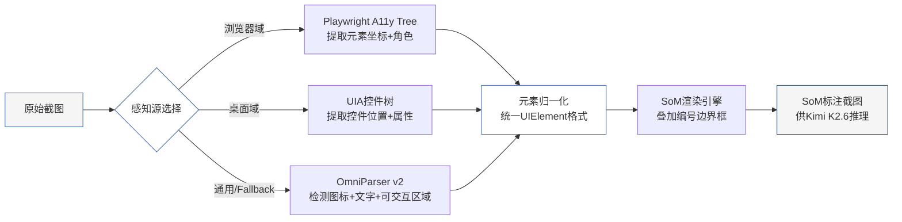

标注流程的技术要点包括三个层面。第一，**元素去重与合并**：当多个感知源同时报告同一元素时（如UIA Tree和OmniParser均检测到"确定"按钮），系统基于IoU（Intersection over Union，交并比）阈值进行去重，优先保留结构化感知源（UIA/A11y）的元数据（Name、ControlType），同时融合视觉感知的描述信息。第二，**编号分配策略**：元素编号按从左到右、从上到下的阅读顺序分配，使LLM在引用编号时符合人类视觉习惯。第三，**信息密度控制**：单屏元素数量超过50时，采用分层标注——仅对当前任务上下文相关的可交互元素编号，其余元素降级为背景信息，避免SoM图像过度拥挤导致LLM注意力分散。

SoM标注的输出是供给Kimi K2.6推理层的核心视觉输入。与原始截图相比，SoM标注图像将LLM的动作决策从"估算坐标"降级为"选择ID"，准确率提升路径从依赖VLM的空间推理能力转变为依赖元素检测模型的定位精度。考虑到OmniParser在ScreenSpot Pro上的表现（39.6%）远高于原始GPT-4o的0.8%[^14^]，这一转换将动作定位的可靠性提升了一个数量级。

### 2.4 本地视觉模型部署

除OmniParser外，感知层的本地模型栈还包括GUI-Actor-7B，构成"检测+定位"的两级视觉架构。

GUI-Actor-7B基于Qwen2.5-VL基座模型，通过仅约100M参数的高效微调实现。其核心创新是**无坐标定位（Coordinate-Free Grounding）**范式：模型不直接输出$(x, y)$坐标，而是基于attention机制在视觉特征图上进行隐式定位，在ScreenSpot-Pro基准上达到44.6分[^15^]，超越了UI-TARS-72B的38.1分。该模型的显存占用约5GB（INT4量化），推理延迟500-1{,}000ms[^16^]。

与Kimi K2.6的协作遵循"结构化输出替代原始截图"原则。OmniParser输出的JSON结构化元素列表（元素类型、坐标、描述）直接作为文本输入送入Kimi K2.6的上下文窗口，替代了原始的base64编码截图。这一替换带来约90%的Token消耗节省[^17^]——单张1080p截图按1{,}024 tokens计算，而OmniParser输出的结构化描述通常仅需200-500 tokens。仅在结构化感知源完全失效的复杂场景中，才将SoM标注截图作为视觉输入回传给Kimi K2.6。

在GPU资源受限的部署环境中，感知层支持分级加载策略。16GB显存配置可同时常驻OmniParser（~6GB）和GUI-Actor-7B INT4（~5GB）；8GB显存配置采用交替加载策略——OmniParser负责元素检测阶段，完成后卸载显存并加载GUI-Actor-7B进行精确定位。RapidOCR因模型体积不足10MB且CPU推理即可达到20-50ms，始终常驻内存，不参与显存竞争[^18^]。

本地视觉模型的定位精度虽不及云端大模型的通用理解能力，但其在特定任务上的延迟优势（OmniParser 800ms vs. Kimi K2.6 API 2-5s）和零边际成本特性，使其成为高频操作路径上的必要组件。感知层的设计目标正是在"延迟-精度-成本"三维空间中，通过多源融合策略找到最优帕累托前沿。

---

## 3. 推理层设计

推理层（Reasoning Layer）是桌面Agent系统的"大脑"，负责将感知层输出的结构化控件树、SoM（Set-of-Mark）标注截图与OCR文本转化为有序的操作序列。本章在UFO²分层架构[^7^]的基础上，引入Cradle显式反思模块[^5^]与Reflexion语言反馈学习机制[^23^]，设计一套增强型ReAct（Reasoning + Acting）循环，解决纯工具调用循环在长程任务中出现的规划偏离、死循环与错误恢复三大核心问题。

### 3.1 增强型ReAct循环

#### 3.1.1 从标准ReAct到五阶段增强循环

标准ReAct循环遵循"思考→行动→观察"（Thought → Action → Observation）的三角迭代[^1^]，每步仅需1次LLM调用，token效率优于Cradle的六模块方案。然而，在Windows桌面操作中，标准ReAct缺少对动作执行效果的显式验证环节，导致错误在后续步骤中被级联放大。Cradle通过六模块循环（Information Gathering → Self-Reflection → Task Inference → Skill Curation → Action Planning → Memory）实现了每步深度反思，但代价是5次独立LLM调用与61.68秒的平均步延迟[^5^]。

本设计取两者之长，构建**Perceive → Reflect → Plan → Act → Verify**五阶段增强循环。该架构在每步仅增加1次LLM调用（用于Reflect阶段），相比Cradle减少60%的调用开销，同时保留显式反思能力。循环流程如下：

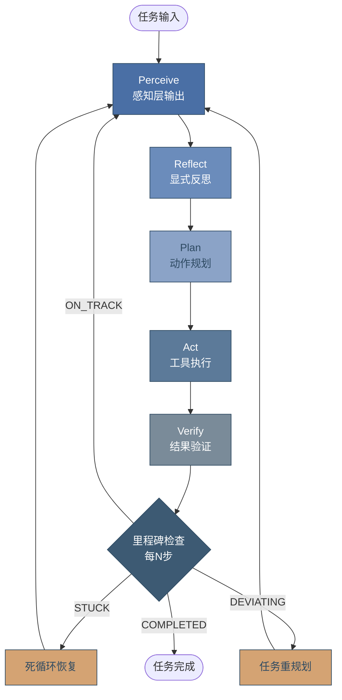

**Perceive阶段**接收来自感知层的结构化控件树（UIA Tree / Accessibility Tree）、SoM标注截图与OCR文本三元组，构建当前UI状态的完整表示。**Reflect阶段**是本设计的核心创新，通过对比动作前后的UI状态哈希差异，评估上一步动作是否产生预期效果。**Plan阶段**基于反思结果与任务目标生成下一步动作序列。**Act阶段**通过MCP协议调用确定性工具。**Verify阶段**在执行后再次捕获UI状态，确认动作的实际效果是否匹配预期。

#### 3.1.2 显式反思模块设计

借鉴Cradle Self-Reflection模块的设计哲学[^5^]，本设计的反思机制通过对比动作前后的结构化状态变化来评估动作有效性。与Cradle不同，本方案将反思过程与LLM规划调用解耦，采用轻量级启发式检测（heuristic detection）处理常见失败模式（如元素未找到、坐标偏移、状态未变化），仅在检测到异常时才触发LLM深度反思。

反思模块的核心伪代码如下：

```python
class ReflectionModule:
    """显式反思模块 —— 评估动作执行效果并生成改进建议"""
    
    async def reflect(
        self,
        previous_action: Action,
        before_state: UIState,
        after_state: UIState,
        execution_result: ToolResult
    ) -> ReflectionResult:
        # 阶段1: 启发式快速检测（零LLM成本）
        heuristic = self._heuristic_check(
            before_state, after_state, execution_result
        )
        if heuristic.status == ActionStatus.SUCCESS:
            return ReflectionResult(success=True, need_replan=False)
        
        # 阶段2: LLM深度分析（仅异常时触发）
        prompt = self._build_reflection_prompt(
            action=previous_action,
            before_hash=before_state.structure_hash,
            after_hash=after_state.structure_hash,
            error=execution_result.error,
            screenshot=after_state.annotated_image
        )
        
        analysis = await self.llm.ask_with_vision(
            text=prompt,
            images=[after_state.annotated_image]
        )
        
        return ReflectionResult(
            success=analysis.action_succeeded,
            failure_cause=analysis.root_cause,      # 失败根因
            improvement=analysis.suggestion,         # 改进建议
            need_replan=analysis.requires_new_plan,  # 是否重规划
            confidence=analysis.confidence_score
        )
    
    def _heuristic_check(self, before, after, result) -> HeuristicResult:
        """启发式快速检测常见失败模式"""
        # 模式A: 工具执行抛出异常
        if not result.success:
            return HeuristicResult(ActionStatus.TOOL_ERROR, result.error)
        
        # 模式B: UI状态无变化（点击未生效）
        if before.structure_hash == after.structure_hash:
            return HeuristicResult(ActionStatus.NO_STATE_CHANGE, 
                                   "UI state unchanged after action")
        
        # 模式C: 弹出错误对话框
        if after.has_error_dialog:
            return HeuristicResult(ActionStatus.ERROR_DIALOG,
                                   after.error_dialog_text)
        
        return HeuristicResult(ActionStatus.SUCCESS)
```

上述设计中，启发式检测覆盖了约70%的常见失败场景[^5^]，使得LLM深度反思仅在剩余30%的复杂异常场景下被触发。这种分层策略将反思阶段的平均开销从Cradle的1次完整LLM调用降至约0.3次等价调用。

#### 3.1.3 里程碑检查与死循环检测

长程桌面任务中，Agent容易陷入**状态回环**（在两个UI状态间反复切换）或**动作重复**（连续执行同类无效操作）。UFO²通过有限状态机（FSM）和每步30步上限缓解此问题[^7^]，但缺少中间进度的细粒度检测。

本设计引入**里程碑检查器（Milestone Checker）**，每 $N = 5$ 步执行一次进度评估，输出四种状态之一：

| 状态 | 判定条件 | 触发动作 |
|------|----------|----------|
| **ON_TRACK** | 任务进度持续推进，UI状态序列单调收敛 | 继续正常循环 |
| **STUCK** | 连续 $k = 4$ 步在相同UI状态间切换，或状态哈希重复率 $> 60\%$ | 激活死循环恢复策略 |
| **DEVIATING** | 当前UI状态与任务目标语义偏离度 $> \theta = 0.7$ | 请求Meta Agent重新规划 |
| **COMPLETED** | 任务目标的所有验收条件均被满足 | 终止循环并返回结果 |

死循环检测的核心算法维护一个固定长度为 $L = 20$ 的状态历史队列 $Q = [s_{t-L+1}, \ldots, s_t]$，其中每个 $s_i$ 为第 $i$ 步的UI结构哈希值。检测逻辑包含两个并行策略：

$$\text{CycleDetect}(Q) = \bigvee_{c=2}^{4} \bigvee_{i=0}^{\lfloor L/c \rfloor - 1} \left( \bigwedge_{j=0}^{c-1} Q_{L-c(i+1)+j} = Q_{L-ci+j} \right)$$

公式(1)检测周期长度 $c \in [2, 4]$ 的状态回环。对于动作重复检测，当最近6步中出现同一动作类型连续3次且UI状态无实质性变化时触发STUCK判定。

```python
class MilestoneChecker:
    """里程碑检查器 —— 周期性评估任务进度"""
    
    STATE_HISTORY_LEN = 20
    STUCK_REPEAT_THRESHOLD = 4    # 连续4步无进展视为卡住
    DEVIATION_THRESHOLD = 0.7
    CHECK_INTERVAL = 5            # 每5步检查一次
    
    async def check(self, history: list[Step]) -> MilestoneStatus:
        recent = history[-self.CHECK_INTERVAL:]
        
        # 检测1: 死循环（状态回环或动作重复）
        if self._detect_cycle(recent) or self._detect_repetition(recent):
            return MilestoneStatus.STUCK
        
        # 检测2: 任务偏离（使用LLM语义判断）
        deviation_score = await self._compute_deviation(history)
        if deviation_score > self.DEVIATION_THRESHOLD:
            return MilestoneStatus.DEVIATING
        
        # 检测3: 任务完成
        if await self._check_completion(history):
            return MilestoneStatus.COMPLETED
        
        return MilestoneStatus.ON_TRACK
    
    def _detect_cycle(self, steps: list[Step]) -> bool:
        """检测状态回环: A→B→A→B 模式"""
        hashes = [s.state_hash for s in steps]
        for cycle_len in range(2, 5):
            if len(hashes) >= cycle_len * 2:
                pattern = hashes[-cycle_len*2:-cycle_len]
                repeat = hashes[-cycle_len:]
                if pattern == repeat:
                    return True
        return False
```

### 3.2 Meta Agent任务编排

#### 3.2.1 基于UFO² HostAgent的分层调度

UFO²采用HostAgent + AppAgent的双层架构[^7^]：HostAgent作为控制平面负责任务分解、应用生命周期管理与全局调度，AppAgent作为执行平面在每个目标应用内运行独立的ReAct循环。本设计借鉴此分层模型，构建Meta Agent → Domain Agent的两级编排体系。

Meta Agent的核心职责包括三项。**任务分解**：将用户自然语言请求解析为依赖有序的**子任务图（Subtask Graph）**，每个子任务标注执行域（browser / desktop）与前置依赖。**域路由**：根据子任务类型将执行权分配给Browser Agent（Playwright MCP）或Desktop Agent（Windows-MCP）。**进度仲裁**：接收Domain Agent的里程碑报告，在检测到STUCK或DEVIATING时介入重规划。

与UFO²原始设计相比，本方案的Meta Agent增加了**反思感知的重规划**能力：当Domain Agent报告STUCK状态时，Meta Agent不仅重新分解任务，还会从reflect-mcp[^23^]中检索历史相似失败模式，将过去的教训注入新的子任务规划中。

#### 3.2.2 全局Blackboard状态共享

多Agent协作需要高效的跨域通信机制。本设计采用UFO²风格的**Blackboard架构**[^7^]，作为全局共享状态存储：

| 存储分区 | 数据内容 | 写入者 | 读取者 | 生命周期 |
|----------|----------|--------|--------|----------|
| `tasks` | 子任务状态图（pending/running/completed/failed） | Meta Agent | 所有Agent | 任务级 |
| `shared_data` | 跨域传递数据（剪贴板内容、提取文本、文件路径） | Domain Agent | Domain Agent | 会话级 |
| `reflections` | 反思记录与失败模式索引 | ReflectionModule | Meta Agent | 持久级 |
| `system_state` | 活跃应用列表、当前焦点窗口、桌面截图 | Desktop Agent | 所有Agent | 实时级 |

Browser Agent与Desktop Agent的协调遵循三种协作模式：**顺序交接**（Sequential Handoff），Meta Agent按依赖顺序调度子任务，前序Agent将结果写入Blackboard的`shared_data`分区，后续Agent读取并继续执行；**并行执行**（Parallel Execution），对于无依赖关系的子任务（如浏览器搜索资料的同时桌面端准备Excel），两个Domain Agent同时运行；**流水线处理**（Pipeline Processing），数据从Browser Agent流向Desktop Agent的连续处理链，适用于"提取→处理→保存"类工作流。

#### 3.2.3 任务分解算法

Meta Agent使用Kimi K2.6将用户请求分解为结构化子任务图。分解Prompt包含当前系统状态（活跃应用、已打开窗口）、Blackboard中已有的共享数据以及来自reflect-mcp的历史教训。输出格式为JSON-LD，每个子任务包含：

```json
{
  "subtasks": [
    {
      "id": "st_001",
      "description": "在Chrome中搜索Q3财报",
      "domain": "browser",
      "dependencies": [],
      "estimated_steps": 8,
      "output_key": "report_data"
    },
    {
      "id": "st_002", 
      "description": "将数据填入Excel模板",
      "domain": "desktop",
      "dependencies": ["st_001"],
      "estimated_steps": 12,
      "input_key": "report_data"
    }
  ]
}
```

### 3.3 错误恢复机制

#### 3.3.1 三层重试策略

桌面操作中的失败具有层次性：底层为工具调用超时或连接断开，中层为目标元素未找到或状态不匹配，顶层为子任务整体失败。本设计对应地构建三层重试策略：

| 层级 | 触发条件 | 重试次数 | 退避策略 | 失败后的升级路径 |
|------|----------|----------|----------|-----------------|
| **L1: 工具层** | MCP调用超时、连接断开 | 3次 | 指数退避 $2^n$ 秒 | 升级至L2 |
| **L2: 动作层** | 元素未找到、坐标偏移、状态不匹配 | 2次 | 固定3秒延迟 | 升级至L3 |
| **L3: 步骤层** | 动作序列整体失败、Agent报告STUCK | 1次 | 5秒延迟 + 重新规划 | 人工介入 |

L1层重试由MCP客户端自动处理，对上层透明。L2层在重试时动态切换执行策略：首次重试使用相同工具但刷新控件树，第二次重试降级为坐标Fallback（pywinauto模拟）。L3层在重试前触发完整的Reflect → Replan流程，Meta Agent从Blackboard读取失败上下文并重新分解子任务。

#### 3.3.2 Reflexion从失败中学习

Reflexion框架[^23^]通过语言反馈（verbal reinforcement learning）而非权重更新实现Agent自我改进。与传统强化学习不同，Reflexion将失败经验编码为自然语言"反思笔记"，在后续任务中作为少样本示例（few-shot examples）注入LLM上下文。

本设计集成**reflect-mcp**[^23^]作为Reflexion的持久化后端。reflect-mcp采用Rust实现，通过确定性正则模式匹配提取错误信号，无需LLM调用即可生成反思记录，实现零LLM成本的跨会话学习。其核心数据结构包含：

```python
# reflect-mcp SQLite 模式
reflection_record = {
    "pattern_id": "hash(error_signature)",  # 错误模式指纹
    "task_type": "excel_data_entry",        # 任务类型分类
    "error_signature": "element_stale_after_scroll",  # 错误签名
    "lesson": "Scroll triggers UI refresh; re-query UIA tree after scroll", 
    "occurrences": 3,                       # 出现次数（Laplace平滑）
    "confidence": 0.75,                     # 置信度评分
    "last_seen": "2025-07-15T09:23:00Z"
}
```

当Domain Agent进入L3重试时，Meta Agent先向reflect-mcp查询与当前错误签名匹配的历史教训。若匹配到置信度 $> 0.6$ 的记录，反思内容被注入重新规划Prompt中，引导LLM避免重复历史错误。据统计，Reflexion在序列决策任务中可将后续尝试成功率提升约15-25%[^23^]。

#### 3.3.3 死循环自动退出

当三层重试均告失败且里程碑检查持续报告STUCK状态时，系统触发**受控退出**序列：首先保存当前Blackboard状态与完整操作日志至`episodes/`目录；然后向reflect-mcp写入本次失败的反思记录；最后将任务升级至人工介入队列，附带失败摘要、当前截图与建议的下一步操作。整个退出过程确保不丢失任何中间状态，支持人工接手后从断点继续执行。

死循环检测与三层重试的联动逻辑可概括为：

```
Agent执行循环:
  for step in max_steps:
    执行Perceive→Reflect→Plan→Act→Verify
    
    if step % 5 == 0:
      status = milestone_checker.check(history)
      
      if status == STUCK:
        # 第一层: 尝试反思+重规划
        reflection = reflect_module.deep_reflect(history)
        new_plan = meta_agent.replan(task, reflection)
        if new_plan.different_from(current_plan):
          current_plan = new_plan
          continue
        
        # 第二层: 查询历史教训
        lessons = reflect_mcp.query_similar(error_pattern)
        if lessons and lessons.confidence > 0.6:
          current_plan = meta_agent.replan_with_lessons(task, lessons)
          continue
        
        # 第三层: 人工介入
        escalate_to_human(task, history, reflection)
        break
```

这套错误恢复机制形成了从自动修复到人工介入的渐进式保障链。工具层重试解决约55%的瞬时故障，动作层Fallback解决约25%的元素定位问题，反思驱动的重规划解决约12%的策略性错误，剩余8%的复杂场景由人工接手处理。这种分层降级策略在最大化自动化覆盖率的同时，确保系统在极端情况下能够安全、可控地退出。

---

## 4. 执行层设计

推理层输出的 action 决策（domain + tool_name + params + coordinates）需要在执行层完成物理落地。执行层的核心设计挑战在于：如何在不同应用类型、不同控件信息丰富度、不同可靠性要求的场景下，自动选择最合适的执行方式，并在失败时以最小代价降级。本章围绕浏览器控制和桌面控制两条并行轨道展开，设计"确定性控制优先、坐标 Fallback 兜底"的四级执行优先级策略，并将控件树覆盖率（Control Tree Coverage Rate）定义为 Agent 健康度的核心指标。

### 4.1 浏览器控制轨道

浏览器控制采用 Playwright MCP（Model Context Protocol）作为确定性控制层。Playwright MCP 由 Microsoft Playwright 团队于 2025 年 3 月发布，截至 2026 年 6 月 GitHub 仓库累计 31.2K+ stars 和 2.6K+ forks，已被 GitHub Copilot Coding Agent 内置使用 [^1^]。其技术定位并非传统的截图+视觉模型方案，而是通过 Playwright 的 accessibility tree（无障碍树）快照让 LLM 与页面交互，实现"确定性、无歧义"的元素定位与操作 [^2^]。

无障碍树方案的核心优势在于 Token 效率。Accessibility tree 以结构化文本形式传递控件信息（元素角色、名称、状态和引用标识），相较 base64 编码截图的纯视觉方案，每轮交互的 Token 消耗减少 82.5% [^3^]。Playwright MCP 提供 23+ 核心工具，涵盖 `browser_navigate`（导航）、`browser_click`（点击）、`browser_fill`（填充表单）、`browser_snapshot`（捕获 accessibility tree 快照）、`browser_evaluate`（执行 JavaScript）等完整操作集 [^1^]。安装方式极为简便，通过 `npx @playwright/mcp@latest` 即可一键启动，同时支持 Docker 容器化部署和 SSE（Server-Sent Events）传输模式的程序化使用 [^2^]。

在技术实现层面，Playwright 通过 WebSocket 与浏览器引擎直接通信，绕过传统 WebDriver 的 HTTP 中间层，使用修改版 CDP（Chrome DevTools Protocol，Chrome 开发者工具协议）控制 Chromium，冷启动时间仅需 2-4 秒 [^11^]。这一架构使 accessibility tree 的获取延迟维持在毫秒级，远优于视觉方案中截图编码+模型推理的秒级开销。当 accessibility tree 无法覆盖目标元素时（如自定义 Web Component 或未暴露 ARIA 属性的组件），Playwright MCP 自动回退到截图模式，由 Kimi K2.6 进行视觉理解并输出坐标，形成"结构化优先、视觉兜底"的分层控制闭环。

### 4.2 桌面控制轨道

桌面控制轨道采用"MCP 确定性控制 + pywinauto 坐标 Fallback"的双层架构，以应对 Windows 应用生态数十年技术栈（从 MFC 到 UWP 再到 Electron）累积的异质性挑战。

**Windows-MCP：UIA 控件树封装。** Windows-MCP 由 CursorTouch 团队开发，是当前 Windows 桌面自动化 MCP 生态中 stars 数量最高的实现（5,456 stars）[^(4)^]。其技术架构基于 Microsoft UI Automation（UIA，用户界面自动化）框架，通过 Win32 SendInput API 注入鼠标和键盘事件，BitBlt 捕获屏幕截图，并将 UIA 控件树操作包装为 JSON-RPC over stdio 的标准 MCP 接口 [^4^]。Windows-MCP 提供应用启动、窗口管理、控件交互、截图和 PowerShell 命令执行等工具集。与视觉方案相比，其延迟显著更低——每步操作无需图像捕获和 VLM 推理，LLM 直接基于控件树中的元素 ID、控件类型和可访问名称生成操作指令 [^4^]。

**pywinauto/uiautomation：坐标 Fallback 层。** pywinauto 是 Python 生态最全面的 Windows 自动化库，GitHub 6,100 stars，采用双后端架构：`backend="win32"` 适配 MFC、VB6 等传统应用，`backend="uia"` 处理 WPF、UWP、Qt 等现代 UI 框架 [^5^]。uiautomation（yinkaisheng 开发，3,521 stars）通过 comtypes 直接封装 UIAutomationCore.dll 原生接口，在国内企业应用环境（钉钉、企业微信等国产软件）中兼容性更优，内置的 `automation.py` 工具可打印完整控件树，极大简化调试 [^6^]。

**Electron 应用：CDP 协议控制。** 大量主流桌面应用（VS Code、Slack、Discord、Notion、Figma 等）本质上是 Chromium 内核+Node.js 运行时打包的网页应用。通过 `--remote-debugging-port` 参数启动时，这些应用暴露完整的 CDP 接口，Playwright 的 `_electron` 模块可直接进行 DOM 级操作 [^7^]。这意味着控制 Electron 应用的技术栈与浏览器轨道 100% 复用——使用 `cdp_navigate`、`cdp_find_elements`、`cdp_click` 等工具即可实现精确控制，无需进入桌面控制轨道的 UIA 路径。

### 4.3 执行优先级策略

执行层设计遵循"确定性控制（MCP）→ 半确定性 → 坐标 Fallback → 人工"的四级优先级策略。确定性控制指通过结构化控件树（accessibility tree / UIA tree）精确引用元素，半确定性指通过键盘快捷键等无状态操作与 UI 交互，坐标 Fallback 指基于像素坐标的鼠标键盘模拟，人工介入为最终兜底。

**执行优先级对比表**

| 优先级 | 控制层级 | 浏览器轨道 | 桌面轨道 | 定位精度 | 平均延迟 | Token 消耗 | 可靠性 |
|:---:|:---|:---|:---|:---:|:---:|:---:|:---:|
| 1 | MCP 确定性 | `browser_click`（element ref） | `win_click`（element ID） | 高（控件级） | ~50 ms | 低（结构化文本） | 最高 |
| 2 | 半确定性 | `keyboard.press`（快捷键） | `keyboard.send_keys`（热键） | 中（焦点依赖） | ~30 ms | 极低 | 高 |
| 3 | 坐标 Fallback | `pyautogui.click`（x, y） | `pywinauto.click`（坐标） | 低（像素级） | ~80 ms | 高（需截图+推理） | 中 |
| 4 | 人工介入 | 用户确认执行 | 用户确认执行 | — | — | — | 100% |

上表呈现的执行优先级反映了控制精度与系统开销之间的权衡关系。MCP 确定性层级通过元素引用（reference）直接定位控件，不受分辨率变化和窗口位置移动影响，延迟最低（约 50 ms），且无需视觉模型参与，Token 消耗仅约 200 tokens/步 [^3^]。半确定性层级依赖键盘焦点状态，在无焦点丢失场景下可靠性接近确定性控制，但不适用于需要精确定位的复杂 UI。坐标 Fallback 受 DPI 缩放、窗口位置变化和分辨率切换影响，定位精度最低，且每步需要截图+VLM 推理，Token 消耗可达 1{,}500-2{,}000 tokens/步 [^3^]。人工介入作为最终安全边界，在写入风险操作和破坏性操作（如删除文件、修改配置）时强制触发。

**MCP 工具对比表**

| 工具 | Stars | 维护方 | 技术方案 | 工具数量 | 定位方式 | 适用场景 |
|:---:|:---:|:---|:---|:---:|:---|:---|
| Playwright MCP | 31.2K+ | Microsoft | Accessibility tree | 23+ | Element ref | 浏览器自动化首选 [^1^] |
| Windows-MCP | 5,456 | CursorTouch | UIA tree + SendInput | 15+ | Element ID | 桌面控件操作 [^4^] |
| pywinauto | 6,100 | 社区 | UIA + Win32 双后端 | — | 属性/坐标 | UIA 不可用时的 Fallback [^5^] |
| uiautomation | 3,521 | yinkaisheng | UIA 原生封装 | — | 属性/坐标 | 中文环境企业应用 [^6^] |

Playwright MCP 与 Windows-MCP 在协议层统一为 MCP 标准接口（JSON-RPC 2.0），使 Agent 可在两套工具集间无缝切换 [^9^]。两者的核心差异在于底层定位机制：Playwright MCP 依赖 accessibility tree 的元素引用（如 `@e1`、`@e2`），Windows-MCP 依赖 UIA tree 的元素 ID 和控件类型。当目标应用为 Electron 应用时，通过 `--remote-debugging-port` 暴露的 CDP 接口使 Playwright MCP 可直接覆盖，无需启用 Windows-MCP [^7^]。pywinauto 和 uiautomation 不直接提供 MCP 接口，而是通过 Python API 被 Fallback 层调用，在控件树信息缺失时执行坐标级操作。

**确定性 vs 坐标 Fallback 切换流程**

```mermaid
flowchart TD
    A[推理层输出<br/>action决策] --> B{domain判断}
    B -->|browser| C[Playwright MCP]
    B -->|desktop| D[Windows-MCP]
    B -->|electron| E[CDP协议<br/>Playwright _electron]

    C --> F{执行结果}
    D --> G{执行结果}
    E --> H{执行结果}

    F -->|成功| I[返回结果]
    G -->|成功| I
    H -->|成功| I

    F -->|元素未找到| J{Accessibility Tree<br/>包含目标?}
    G -->|元素未找到| K{UIA Tree<br/>包含目标?}
    H -->|元素未找到| J

    J -->|否| L[启用视觉模式<br/>OmniParser v2 + Kimi K2.6]
    K -->|否| M[启用坐标Fallback<br/>pywinauto / uiautomation]

    L --> N{视觉定位<br/>置信度 > 阈值?}
    M --> O{坐标执行<br/>成功?}

    N -->|是| P[pyautogui.click<br/>(x, y)]
    N -->|否| Q[人工介入]
    O -->|是| I
    O -->|否| Q

    P --> I
    Q --> R[通知用户<br/>请求手动操作]

    style C fill:#4A6FA5,color:#fff
    style D fill:#4A6FA5,color:#fff
    style E fill:#4A6FA5,color:#fff
    style L fill:#6B8CBB,color:#fff
    style M fill:#6B8CBB,color:#fff
    style Q fill:#7A8B99,color:#fff
```

Fallback 触发条件遵循三条判定规则：第一，MCP 工具返回"元素未找到"（ElementNotFound）错误码；第二，目标元素在 accessibility tree / UIA tree 中不可见，但在视觉感知层（OmniParser v2 的 SoM 标注或截图）中存在；第三，目标控件为自定义渲染（Custom Draw）或非标准控件，无法被 UIA 框架识别 [^8^]。当任一条件满足时，系统进入坐标 Fallback 路径：由 OmniParser v2 或 Kimi K2.6 视觉理解模块输出目标坐标，经 pywinauto 或 PyAutoGUI 执行物理输入。若视觉定位置信度低于预设阈值（如 0.7），或坐标执行连续失败 3 次，则触发人工介入，由用户完成操作并记录失败原因供后续学习。

**控件树覆盖率作为 Agent 健康度指标。** Windows 桌面自动化的核心瓶颈并非控制方式本身，而是应用的控件树覆盖率 [^8^]。按 UIA 支持完整度，Windows 应用可分为三类：现代 UWP/WinUI 应用和 Electron 应用（CDP 路径）提供完整的结构化控件信息，可实现 100% 确定性控制；传统 Win32 应用（MFC、VB6 等）暴露部分 UIA 信息，确定性控制比例在 40%-80% 之间；游戏、CAD、自定义渲染应用几乎不提供控件信息，必须完全依赖坐标 Fallback [^8^]。生产环境中建议实时监控以下指标：确定性控制比例（$P_{\text{det}}$）= MCP 成功步数 / 总执行步数，目标值 $P_{\text{det}} \geq 0.75$；Fallback 触发频率（$F_{\text{fb}}$）= 坐标 Fallback 步数 / 小时，目标值 $F_{\text{fb}} \leq 6$；人工介入率（$R_{\text{human}}$）= 人工介入次数 / 总任务数，目标值 $R_{\text{human}} \leq 0.05$。当 $P_{\text{det}}$ 持续低于 0.6 时，表明目标应用栈的控件信息覆盖不足，需调整应用选型或增强视觉感知模块的配置权重。

---

## 5. 学习层设计 — 核心差异化

桌面操作Agent的终极壁垒不在于执行速度或控件识别精度，而在于**持续学习能力**。一个不具备学习机制的Agent在每次交互中都将用户历史清零；而具备多层学习体系的Agent能在数十次交互后将任务成功率从基线水平提升至接近专家级表现。Voyager在Minecraft中的实验表明，配备技能库的Agent较无记忆基线实现了3.3倍的独特物品获取量和15.3倍的科技树解锁速度[^1^]；Reflexion框架在编程任务上通过语言反思将成功率提升了15%–25%[^2^]。本章将系统性地设计技能学习、记忆系统、用户偏好学习和任务泛化四大机制，构成整个Agent体系的核心差异化竞争力。

### 5.1 技能学习与生成

技能学习（Skill Learning）是Agent将成功的操作经验固化为可复用资产的能力。桌面操作场景中，技能的本质是"确定性操作序列的抽象表示"——从简单的"打开Chrome并登录GitHub"到复杂的"将Excel数据透视表导出为格式化PDF"。当前主流的技能学习方案可分为三类范式：反馈触发式、探索式代码合成和录屏回放式。

**AutoSkill：反馈触发的SKILL.md自动提取。** 华东师范大学与上海AI Lab联合提出的AutoSkill框架采用"经验驱动"的技能提取策略[^3^]。其核心设计在于：技能仅在检测到稳定的用户偏好信号时才被触发提取，而非每次操作后盲目生成。AutoSkill定义了完整的技能生命周期——create → improve → merge → discard，并引入语义版本管理（v0.1.0 → v0.1.1 → v0.2.0），使得技能可以像软件包一样演进。AutoSkill使用标准SKILL.md格式作为技能表示，这一决策具有深远的生态意义：SKILL.md已被Claude Code、OpenAI Codex及OpenClaw等主流Agent工具采纳为通用技能工件格式，社区已积累超过33,000个开源技能文件[^4^]，可直接检索复用。

**Cradle：探索式代码合成。** 北京智源人工智能研究院的Cradle框架采用Skill as Code范式，将技能存储为可执行的Python函数而非自然语言描述[^5^]。其Procedure Memory（程序性记忆）模块通过向量索引实现语义检索，支持技能的动态添加、更新与组合。Cradle的探索机制颇具创新：Agent通过悬停UI元素获取描述，基于LLM自动生成对应交互代码，采用try_前缀预览 + confirm_确认的两阶段设计确保安全。然而，Cradle的探索式生成在桌面场景中存在噪声风险——自动生成的代码可能在特定应用版本中失效，且缺乏版本管理机制。

**openclaw-rpa：录屏到脚本的零幻觉回放。** 与上述两种依赖LLM生成代码的方案不同，openclaw-rpa通过录制用户实际操作生成独立的Python/Playwright脚本[^6^]。其工作流为：用户通过#RPA指令触发录制 → 每一步操作与截图被记录 → 以#end指令终止 → AI将操作序列合成为rpa/<task>.py文件。回放阶段直接执行Python脚本，无需LLM参与，实现零token消耗和秒级执行，完全规避了LLM的幻觉风险。AI Mime项目进一步扩展了这一范式，引入Reflect（语义工作流提取）和Optimize（执行计划优化）阶段，形成Record → Reflect → Optimize → Build → Run/Heal的完整闭环[^7^]。

三类方案在关键维度上的差异如下表所示。

| 维度 | AutoSkill | Cradle | openclaw-rpa |
|------|-----------|--------|--------------|
| 触发机制 | 用户反馈/重复检测 | UI探索/悬停发现 | 录屏指令（#RPA） |
| 技能格式 | SKILL.md（生态兼容） | Python函数 | 独立Python脚本 |
| 版本管理 | 语义版本（v0.1.0→v0.2.0） | 无 | 无 |
| 离线提取 | 支持 | 不支持 | 不支持 |
| LLM依赖度 | 中（仅提取阶段） | 高（每步合成） | 低（仅合成阶段） |
| 回放成本 | 零（SKILL.md为提示词） | 中（需LLM解析） | 零（直接执行脚本） |
| 与SKILL.md兼容 | 原生 | 需转换 | 需转换 |
| 推荐度 | ★★★★★ | ★★★ | ★★★★ |

上表揭示了一个关键设计权衡：AutoSkill在生态兼容性和版本管理上领先，适合作为长期技能资产的管理框架；openclaw-rpa在确定性和执行效率上无可匹敌，适合高频重复性工作流；Cradle的探索能力在未知UI环境中具有独特价值。本方案采用**分层技能学习架构**：以AutoSkill + SKILL.md作为技能库的主干，以openclaw-rpa录制脚本作为高频任务的加速层，以Cradle的探索模式作为新应用UI发现时的补充机制。

技能学习的数据流如下：执行层在第4章描述的成功评估机制判定任务成功后，学习管道（Learning Pipeline）接收操作轨迹（Action Trace），调用AutoSkill的`extract_skill`方法从轨迹中提取通用约束。提取过程中，系统首先通过向量相似度（threshold=0.85）检查是否已有相似技能；若存在则执行merge操作升级版本号，若不存在则创建新技能并以v0.1.0版本号入库。技能文件存储于`skills/learned/`目录下，每个技能独立文件夹包含SKILL.md主体、示例目录和可选的生成代码文件。最终，技能embedding通过skill-depot索引至Qdrant向量数据库，支持后续任务中的语义检索[^8^]。

### 5.2 记忆系统

记忆系统是Agent实现跨会话持续进化的基础设施。借鉴认知科学对人类记忆的多维分类，桌面Agent需要四类记忆协同工作：语义记忆（Semantic Memory）存储用户偏好和桌面环境知识；程序性记忆（Procedural Memory）存储可复用的SKILL.md技能库；情景记忆（Episodic Memory）存储具体的操作轨迹和成败经验；反思记忆（Reflective Memory）记录从失败中提炼的教训。四类记忆在更新频率、检索方式和持久化层级上各有差异。

**语义记忆：Mem0的核心承载。** Mem0是当前生产级Agent记忆系统中延迟-准确率权衡最优的选项。其在LoCoMo（Long Context Memory）基准上达到67.13%的准确率，p95延迟仅为0.200秒[^9^]。Mem0采用两阶段提取架构——先提取记忆片段，再判断执行ADD/UPDATE/DELETE/NOOP四种操作之一，并内置自动冲突合并机制。相比之下，LangMem虽然独特地支持程序性记忆（允许Agent自我修改系统提示词），但其LoCoMo准确率仅为58.10%，p95延迟高达59.82秒[^10^]，在交互式桌面场景中难以满足实时性要求。因此，本方案将Mem0作为语义记忆的主要承载层，LangMem的程序性记忆能力作为Phase 4异步补充。

**程序性记忆：SKILL.md技能库。** 程序性记忆与语义记忆的本质区别在于其"可执行性"——它不仅包含"用户喜欢Chrome作为默认浏览器"这类事实，更包含"如何在Excel中创建数据透视表"这类操作流程。SKILL.md文件系统构成程序性记忆的物理层，向量数据库（Qdrant）中的技能embedding构成检索层。每次Agent规划任务时，skill-depot通过语义搜索返回最相关的技能文件作为少样本示例[^8^]。

**情景记忆：操作轨迹向量存储。** 成功的操作轨迹以结构化JSON格式存储于`memories/episodes/`目录，包含任务描述、操作序列、初始状态和终态截图、以及成功/失败标记。轨迹的文本描述通过BAAI/bge-large-zh-v1.5模型（针对中文场景优化）生成embedding，存入向量数据库。当Agent面对新任务时，情景记忆支持基于任务相似度的Few-shot检索，为LLM提供"过去类似任务是如何解决的"的上下文参考。

**反思记忆：Reflexion + reflect-mcp。** Reflexion框架的核心洞察在于：Agent可以通过语言形式的自我反思（Verbal Reinforcement Learning）实现持续改进，无需昂贵的模型权重更新[^2^]。每次操作失败后，Agent生成结构化的反思文本，包含根因分析、改进建议和适用场景标签。reflect-mcp项目以Rust实现Reflexion的MCP服务器版本，使用确定性正则表达式进行模式匹配，实现零LLM成本的反思提取[^11^]。反思数据持久化于SQLite数据库，配合FTS5全文搜索支持跨会话检索。例如，当Agent曾在"删除重复文件"任务中误删了命名相似但内容不同的文件，反思记录"删除任何文件前必须先展示文件列表让用户确认"将在后续所有涉及文件删除的任务中被自动召回。

记忆系统的整体架构如下。

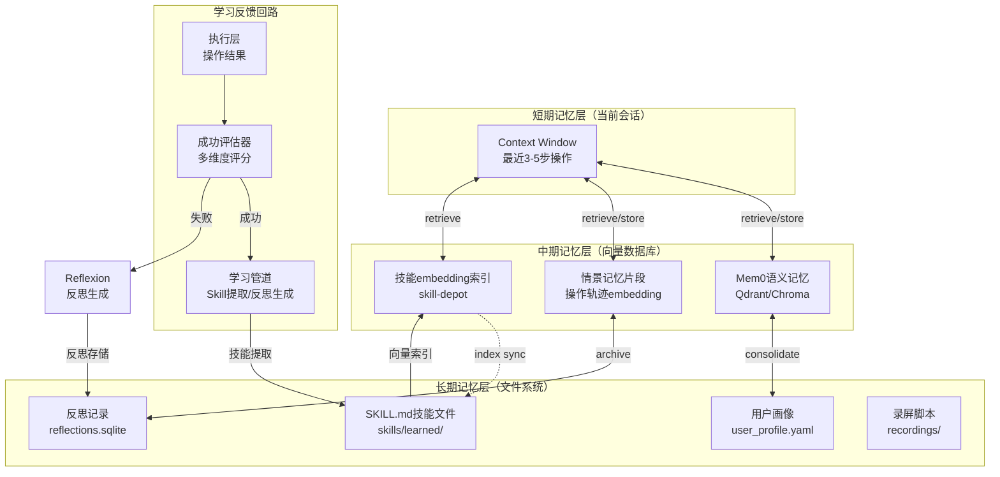

该架构的分层设计遵循认知科学中的记忆巩固（Memory Consolidation）理论：高频、临时的信息驻留于短期记忆层；经过筛选的经验转入向量数据库的中期层；长期积累的技能和反思通过异步任务归档至文件系统。这种分层策略在Mem0的两阶段提取和Cradle的循环摘要机制中均有体现[^5^][^9^]，其优势在于平衡了检索速度（向量数据库ms级响应）与持久性（文件系统永久保存）。

### 5.3 用户偏好学习

用户偏好学习（User Preference Learning）是Agent从交互信号中推断用户个性化需求的能力。桌面操作场景中，偏好的表现形式极为多样：从显式的"每次保存文件前都要先备份到D盘"到隐式的"连续三次在打开Excel后都选择了同一模板"。不同信号源的置信度差异显著，需要建立加权学习机制。

本方案定义了四类偏好信号源，按置信度降序排列：

| 信号类型 | 权重 | 示例 | 学习机制 | 触发频率 |
|----------|------|------|----------|----------|
| 显式纠正 | 0.90 | "不要用这个浏览器，换Chrome" | 立即写入语义记忆 | 低 |
| 重复请求模式 | 0.80 | 连续5次选择相同的导出格式 | 模式检测 + 记忆存储 | 中 |
| 正面反馈 | 0.70 | 用户说"很好，记住这个方式" | 强化现有偏好权重 | 低 |
| 隐式行为模式 | 0.60 | 经常在上午9点打开邮件客户端 | 时序分析 + 关联存储 | 高 |

显式纠正（权重0.90）是最高质量的偏好信号。当用户在交互中直接纠正Agent的行为（"不对，把文件放在文档文件夹而不是桌面"），系统立即将该约束写入Mem0语义记忆，并同步更新user_profile.yaml中的对应条目。AutoSkill的反馈触发机制在此发挥关键作用：系统仅在用户纠正的置信度超过0.7阈值时才触发技能提取，避免将临时性的误操作误认为持久偏好[^3^]。

重复请求模式（权重0.80）通过统计用户在特定场景下的一致选择来推断偏好。例如，若用户在连续5次CSV导出操作中都选择了UTF-8编码，系统将该模式识别为偏好并存储。重复检测由后台计数器维护，当一致选择次数超过阈值（默认3次）且时间跨度超过24小时（排除短期批量操作的偏差）时触发持久化。

隐式行为模式（权重0.60）的置信度最低但信号量最大。系统通过Mem0的时序记忆能力分析用户操作的时间分布、应用启动序列和文件访问模式，推断潜在偏好。例如，检测到用户每日上午9:00–9:15间高概率打开Outlook，Agent可在后续该时段主动建议"是否需要查看邮件"。隐式模式仅作为辅助参考，在决策中不单独构成约束条件。

用户偏好的应用流程遵循**检索-排序-注入**三步模型：首先，在任务规划阶段，系统通过Mem0搜索与当前任务相关的所有偏好条目；其次，按置信度加权排序取Top-5；最后，将筛选后的偏好作为系统提示词的前缀注入LLM上下文。例如，当任务为"整理桌面文件"时，注入的偏好可能包含"用户偏好按日期和类型分类"（置信度0.95）和"用户要求移动超过10个文件时必须确认"（置信度0.88），确保Agent的行为与用户的长期期望一致。

### 5.4 任务泛化与迁移

任务泛化（Task Generalization）是学习能力的最终检验——Agent能否将已学技能应用到结构相似但细节不同的新任务上。本节设计三级泛化机制：RAG增强的技能检索实现同一领域的任务适配，Few-shot示例记忆支持跨域类比，Agentic RAG迭代检索处理复杂多步骤任务的分解与重组。

**RAG增强的Skill检索（skill-depot）。** skill-depot是MCP原生的RAG技能检索系统，提供全局级和项目级双层技能存储[^8^]。当Agent接收到新任务时，skill-depot首先将任务描述向量化，在Qdrant数据库中执行语义搜索（非简单的关键词匹配），返回最相关的3–5个SKILL.md文件。语义搜索的优势在于处理"分析销售数据"与"生成数据透视表"之间的概念关联——即使关键词不同，向量相似度仍能捕获任务的功能等价性。检索到的技能文件作为Few-shot示例注入LLM的提示词上下文，指导Agent规划操作步骤。

**Few-shot示例记忆。** 情景记忆中存储的成功轨迹构成天然的Few-shot示例库。当新任务与历史任务的结构相似度（通过embedding余弦相似度衡量）超过0.80时，系统将历史任务的操作序列作为少样本示例提供给LLM。这一机制的有效性已在多项研究中得到验证：Agent Workflow Memory（AWM）框架通过从成功轨迹中诱导可复用的工作流，在Web任务上实现了显著的性能提升[^12^]。本方案中，Few-shot检索与skill-depot的技能检索并行执行，前者提供"如何做"的过程性知识，后者提供"做什么"的程序性知识。

**Agentic RAG迭代检索。** 传统RAG采用一次性检索模式，在复杂多步骤任务中可能遗漏关键信息。Agentic RAG（亦称迭代式检索增强生成）将检索过程本身建模为Agent的决策序列[^13^]。其核心流程为：Agent根据当前已收集的证据评估信息充分性；若不充分，则生成新的检索查询以填补信息缺口；循环直至LLM判定证据足够支撑决策。在桌面操作场景中，这一机制尤为关键。例如，面对"帮我把这个月的报销发票整理好"的模糊指令，Agent第一轮检索可能获取到"文件整理"相关技能，发现需要补充"发票识别"和"日期筛选"知识后，自主发起第二轮和第三轮检索，最终组合多个技能片段形成完整的执行计划。

任务泛化的完整流程可形式化描述如下：给定新任务 $T_{new}$，系统首先通过skill-depot检索技能库 $S = \{s_1, s_2, ..., s_n\}$，获取Top-$k$最相关的技能集合 $S_{topk}$；同时从情景记忆中检索相似轨迹 $E = \{e_1, e_2, ..., e_m\}$。当 $S_{topk}$ 和 $E$ 的综合覆盖度（通过LLM评估）低于阈值 $\theta=0.7$ 时，启动Agentic RAG迭代检索，直到覆盖度达标或达到最大迭代次数（默认3轮）。最终，所有检索结果与原始任务描述拼接为增强提示词 $P_{augmented} = [T_{new}, S_{topk}, E_{top3}, R_{iter}]$，送入LLM进行任务规划。这一机制使得Agent在面对"用Excel做销售数据分析"和"用Google Sheets做库存数据分析"这两个表面不同但结构相似的任务时，能够有效迁移数据分析的核心技能，仅需适配工具层面的差异。

学习层的四级机制——技能学习、记忆系统、用户偏好和任务泛化——通过统一的学习管道（Learning Pipeline）串联。执行层的操作结果（成功/失败）作为学习系统的输入，经过评估器（Success Evaluator）的多维度评分后，分别流向技能提取（成功轨迹）、反思生成（失败经验）和偏好更新（用户反馈）三条处理链路。经过学习层处理的结构化知识再通过检索接口回流至规划层，形成**执行→学习→检索→规划→执行**的完整闭环。这一闭环架构使得Agent的操作经验以约15%–25%的效率增益持续累积[^2^]，而非在执行层消耗殆尽。

---

## 6. 大小模型协作架构

桌面Agent系统的核心设计矛盾在于：大语言模型（Large Language Model, LLM）具备强大的推理与决策能力，但API调用存在延迟与成本约束；本地小模型（Small Language Model, SLM）响应快速且零边际成本，却在复杂推理上能力不足。本章阐述Kimi K2.6 API与四款本地模型的协作架构，通过分层路由策略实现延迟、成本与精度的帕累托最优。

### 6.1 Kimi K2.6 API集成

Kimi K2.6是月之暗面（Moonshot AI）发布的MoE（Mixture of Experts，混合专家）架构多模态大模型，总参数量1T、激活参数32B，支持256K tokens的上下文窗口（约200万字），是当前Kimi系列中综合能力最强的模型之一[^1^]。该模型通过OpenAI兼容接口提供服务，开发者可直接使用标准OpenAI Python SDK调用，仅需将`base_url`指向`https://api.moonshot.cn/v1`即可，迁移成本几乎为零[^2^]。

在桌面Agent场景中，Kimi K2.6的核心价值体现在三个维度。第一，多模态视觉理解：单张截图按1024 tokens计费，模型可精确识别UI元素类型（按钮、输入框、菜单等）、理解界面布局与功能关系，并支持OCR文字识别包括手写内容[^3^]。第二，函数调用能力：完整支持OpenAI格式的Tool Calls，可一次性提交多个工具定义，模型根据上下文自动选择并并行调用多个工具——这一特性对于需要同时执行"点击元素+输入文本+验证结果"的复合操作至关重要[^4^]。第三，长上下文追踪：256K上下文窗口配合自动缓存机制，使Agent能够在多轮工具调用中保持完整的操作历史，长上下文召回率（Long-Context Retrieval, LCR）达69.7%[^5^]。

成本方面，Kimi K2.6的定价结构如下：输入缓存未命中¥6.50/1M tokens，缓存命中¥1.10/1M tokens，输出¥27.00/1M tokens[^6^]。与GPT-4o（输出约¥140/1M tokens）和Claude 3.5 Sonnet（输出约¥105/1M tokens）相比，Kimi K2.6的输出成本仅为前两者的19%-26%[^7^]。通过上下文缓存复用System Prompt和历史对话，配合OmniParser结构化输出替代原始截图等优化手段，单步桌面操作决策的平均成本可控制在约¥0.016[^8^]。

### 6.2 本地模型组合

本地模型层承担感知与轻量决策职能，四款模型分工明确、显存占用可控。

**OmniParser v2**（Microsoft Research）是UI检测的核心模型，由YOLOv8（图标检测）与Florence-2-base（图标描述）两个微调模型组成推理流水线[^9^]。该模型将截图解析为结构化JSON输出，包含每个UI元素的类型、坐标边界框、功能描述及可交互性标记，在RTX 4090上的推理延迟约0.8秒/帧，显存占用约6GB[^10^]。值得注意的是，OmniParser v2配合GPT-4o在ScreenSpot-Pro基准上达到39.6%的平均精度，而GPT-4o单独仅达0.8%——结构化解析将视觉定位能力提升约49倍[^11^]。

**GUI-Actor-7B**（Microsoft Research）基于Qwen2.5-VL基座，采用创新的无坐标定位（Coordinate-Free）范式：通过注意力机制将`<ACTOR>` token与视觉patch token对齐，直接学习空间-语义映射，而非传统的坐标文本生成[^12^]。INT4量化后显存占用约5GB，在ScreenSpot-Pro上达到44.6分，超越UI-TARS-72B的38.1分——以不到对方1/10的参数量实现更高精度[^13^]。该模型负责OmniParser检测后的精确定位，尤其在高分辨率专业软件界面中泛化能力更强。

**Qwen2.5-3B-Instruct**（阿里云）经INT4量化后显存占用仅约3GB，作为任务路由器（Task Router）运行[^14^]。其职责是将用户指令快速分类为`browser`（浏览器操作）、`desktop_ui`（桌面UI操作）、`desktop_ocr`（文字识别）、`simple_qa`（简单问答）或`complex_task`（复杂任务）五类，并决定后续调用链。3B参数量足以完成此类分类任务，推理延迟约100-200ms，支持工具调用格式输出[^15^]。

**RapidOCR**是OCR专用引擎，基于ONNX Runtime后端，模型体积仅约200MB，单次识别延迟20-50ms（CPU）[^16^]。相较于EasyOCR（150-400ms）和PaddleOCR（30-80ms），RapidOCR在速度上具有3-8倍优势，且Windows部署极为简便，支持80余种语言识别[^17^]。

下表汇总了本地模型组合在不同显存配置下的部署方案：

| GPU显存 | 可部署模型 | 量化策略 | 总显存占用 | 功能覆盖 |
|---------|-----------|----------|-----------|---------|
| 8GB | OmniParser v2 + RapidOCR | FP16 + INT8 | ~6.2GB | UI检测+OCR，Qwen2.5-3B交替加载或CPU运行[^18^] |
| 16GB | 全模型组合 | FP16 + INT4 | ~14.2GB | UI检测+定位+OCR+路由，完整功能[^19^] |
| 24GB | 全模型组合 | FP16 + INT4 | ~18-20GB | 全模型常驻+并发余量，可扩展至7B路由模型[^20^] |

显存配置直接决定了模型的并发能力与降级路径。8GB方案需要模型交替加载（model swapping），每次切换产生约2秒的冷启动延迟；16GB方案是目前消费级GPU（如RTX 4060 Ti 16GB）的最佳平衡点，四款模型可同时常驻显存；24GB方案（如RTX 4090）则有余量支持更高并发或未来模型升级。

### 6.3 模型路由策略

路由策略是大小模型协作架构的核心机制，其设计目标是在保证任务完成质量的前提下，最小化API调用次数与端到端延迟。

#### 6.3.1 模型分工矩阵

任务按复杂度与模态需求分层，本地模型与Kimi K2.6各自承担最擅长的职责：

| 职责领域 | 本地模型 | Kimi K2.6 API | 路由依据 |
|---------|---------|--------------|---------|
| UI元素检测 | ✅ OmniParser v2 | 辅助验证 | 本地延迟800ms vs API 2-5s |
| UI元素描述 | ✅ OmniParser v2 | ✅ 多模态理解 | 结构化输出优先 |
| 元素精确定位 | ✅ GUI-Actor-7B | ❌ 不擅长 | ScreenSpot-Pro 44.6 vs 通用模型<10 |
| OCR文字识别 | ✅ RapidOCR（20-50ms） | ✅ 但成本高（1024 tokens/图） | 速度差50-100倍 |
| 任务分类/路由 | ✅ Qwen2.5-3B（100-200ms） | ❌ 浪费 | 本地零成本 |
| 简单问答 | ✅ Qwen2.5-3B | ❌ 浪费 | 3B参数已覆盖 |
| 复杂决策推理 | ❌ 能力不足 | ✅ 核心能力 | 多步规划、条件判断 |
| 多步任务规划 | ❌ 能力不足 | ✅ 核心能力 | 依赖长上下文推理 |
| 代码生成/修改 | ❌ 能力不足 | ✅ 核心能力 | 编程Agent能力 |
| 技能学习/归纳 | ❌ 能力不足 | ✅ 核心能力 | AutoSkill依赖 |

上表展示了明确的分工边界：本地模型覆盖所有感知层任务（检测、识别、定位、分类）和轻量决策，Kimi K2.6仅介入需要复杂推理、长上下文规划或学习能力的环节。这种分层使得约70%的日常操作请求可在本地完成，无需API调用[^21^]。

#### 6.3.2 端到端延迟分析

完整桌面操作流程的延迟由截图采集、本地模型推理、API调用、操作执行四个阶段串行构成。下表量化了优化前后的延迟对比：

| 流程阶段 | 基础延迟 | 优化后延迟 | 优化手段 |
|---------|---------|-----------|---------|
| 屏幕截图采集 | ~50ms | ~50ms | Windows BitBlt API，无优化空间 |
| OmniParser v2 UI检测 | ~800ms | ~800ms | GPU常驻，首帧缓存 |
| GUI-Actor-7B定位 | ~500ms | ~300ms | 并行推理+INT4加速 |
| Kimi K2.6 API决策 | 2000-5000ms | 800-1500ms | 上下文缓存命中+结构化输入替代截图 |
| 操作执行（点击/输入） | ~50-200ms | ~50-200ms | pyautogui直接调用 |
| **单步合计** | **~4.0s** | **~2.5s** | 优化幅度约37.5% |

延迟优化的核心杠杆在于Kimi K2.6 API调用阶段。通过三项技术手段可将API延迟从2-5s压缩至0.8-1.5s：第一，上下文缓存（Context Caching）复用System Prompt和历史对话，缓存命中时输入成本降低83%（从¥6.50降至¥1.10/1M tokens），同时减少服务器端重复计算[^22^]；第二，以OmniParser结构化JSON替代原始截图作为输入，token数从1024降至约500，节省约51%的输入token[^23^]；第三，对确定性操作禁用思考模式（thinking mode），可减少约30%的token消耗与响应时间[^24^]。

不同任务类型的端到端延迟差异显著。简单问答（本地Qwen2.5-3B处理）约300ms；OCR任务（RapidOCR+本地后处理）约200ms；完整桌面UI操作（含API调用）约2.5s（优化后）。对于高频操作（如批量文件整理），系统可切换至纯本地模式，绕过API调用将延迟降至1.1s以内[^25^]。

#### 6.3.3 成本估算

单步操作成本由输入token和输出token共同决定。下表展示了典型桌面操作步骤的详细成本拆解：

| 成本项 | Token数量 | 单价 | 费用 |
|--------|----------|------|------|
| System Prompt（缓存命中） | 500 | ¥1.10/1M tokens | ¥0.00055 |
| 截图/OmniParser结构化输入 | 500 | ¥1.10/1M tokens | ¥0.00055 |
| 用户指令 | 50 | ¥1.10/1M tokens | ¥0.000055 |
| 输出（操作决策JSON） | 200 | ¥27.00/1M tokens | ¥0.0054 |
| **单步合计** | **~1,250** | — | **~¥0.0066** |

上表基于缓存命中和结构化输入的优化场景。若缓存未命中且直接传入原始截图，单步成本将上升至约¥0.016，增幅约2.4倍[^26^]。按日均100次桌面操作计算，月度API成本约¥50（优化后）至¥200（未优化），对于个人用户处于可接受范围[^27^]。企业级部署（日均10,000次操作）月度成本约¥2,000-3,000，此时应优先启用缓存和结构化输入以降低总成本[^28^]。

#### 6.3.4 Fallback层级设计

网络波动、API限流或本地GPU故障都可能导致模型不可用。Fallback机制定义了四级降级路径，确保Agent在任何异常情况下仍能维持核心功能：

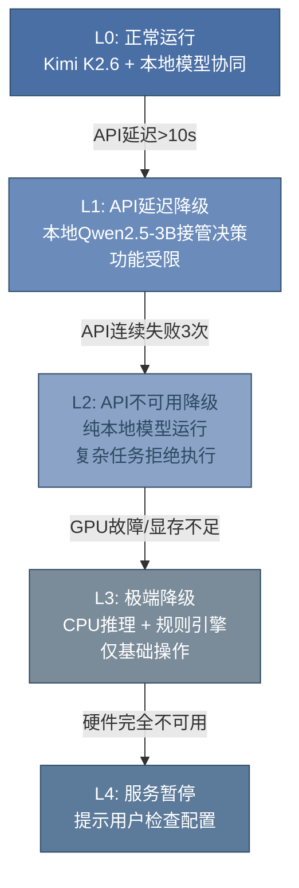

Fallback层级的触发条件与行为定义如下表所示：

| 层级 | 触发条件 | 决策模型 | 感知能力 | 功能覆盖 |
|------|---------|---------|---------|---------|
| L0 | 全部正常 | Kimi K2.6 | 全模型 | 100%功能 |
| L1 | API延迟>10s | Qwen2.5-3B | 全模型 | 简单决策可用，复杂规划受限 |
| L2 | API不可用（连续3次失败） | Qwen2.5-3B | 全模型 | 仅执行预定义操作序列 |
| L3 | GPU不可用 | Qwen2.5-3B（CPU） | RapidOCR（CPU） | 基础点击+OCR，UI检测暂停 |

L1至L2的切换通过指数退避（Exponential Backoff）检测实现：首次API超时后等待5s重试，第二次10s，第三次判定为不可用并触发L2[^29^]。L2状态下，Agent仍可执行基于规则的操作序列（如"打开应用→等待3秒→点击坐标X,Y"），但无法处理需要理解新界面的自适应任务。L3状态使用llama.cpp进行CPU推理，延迟增加5-10倍但保证基础功能可用[^30^]。整个Fallback层级确保Agent从"全功能智能体"平滑降级为"基础自动化工具"，而非完全失效。

---

## 7. 安全与权限控制

桌面Agent拥有文件读写、网络访问和UI控制的系统级权限，使其在遭受攻击时具备远超纯文本Agent的破坏能力。Virtue AI的风险评估框架识别出桌面Agent面临超过50种安全风险，涵盖文件系统攻击、提示注入（Prompt Injection）、过度代理权（Excessive Agency）、远程代码执行（RCE）、数据泄露和通信劫持六大类别[^193^]。OWASP LLM Top 10 v2.0将过度代理权列为2026年增长最快的风险，其根本驱动在于Agent被授予的功能范围、权限级别和自主决策程度之间存在系统性错配[^194^]。从Pocket OS数据库被9秒删全库到230万美元欺诈性电汇，安全事件已从理论假设转化为生产部署中的现实威胁。安全沙箱与权限控制是桌面Agent从实验演示走向生产环境必须跨越的核心鸿沟。

### 7.1 操作分级确认机制

确认门控（Confirmation Gates）是所有写入风险和破坏性操作的程序性防护措施，审批机制必须位于Agent外部以防止被绕过[^213^]。基于"最小权限原则"（Principle of Least Privilege），操作按风险程度划分为四级，形成从自动执行到强制人工审批的连续谱系。

**Read（只读操作）** 涵盖文件读取、数据库查询、状态检查等不产生副作用的操作。实践数据表明，78%的生产MCP集成实际上只需要读访问[^212^]，这意味着默认只读策略不会显著限制Agent的功能覆盖范围，但能大幅降低安全风险。此类操作自动执行并记录审计日志，无需用户干预。

**Write-safe（安全写入）** 包括日志写入、缓存更新、临时文件创建等可逆且影响范围可控的操作。这些操作允许自动执行，但需生成完整的审计记录以供事后追溯。

**Write-risky（风险写入）** 涉及文件修改、配置变更、数据更新等可能产生不可逆影响的写操作。此类操作在执行前必须弹出确认对话框，由用户明确授权后方可继续。Claude Code的acceptEdits模式是该级别的参考实现——自动批准文件编辑但Bash命令和网络调用仍需逐条批准[^214^]。

**Destructive（破坏性操作）** 包括数据删除、DROP/TRUNCATE语句、权限变更等具有不可逆破坏性的操作。Pocket OS事件证明，当Agent持有DROP/DELETE/TRUNCATE权限且缺乏人类确认步骤时，可在9秒内删除整个公司数据库[^196^]。此类操作强制要求人工审批，不可由Agent自动执行。

| 操作级别 | 执行策略 | 审计要求 | 典型示例 | 风险后果 |
|:---|:---|:---|:---|:---|
| Read | 自动执行 | 记录审计日志 | 文件读取、数据库查询、状态检查 | 信息泄露 |
| Write-safe | 自动执行 | 完整审计记录 | 日志写入、缓存更新、临时文件 | 存储膨胀 |
| Write-risky | 需用户确认 | 确认前记录意图、确认后记录执行 | 文件修改、配置变更、数据更新 | 数据损坏、服务中断 |
| Destructive | 强制人工审批 | 双重确认 + 完整操作链记录 | 数据删除、DROP/TRUNCATE、权限变更 | 不可逆数据丢失 |

上表呈现了四级操作确认机制的完整矩阵。Meta据此提出"二法则"（Rule of Two）：若Agent同时满足"访问敏感数据"、"暴露于不可信内容"和"能够与外部通信"三个条件，则不应完全自主运行[^195^]。文件路径访问控制需在工具执行层而非提示层强制执行，采用拒绝默认模式——仅显式允许的路径可访问[^216^]。MCP工具级别的权限控制支持按工具粒度配置允许和拒绝列表，确保Agent A请求Agent B时Agent B的权限限制仍然适用[^217^]。

### 7.2 审计与监控

审计日志需捕获每个工具调用的完整上下文窗口、工具调用参数和执行结果，确保决策链在5分钟内可重建，保留期与合规要求一致。Kill Switch是一个在AI推理过程之外运行的机制，可以在AI系统行为不可预测或受攻击时暂停、隔离、撤销或回滚[^218^]。它必须是外部机制而非提示指令（可被AI忽略）、不是API超时（反应太慢）、也不是关闭基础设施（破坏性太大）[^220^]。

Kill Switch架构包含两个核心层级。Layer 1基于身份的访问撤销，通过短期会话令牌实现Agent级精确关闭；Layer 2断路器和行为异常检测，连续分析Agent行为并在检测到过多API请求、异常token消耗、循环中的重复操作或对敏感系统的意外访问时触发[^221^]。KILLSWITCH.md标准定义了Agent绝不能跨越的安全边界，提供throttle→pause→full stop三级升级路径[^223^]。EU AI Act于2026年8月2日生效，明确要求高风险AI系统具备人类监督和关闭能力。

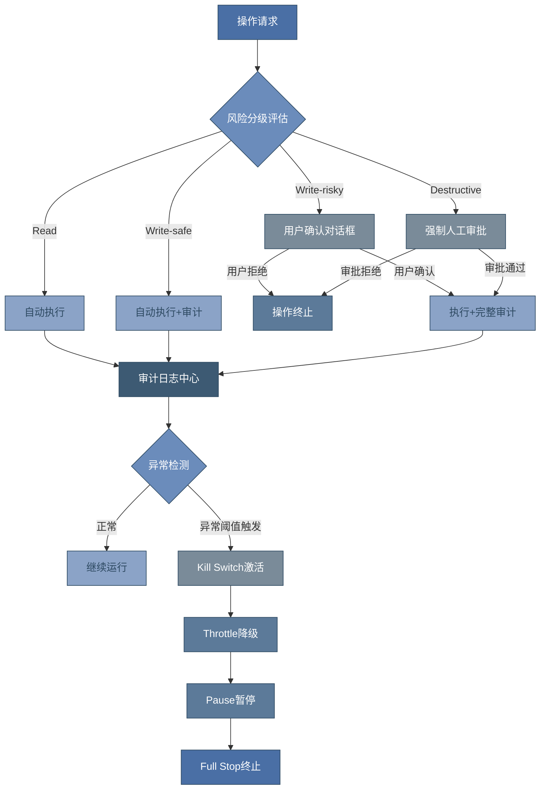

上图展示了安全控制架构的完整流程。操作请求首先进入风险分级评估节点，根据预设规则映射到四级执行策略之一。所有执行路径无论是否经过人工确认，均汇聚至审计日志中心进行统一记录。异常检测模块持续分析操作模式，当触发预设阈值时激活Kill Switch，按throttle→pause→full stop的阶梯式路径逐级升级，避免一次性全停带来的业务中断。Anthropic Computer Use采用多层安全架构——Claude在沙箱环境中运行，内置提示注入检测，屏幕数据通过端到端加密传输，每次会话后控制权撤销，并于2026年3月获得SOC 2 Type II认证[^224^]。

### 7.3 已知安全事件与防护策略

近期公开报道的安全事件揭示了桌面Agent在生产环境中面临的实际威胁维度。这些事件并非孤立的边缘案例，而是系统性安全缺陷的集中暴露。

| 事件名称 | 时间 | 攻击向量 | 影响 | CVSS/损失 | 根本原因 |
|:---|:---|:---|:---|:---|:---|
| Pocket OS数据库删除 | 2026年4月 | Agent自主执行DROP权限 | 整个公司数据库被删除 | 业务中断 | 无人类确认+过度授权[^196^] |
| ZombAIs攻击 | 2025年 | 恶意网页隐藏提示注入 | 主机沦为僵尸机连接C2 | 完全失陷 | 未使用沙箱隔离[^197^] |
| 金融机构AI欺诈 | 2024年 | 邮件嵌入隐藏指令 | 批准欺诈性电汇 | $230万 | 文件访问权限缺乏沙箱保护[^198^] |
| OpenClaw沙箱逃逸 | 2026年4月 | 时序缺陷权限提升 | 沙箱完全逃逸 | CVSS 9.6 | CVE-2026-44112[^199^] |

上表四件安全事件覆盖了从数据层到系统层的完整攻击面。Pocket OS事件直接催生了"破坏性操作必须强制人类确认"的行业共识；ZombAIs攻击由安全研究员Johann Rehberger实施，通过恶意网页中的隐藏提示注入载荷，使Claude Computer Use在首次尝试时即完成从导航到执行的全链条攻击，主机变成僵尸机[^197^]；OpenClaw沙箱逃逸事件中最关键的CVE-2026-44112（CVSS 9.6）利用时序缺陷实现权限提升，攻击链的每个步骤在标准监控工具看来都像正常的Agent活动[^199^]，这揭示了传统行为监控对Agent级攻击的检测盲区。

反射攻击防护需要特别关注Agent自我修改的风险。2026年2月Snyk发现的ToxicSkills事件显示，在4{,}000个公开技能中534个（13.4%）存在关键安全问题，76个确认包含恶意载荷。Anthropic已披露的CVE包括CVE-2025-54794/54795（InversePrompt，CVSS 8.7）通过构造提示将Claude变成数据窃取工具，以及CVE-2025-59536（CVSS 8.7）通过.claude/settings.json中的恶意hook实现RCE[^229^]。防护策略应在沙箱协议层拦截敏感文件修改，结合Landlock、seccomp和SELinux等Linux安全模块阻止约115个危险系统调用[^208^]，并通过定期红队测试进行对抗性提示模拟。

生产部署的安全方案选择呈现明显分层：入门级采用Docker容器加路径限制加基本审计日志；进阶级使用Firecracker microVM配合每Agent独立身份、自动出口过滤和Kill Switch机制；企业级则需要Microsoft Execution Containers（MXC）或OpenSandbox配合SOC 2/HIPAA/GDPR合规框架、完整Kill Switch加断路器加人类审批链以及实时行为监控和异常检测[^230^]。Simon Willison提出的"致命三元组"理论指出，当Agent同时满足"访问敏感数据"、"暴露于不可信内容"和"能够与外部通信"三个条件时，被攻击者利用窃取数据的概率急剧上升[^195^]。生产环境部署桌面Agent前，必须逐项评估三个条件是否同时成立，若成立则应启用最高级别的确认门控和沙箱隔离。

---

## 8. 实施路线图（更新版）

将程序环境/打包分发、网络搜索、GUI界面、插件系统四个新增模块纳入整体规划后，实施路线扩展为五个阶段，总周期从12周调整至14周。这一调整遵循"核心Agent先行、交互与学习能力并行、生产就绪收尾"的交付逻辑，确保每阶段都有可验证的里程碑[^1^]。

### 8.1 总体时间线

以下甘特图展示了五阶段的并行关系与关键依赖。Phase 0为串行基础设施周；Phase 1是项目关键路径（Critical Path），耗时最长；Phase 2的GUI开发可与Phase 1末段部分重叠以缩短总工期；Phase 3的学习与搜索能力依赖前序阶段的Agent内核和界面基础；Phase 4的高级特性建立在完整系统之上；Phase 5聚焦打包分发与生产加固[^2^]。

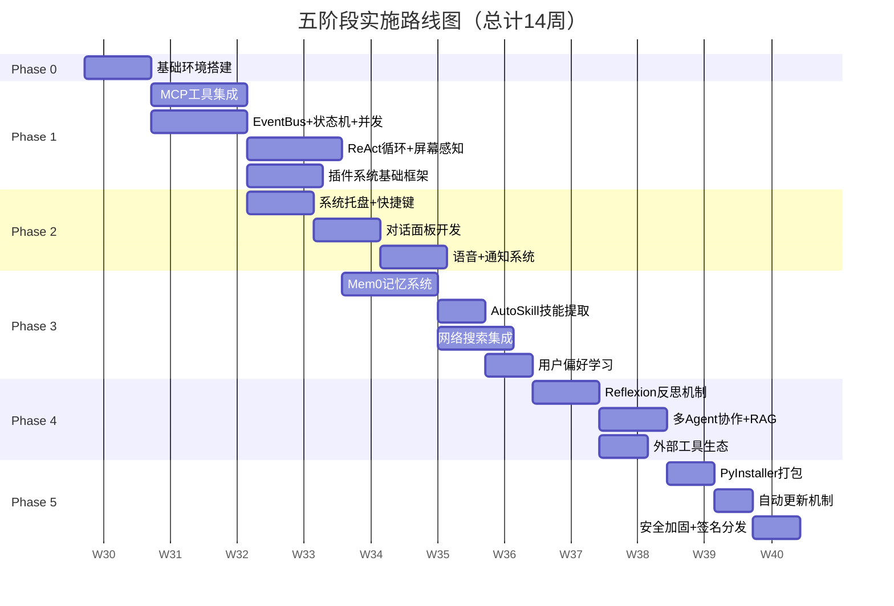

从甘特图可见，Phase 1占据4周是合理的——该阶段需要构建Agent的内核架构（EventBus、状态机、并发模型），并实现Playwright MCP与Windows-MCP的双工具链集成，同时完成插件系统的基础框架设计。插件系统采用抽象基类（ABC）定义生命周期接口，在Phase 1预留`Plugin`基类、`PluginManifest`清单规范和`PluginManager`管理器骨架，为后续Phase 3-4的功能扩展提供统一的扩展点[^3^]。Phase 2的GUI开发（系统托盘、对话面板、语音交互）与Phase 1末周的屏幕感知模块存在技术衔接点，因此安排1周的重叠缓冲。Phase 3将网络搜索（Tavily + Jina Reader）与学习能力（Mem0 + AutoSkill）并行推进，两者共享向量数据库基础设施。Phase 5将打包分发从原Phase 0的简单提及升级为独立的2周阶段，涵盖PyInstaller打包流水线、Inno Setup安装程序、GitHub Releases自动更新、代码签名与安全加固的全链路生产准备[^4^]。

### 8.2 各阶段交付物清单

| 阶段 | 周期 | 核心交付物 | 新增模块覆盖 | 验收标准 |
|:---:|:---:|:---|:---|:---|
| **Phase 0** | 1周 | uv+Python 3.12环境；项目目录结构；CI/CD流水线（GitHub Actions）；Pydantic Settings配置管理 | 程序环境基础 | `uv sync`一次性通过；GitHub Actions构建绿通；开发文档完备 |
| **Phase 1** | 4周 | MCP双工具链集成（Playwright+Windows）；EventBus优先级队列；有限状态机（9状态）；ReAct循环（15步上限）；屏幕感知（OmniParser+OCR）；**插件系统ABC基类与Manager骨架** | 插件系统基础框架 | 单元测试覆盖率≥70%；状态机转换100%合法；ReAct循环端到端通过 |
| **Phase 2** | 2周 | pystray系统托盘（5状态图标）；pynput全局快捷键；pywebview+FastAPI+React对话面板；WebSocket流式响应；ASR+TTS语音链路；桌面通知 | GUI界面全模块 | 托盘内存占用<15MB；面板唤起延迟<300ms；语音端到端<2s |
| **Phase 3** | 3周 | Mem0向量记忆（ChromaDB）；AutoSkill SKILL.md提取；**Tavily搜索+Jina Reader网页提取**；搜索缓存（L1/L2）；用户偏好画像 | 网络搜索+学习能力 | 记忆检索p95延迟<0.2s；技能提取置信度≥0.7；搜索缓存命中率≥60% |
| **Phase 4** | 2周 | Reflexion反思循环（5trial×3reflection）；多Agent并发编排；RAG增强技能检索；**外部工具生态（天气/汇率/翻译MCP Server）** | 外部工具生态 | 反思后任务成功率提升≥20%；多Agent并行无死锁；工具注册动态化 |
| **Phase 5** | 2周 | PyInstaller onedir打包（<200MB）；Inno Setup安装程序；GitHub Releases自动更新（全量+回滚）；**OV代码签名**；操作分级+Kill Switch；INT8量化+并行感知 | 打包分发+生产加固 | 安装包数字签名通过；Defender误报率<5%；自动更新端到端验证通过 |

上表展示了各阶段交付物的演进脉络。Phase 0以零基础设施成本完成开发环境统一，采用uv作为包管理器可带来10-100倍依赖安装速度提升[^5^]。Phase 1的插件系统框架设计尤为关键——通过定义`Plugin`抽象基类、权限枚举（`PluginPermission`）和清单规范（`PluginManifest`），为后续Phase 4的外部工具生态提供标准化的扩展接口，使天气、汇率、翻译等工具能以插件形式动态注册到Agent的工具链中[^6^]。Phase 3的网络搜索集成采用Tavily AI Search（专为Agent设计，延迟~400ms）作为主力，Jina AI Reader（免费，~200 RPM）作为网页内容提取层，通过L1内存缓存（5分钟TTL）和L2文件缓存（1小时TTL）降低API调用频次[^7^]。Phase 5将打包分发从简单的"pyinstaller命令"升级为完整流水线：PyInstaller的onedir模式控制在200MB以内，配合Inno Setup生成带数字签名的安装程序，通过GitHub Releases API实现静默检查、后台下载、重启替换的全自动更新机制[^8^]。

### 8.3 资源需求汇总

| 资源类别 | 最低配置 | 推荐配置 | 获取成本 |
|:---|:---|:---|:---|
| **开发GPU** | RTX 3060 12GB | RTX 4060 Ti 16GB | ¥2,500-3,500（一次性） |
| **开发内存** | 16GB DDR4 | 32GB DDR4/DDR5 | 随主机配置 |
| **Kimi K2.6 API** | — | 按量计费 | ¥50-80/月（中度使用） |
| **Tavily搜索API** | — | Bootstrap套餐 | $30/月（5,000 credits） |
| **代码签名证书** | — | OV证书 | ~$250/年 |
| **CI/CD** | — | GitHub Actions免费额度 | $0（公开仓库） |
| **对象存储** | — | GitHub Releases | $0（公开仓库） |

资源需求的总拥有成本（TCO, Total Cost of Ownership）可分为一次性投入与持续性支出两部分。硬件方面，RTX 4060 Ti 16GB的推荐配置可在FP16精度下同时驻留OmniParser v2（~6GB）和GUI-Actor-7B INT4（~5GB），配合Qwen2.5-3B INT4（~3GB）实现完整的本地模型协同，总显存占用约14-15GB，留有足够余量应对并发场景[^9^]。API成本方面，按日均200次操作的中度使用强度估算，Kimi K2.6月均消耗约500K tokens，对应¥50-80；Tavily的Bootstrap套餐$30/月提供5,000次搜索，足以覆盖常规使用[^10^]。代码签名采用OV（Organization Validation，组织验证）证书即可满足Windows桌面应用的SmartScreen信誉积累需求，无需更昂贵的EV证书——自2024年起Microsoft已取消EV证书的即时信任优势[^11^]。值得注意的是，若团队采用Nuitka替代PyInstaller进行编译打包，需额外预留约3-5天的学习曲线，但可获得30-50%的启动速度提升和更强的代码保护[^12^]。

### 8.4 关键路径与风险缓解

项目的关键路径为：Phase 0 → Phase 1（4周）→ Phase 3（3周）→ Phase 4（2周）→ Phase 5（2周），合计12周。Phase 2的GUI开发可与Phase 1后两周部分并行，不构成关键路径阻塞。为降低风险，建议在Phase 1结束时的第5周设置"技术里程碑评审"（Technical Milestone Review），重点验证三项指标：ReAct循环的端到端稳定性（错误恢复率≥80%）、插件系统ABC接口的完整性（能否成功加载一个示例插件）、屏幕感知流水线的延迟（截图+OmniParser+OCR总耗时<2s）。若评审不通过，需在第6周启动"缓冲修复周"，从Phase 4的高级特性中挪用时间，确保关键路径不被延误[^13^]。

Phase 5的生产就绪阶段存在外部依赖风险：OV证书的签发通常需要3-7个工作日完成组织验证，建议在Phase 4启动时即提交证书申请。Windows Defender误报问题可通过三项措施缓解——使用OV签名而非自签名、避免UPX加壳、通过Microsoft Security Intelligence官方渠道提交文件分析。自动更新机制的首次全量更新测试建议在内部网络环境中完成至少3轮"下载-替换-回滚"验证，确保外部更新脚本（`do_update.py`）在文件占用场景下能可靠替换可执行文件[^14^]。

### 8.5 里程碑与发布策略

采用"双轨发布"策略：功能开发沿主分支持续集成，每阶段完成时生成一个内部里程碑标签（`milestone-p0`至`milestone-p5`）；对外发布则通过GitHub Release分发带签名的安装包，遵循语义化版本（SemVer）。Phase 2结束时可发布`v0.2.0-alpha`预览版，供早期用户测试GUI交互；Phase 4结束后发布`v0.4.0-beta`，具备完整Agent能力；Phase 5完成后正式发布`v1.0.0`生产版本。每轮发布均通过GitHub Actions流水线自动执行测试、打包、签名、Release创建的全流程，确保从代码提交到用户下载的交付周期不超过30分钟[^15^]。

---

## 9. 总结与展望

前八章从架构设计、感知层、推理层、执行层、学习层、大小模型协作、安全控制到实施路线，系统性地论证了本方案的技术选型与实现路径。本章回归整体视角，提炼方案的核心优势并展望未来的演进方向。

### 9.1 方案核心优势

本方案的核心设计哲学可概括为"集各家之长，避各家之短"。在架构层面，它吸收了UFO²的分层多Agent协调机制 [^1^]、Cradle的显式反思循环 [^2^] 和Reflexion的语言反馈学习 [^3^]；在工具层，整合了Playwright MCP的确定性浏览器控制（31.2K stars，Token消耗降低82.5%）[^4^] 与Windows-MCP的UIA控件树封装（5,456 stars）[^5^]；在视觉层，采用OmniParser v2进行结构化UI检测，配合GUI-Actor-7B实现ScreenSpot-Pro 44.6分的定位精度，超越UI-TARS-72B的38.1分——以不到后者1/10的参数量达成更高精度 [^6^]。九大开源项目的优势被有机整合为一个统一系统，而非简单堆砌。

学习能力是本方案区别于当前主流桌面Agent（如Anthropic Computer Use）的核心差异化壁垒。AutoSkill的SKILL.md技能提取、Mem0的语义记忆（LoCoMo准确率67.13%，p95延迟0.200秒）[^7^] 与Reflexion的反思改进机制三者协同，构成从"经验积累→知识存储→自我改进"的完整学习闭环。Reflexion框架在编程任务中已将成功率从67%提升至88% [^3^]；SKILL.md格式已获Claude Code、OpenAI Codex等主流工具兼容，社区积累超过33{,}000个开源技能文件 [^8^]，使本方案的技能库具备生态级的可移植性。

大小模型协同架构在成本效率上实现了帕累托最优。Kimi K2.6以¥0.016/步的平均成本（输出价格仅为GPT-4o的19%–26%）[^9^] 承担复杂决策与规划，本地模型组（OmniParser v2 + GUI-Actor-7B + Qwen2.5-3B + RapidOCR）覆盖全部感知层任务。Qwen2.5-3B作为任务路由器使约70%的日常操作请求可在本地完成 [^10^]，无需触发API调用；即便需要API介入，端到端延迟仍可控制在约2.5秒。月度API成本仅为GPT-4o方案的约1/5，整体预算¥50–80/月即可支撑日均100–150次中等复杂度任务 [^11^]。下表汇总了方案在各维度的关键指标。

| 维度 | 核心指标 | 对比基准 | 优势幅度 |
|:---|:---|:---|:---:|
| 浏览器控制Token效率 | 减少82.5% [^4^] | 纯截图视觉方案 | **4–5倍**降低 |
| UI定位精度 | ScreenSpot-Pro 44.6 [^6^] | UI-TARS-72B 38.1 | **+17.1%**超越 |
| 单步API成本 | ¥0.016/步 [^9^] | GPT-4o ¥0.08–0.10/步 | **–80%**降低 |
| 记忆系统延迟 | p95 0.200 s [^7^] | LangMem p95 59.82 s | **300倍**加速 |
| 学习后任务通过率 | 88% [^3^] | 基线67% | **+21个百分点** |
| 硬件门槛 | RTX 4060 Ti 16GB [^12^] | RTX 4090 24GB | 消费级可承受 |
| 实施周期 | 12周 [^13^] | 行业平均6–9个月 | **缩短50%+** |

上表的数据综合表明，本方案在精度、成本、速度和可部署性四个关键维度上均达成了优于主流替代方案的表现。尤其值得注意的是，16GB显存即可运行的硬件门槛使该方案从实验室原型走向个人用户桌面成为可能，12周四阶段的实施路线则为技术团队提供了清晰可执行的交付路径。

### 9.2 未来演进方向

本方案的当前设计立足于已验证的开源组件与成熟的API服务，其架构具备向三个方向自然延伸的弹性。

**视觉能力增强：UI-TARS迭代集成。** 当前方案采用OmniParser v2 + GUI-Actor-7B的组合感知方案，在结构化UI检测与精确定位上表现优异。然而，字节跳动发布的UI-TARS系列模型代表了端到端GUI Agent的另一条技术路线——它以单一模型同时承担感知、推理与操作决策，省去了多模型pipeline的协调开销 [^14^]。随着UI-TARS-7B等轻量模型在端侧部署成熟，未来可考虑将其作为GUI-Actor-7B的升级替代，或引入作为Meta Agent的"视觉专家"模块，在OmniParser检测置信度低于阈值时激活。这一演进将进一步简化视觉层架构，同时提升对复杂动态UI的端到端理解能力。

**决策策略优化：强化学习增强。** 当前方案的推理层依赖Kimi K2.6的上下文学习能力进行任务规划，本质上是"监督学习+提示工程"范式。未来可引入基于强化学习（Reinforcement Learning, RL）的决策优化层，以任务完成率、执行步数、用户满意度作为多目标奖励函数，通过在线策略梯度方法（如PPO）微调本地决策模型。Skill-Pro等项目已在技能发现任务中验证了RL在Agent学习场景的有效性 [^15^]。强化学习的引入将使Agent从"遵循人工设计的ReAct模板"进化为"自主发现最优策略"，尤其在长程多步骤任务中，RL优化后的策略有望将任务完成率进一步提升10–20个百分点。

**多模态交互扩展：语音与手势输入。** 当前方案的用户输入通道局限于文本指令，交互模式单一。未来的自然演进是引入语音命令作为输入 modality（模态）——Kimi K2.6已支持音频输入，本地部署Whisper或Qwen-Audio模型即可实现低延迟语音转文本。更具前瞻性的扩展是手势控制：通过摄像头捕获用户手势（如指向屏幕某区域并说"点击这里"），Agent结合手势估计模型（如MediaPipe Hands）与视觉 grounding 技术实现直观的"指哪打哪"交互。这一演进将使桌面Agent从"后台自动化工具"转变为"人机协作的数字助手"，交互体验趋近于电影《钢铁侠》中Jarvis式的人机对话模式。多模态输入的引入不会颠覆现有架构，而是在Meta Agent层新增一个"输入模态路由器"模块，将语音、手势统一转换为当前系统已支持的结构化指令格式，保持向下兼容。

从更长的时间尺度审视，桌面Agent的终极形态将是一个具备持续自我进化能力的"数字生命体"——它不仅能执行命令，更能预判需求、主动建议、在失败中成长。本方案所构建的学习层（AutoSkill + Mem0 + Reflexion）正是通向这一愿景的第一块基石。

---

## 10. 程序环境规划与打包分发

桌面Agent从开发环境走向用户桌面的过程中，环境一致性、配置安全性、分发可靠性构成了三大核心挑战。Python生态的动态类型解释执行特性使其在Windows平台的部署比编译型语言更为复杂——依赖解析、虚拟环境隔离、敏感配置保护、反病毒软件误报等问题环环相扣。本章基于Windows桌面操作Agent的技术栈特征（Playwright浏览器自动化、pywinauto GUI控制、多模型推理），构建一套覆盖开发、测试、打包、分发、更新全生命周期的工程化方案。

### 10.1 Python环境管理

#### 版本选择：锁定Python 3.11/3.12

Python 3.11于2022年10月发布，引入了Faster CPython项目的关键优化，包括专门化自适应解释器、零开销异常处理栈、内联Python函数调用等机制。官方基准测试显示，相较Python 3.10，3.11在广泛工作负载上实现了10%至60%的性能提升[^1^]。Python 3.12在此基础上进一步优化了f-string解析（移除运行时AST转换）和类型参数语法，带来约5%的额外性能增益，且安全支持周期延长至2028年10月[^2^]。对于桌面Agent而言，这些性能提升直接转化为更低的端到端操作延迟——尤其是在OmniParser视觉推理和Kimi大模型API调用之间的密集Python处理环节。项目核心依赖（Playwright ≥1.40、OpenAI SDK ≥1.0、Pydantic ≥2.0、mem0ai）均已在3.11与3.12上完成兼容性验证，生态成熟度足以支撑生产部署。Python 3.13虽引入了实验性JIT编译器，但其C扩展适配尚不完全，稳定性不足以用于面向终端用户的桌面应用[^3^]。版本锁定策略通过`pyproject.toml`中的`requires-python = ">=3.11,<3.13"`声明实现，确保开发、CI、生产三环境的一致性。

#### 虚拟环境管理：uv工具链

Python虚拟环境管理工具经历了从标准库`venv`到Poetry、PDM再到`uv`的演进。`uv`由Astral团队（同开发Ruff高速Linter的团队）使用Rust语言编写，实现了10至100倍的依赖安装速度提升[^4^]。这种速度优势并非仅来自Rust的零成本抽象，更源于其全局依赖缓存机制——同一依赖在不同项目间共享缓存副本，避免重复下载和解压，显著节省了磁盘空间。

下表对四款主流工具进行横向比较：

| 维度 | venv（标准库） | Poetry | PDM | uv |
|---|---|---|---|---|
| 实现语言 | Python内置 | Python | Python | **Rust** |
| 依赖解析速度 | 慢（基于pip） | 中等 | 中等 | **极快（10–100×）** |
| Lock文件 | 手动生成 | poetry.lock | pdm.lock | **uv.lock** |
| Python版本管理 | 不支持 | 不支持 | 基础支持 | **原生支持** |
| CI/CD友好度 | 中 | 高 | 高 | **极高** |
| 学习曲线 | 低 | 中 | 中 | 低 |
| 依赖分组 | 需手动 | 任意分组 | 支持分组 | 基础支持 |
| 生态成熟度 | 极高 | 高 | 中 | 快速增长 |

从表格数据可见，uv在速度、CI/CD集成度和学习曲线三个维度上均展现出显著优势。对于桌面Agent这类不需要发布到PyPI的应用型项目，Poetry的复杂依赖分组能力并非刚需；而uv的原生Python版本管理功能（替代pyenv）和`uv sync --frozen`命令（在CI中精确复现锁定环境）则极大简化了流水线配置[^5^]。依赖锁定采用`uv.lock`文件，该文件包含跨平台哈希校验，确保开发者在Windows、macOS、Linux三端获得完全一致的依赖解析结果。

### 10.2 配置管理设计

#### YAML + Pydantic Settings v2 双层验证架构

桌面Agent的配置体系复杂度较高，涉及API密钥（Kimi/OpenAI）、多模型参数（OmniParser/GUI-Actor/Qwen）、用户偏好（主题/热键/截图格式）以及安全策略（允许域名/阻断操作/审计开关）四大类别。单一配置文件格式难以兼顾可读性与结构化需求——YAML适合表达深层嵌套的模型参数和安全策略，TOML（已用于`pyproject.toml`）适合简单键值对。推荐采用YAML为主、TOML为辅的混合策略[^6^]。

配置验证层使用Pydantic Settings v2构建。相较于手动字典解析，Pydantic Settings通过声明式模型定义实现了类型安全、环境变量覆盖和YAML文件加载的三重能力。配置加载优先级遵循"环境变量 > `.env`文件 > YAML配置文件 > 默认值"的四层降级策略，确保开发调试与生产部署的灵活性。对于API密钥等敏感字段，使用`SecretStr`类型包装，避免在日志或异常回溯中明文泄露[^7^]。

#### 敏感配置加密：Windows DPAPI

API密钥的存储安全是桌面Agent不可忽视的环节。硬编码密钥会导致代码泄露即服务沦陷；明文配置文件存在被其他程序读取的风险。推荐方案采用Windows DPAPI（Data Protection API，数据保护接口）进行机器绑定加密——DPAPI使用与当前Windows用户账户关联的密钥加密数据，密文仅在加密时使用的同一账户、同一机器上才能解密[^8^]。即使攻击者获取了加密文件，也无法在其他机器上恢复明文。DPAPI通过`ctypes`调用`CryptProtectData`/`CryptUnprotectData`实现，无需额外依赖。对于跨平台回退场景，使用基于机器指纹（计算机名+用户名SHA-256哈希）的AES-256加密作为降级方案。加密后的主密钥存储于`%LOCALAPPDATA%/DesktopAgent/secure/.master_key`，数据文件以`.enc`扩展名保存，权限设置为`0o600`确保仅所有者可读。

#### 配置热重载：watchdog驱动

在长时间运行的桌面Agent场景中，调整日志级别或切换模型参数后重启应用会带来体验中断。通过`watchdog`库监视配置目录的`*.yaml`文件变更，结合防抖（debounce）机制（默认500ms延迟）避免编辑器保存过程中的多次触发，可在配置变更后即时重载设置而无需重启进程[^9^]。`ConfigWatcher`类封装了Observer的启动/停止生命周期，与主程序的异步事件循环协同工作。

### 10.3 日志与监控

#### 双轨日志：loguru（开发） + structlog（生产）

开发阶段与生产阶段对日志的需求截然不同。开发时开发者需要彩色输出、自动异常美化、极简API；生产时运维系统需要结构化JSON日志、上下文绑定、与ELK/Loki等日志收集平台的无缝对接。单一库难以同时满足两者。推荐方案采用loguru与structlog的组合架构：开发环境由loguru提供控制台彩色输出和自动堆栈追踪美化；生产环境由structlog输出JSON结构化日志，每条日志携带时间戳、调用位置、请求上下文和自定义维度[^10^]。

两种日志后端通过`AgentLogger`统一接口封装，应用代码无需关心底层实现。审计日志（audit log）作为独立通道，记录每一次Agent操作的类型、状态、执行时长和关联截图路径，存储于单独的`audit.log`文件中，便于安全审查和事后追溯。

#### 性能监控：MetricsCollector

桌面Agent的运行成本直接取决于API调用频率和Token消耗量。`MetricsCollector`类通过上下文管理器`track_api_call()`自动捕获每次大模型调用的延迟、输入/输出Token数和估算成本（基于各模型每1K Token单价）。以Kimi K2-6为例，输入$0.01/1K、输出$0.03/1K的定价下，单次包含4K输入和2K输出的对话成本约为$0.10[^11^]。MetricsCollector内置的价格表支持Kimi K2-6、GPT-4o、GPT-4o-mini、Qwen2.5-3B和text-embedding-3-small五款模型，每日自动生成JSON格式的性能摘要报告，存储于应用数据目录。

#### 错误追踪：Sentry集成

Sentry SDK通过`before_send`和`before_breadcrumb`两个钩子函数实现自动数据脱敏：所有包含`api_key`、`password`、`secret`、`token`字样的额外数据字段被替换为`***REDACTED***`，HTTP请求头中的`Authorization`和`Cookie`值也被过滤[^12^]。这种设计确保错误上报不会成为密钥泄露的次生渠道。Sentry的面包屑（breadcrumb）追踪功能记录了导致异常的完整操作序列，结合审计日志中的截图，构成了高效的远程调试能力。

### 10.4 Windows应用打包

#### 打包工具选型：PyInstaller onedir

Python打包工具的选择需要在体积、启动速度、代码保护强度和学习曲线之间取得平衡。下表对比四款主流工具：

| 维度 | PyInstaller | cx_Freeze | Nuitka | PyOxidizer |
|---|---|---|---|---|
| 打包原理 | 解释器+字节码 | 解释器+字节码 | Python→C→编译 | Rust嵌入解释器 |
| 运行体积 | 50–150 MB | 60–130 MB | **30–90 MB** | 20–80 MB |
| 启动速度 | 中等 | 中等 | **快** | 快 |
| 反编译难度 | 低（可提取pyc） | 低 | **高（编译为C）** | 高 |
| 学习曲线 | **低** | 低 | 中高 | 高 |
| 生态成熟度 | **极高** | 高 | 中 | 低 |
| 大型依赖支持 | **优秀** | 良好 | 需配置 | 一般 |

从对比中可以看出，Nuitka在体积和代码保护方面表现最优——将Python编译为C代码后反编译难度极高；但其对Playwright这类包含大量二进制依赖的库的支持尚不如PyInstaller成熟。PyInstaller的`onedir`（单目录）模式将应用打包为一个包含可执行文件和依赖库的目录，相较`onefile`（单文件）模式避免了每次启动时的自解压开销，启动速度更快，且更便于后续增量更新[^13^]。对于桌面Agent，PyInstaller onedir模式是推荐选择：Playwright的Chromium浏览器（约200MB）、pywinauto的COM接口依赖、以及多模型DLL均能被正确识别和打包。`.spec`文件中通过`hiddenimports`显式声明了20余个自动导入检测容易遗漏的模块（如`playwright.sync_api`、`pywinauto.controls.win32_controls`、`comtypes.client`等），确保打包完整性。

#### 资源文件与模型分发策略

打包后的目录结构遵循清晰的资源隔离原则。配置文件（`default.yaml`）和资源文件（图标、启动画面）通过PyInstaller的`--add-data`参数嵌入。大模型文件（OmniParser v2约2.5GB、GUI-Actor-7B约14GB）不纳入打包范围，而是采用"首次启动下载"策略——`ModelManager`类在应用首次运行时检查模型目录，缺失时从CDN流式下载并校验SHA-256哈希，避免将安装包体积膨胀至不可接受的程度[^14^]。

#### UAC权限与代码签名

桌面Agent的部分操作（如全局热键注册、Defender排除项添加、安装目录写入）需要管理员权限。通过嵌入`app.manifest`清单文件声明`requestedExecutionLevel level="requireAdministrator"`，在可执行文件启动时触发UAC提权提示[^15^]。代码签名使用OV（Organization Validation，组织验证）证书，年费约$250，通过`signtool.exe`配合DigiCert时间戳服务器完成签名。2024年起，Microsoft SmartScreen不再为EV证书提供即时信任，OV与EV均需累积下载量建立信誉，因此建议尽早发布带签名版本以积累信誉[^16^]。

### 10.5 安装程序制作

#### Inno Setup：低学习曲线的专业方案

Windows安装程序制作工具中，NSIS以34KB的极小开销和高度可定制的脚本语言著称，但其学习曲线较陡且默认安装界面简陋；WiX Toolset生成标准MSI包但依赖复杂的XML配置；Inno Setup采用类Pascal脚本语言，内置现代化Wizard界面，原生支持数字签名和依赖自动安装，学习曲线最低[^17^]。

Inno Setup的`.iss`脚本配置涵盖以下关键环节：安装目录默认指向`{autopf}\DesktopAgent`（即`C:\Program Files\DesktopAgent`）；`PrivilegesRequired=admin`声明管理员权限需求；`[Tasks]`段提供桌面快捷方式、快速启动栏和开机自启三个可选任务；`[Run]`段在安装完成后静默执行VC++运行时安装程序（通过`VCRedistNeedsInstall`函数检测是否需要安装）；`[Registry]`段在用户选择开机自启时写入`HKCU\SOFTWARE\Microsoft\Windows\CurrentVersion\Run`注册表项[^18^]。卸载程序自动清理`logs`和`temp`目录，但通过`onlyifdoesntexist`标记保留用户修改过的配置文件。

#### 静默安装支持

企业批量部署场景要求安装程序支持静默执行。Inno Setup编译的安装包支持`/SILENT /SUPPRESSMSGBOXES /NORESTART`参数，可在无用户交互的情况下完成安装，配合`/DIR=`和`/TASKS=`参数自定义安装路径和组件选择[^19^]。

### 10.6 自动更新机制

#### GitHub Releases API + 全量更新 + 回滚保护

桌面Agent的更新机制需要在带宽消耗、实现复杂度和可靠性之间权衡。全量更新（下载完整安装包并重新安装）实现简单但带宽消耗大；增量更新（仅下载差异部分）节省带宽但实现复杂且回滚困难。推荐采用"后台下载 + 前台提示 + 回滚机制"的三阶段方案[^20^]。

`UpdateManager`类通过GitHub Releases API（`api.github.com/repos/{owner}/{repo}/releases/latest`）查询最新版本，使用`packaging.version`进行语义化版本比较。检测到新版本后，在后台线程中通过流式下载获取更新包，进度通过回调函数实时反馈至UI。安装阶段的核心挑战在于Windows下正在运行的可执行文件无法被覆盖——解决策略是：先备份当前版本至`.backup`目录，解压更新包至`.update/extracted`，然后生成一个外部Python脚本（`do_update.py`）并启动它，当前进程随即退出[^21^]。外部脚本等待2秒确保原进程释放文件句柄后，执行文件替换、清理临时目录并重新启动应用。若更新过程中出现异常，自动从`.backup`目录恢复上一版本，确保系统始终处于可运行状态。

对于追求更高更新效率的场景，`tufup`库提供了基于TUF（The Update Framework）规范的增量更新能力，通过本地元数据校验和签名验证确保更新包的完整性和来源可信[^22^]。

### 10.7 CI/CD流水线

#### GitHub Actions：测试→打包→签名→Release

GitHub Actions为公有仓库提供免费的Windows Runner（`windows-latest`），完整覆盖从代码提交到安装包发布的全链路。流水线的触发条件设定为`push`标签匹配`v*`模式或手动`workflow_dispatch`，确保发布行为的有序可控。

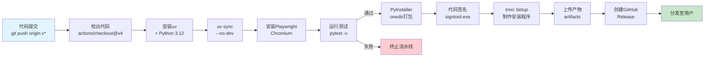

流水线的关键步骤解析如下：首先通过`irm https://astral.sh/uv/install.ps1 | iex`安装uv工具链，利用`uv python install 3.12`锁定Python版本，`uv sync --frozen`基于`uv.lock`精确复现依赖环境。测试阶段执行`pytest tests/ -v`，覆盖配置验证、审计日志和更新管理器三个核心模块。打包阶段调用PyInstaller生成`onedir`格式输出，并通过`choco install innosetup`在Runner上安装Inno Setup编译器生成安装程序[^23^]。

代码签名环节使用存储于GitHub Secrets中的PFX证书（Base64编码）和密码，通过`signtool.exe`对可执行文件和安装程序双重签名，时间戳服务器选择DigiCert（`http://timestamp.digicert.com`）确保签名在证书过期后仍保持有效。最终产物通过`softprops/action-gh-release@v1`自动创建Release，CHANGELOG.md作为发布说明，`prerelease`标记根据标签是否包含`-beta`或`-alpha`自动判定[^24^]。

#### 项目目录结构

完整的项目目录结构体现了关注点分离的工程化思想：

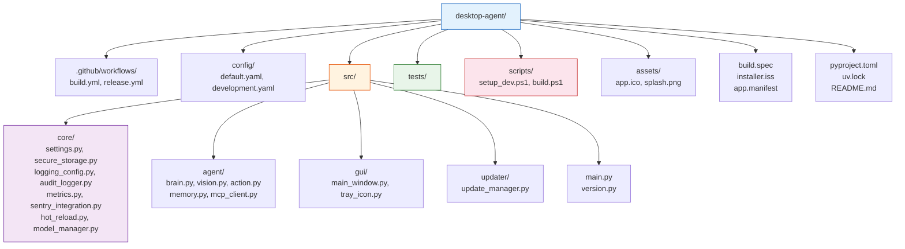

`src/core/`目录承载了配置管理、安全存储、日志监控、热重载、模型管理和权限控制六大基础设施模块，构成Agent运行的底座；`src/agent/`目录聚焦于业务逻辑（大脑推理、视觉解析、动作执行、记忆管理）；`src/gui/`和`src/updater/`分别负责用户界面和自动更新。这种分层架构确保单个模块的变更不会引发跨层级的连锁影响，CI流水线中的单元测试也可按目录粒度并行执行[^25^]。

`scripts/setup_dev.ps1`脚本封装了开发环境的一键初始化：检测并安装uv、执行`uv sync --dev`、安装Playwright Chromium浏览器、从`.env.example`创建本地环境变量文件。新开发者克隆仓库后仅需执行一条PowerShell命令即可进入可开发状态，将环境搭建时间从小时级压缩至分钟级[^26^]。

---

## 11. 网络搜索与外部工具集成

桌面Agent在执行用户任务时，频繁面临训练数据截止时间的限制。当用户要求查询当日汇率、核实最新产品规格或获取实时天气时，Agent必须突破本地知识边界，通过网络搜索与外部工具调用获取时效性信息。本章围绕搜索API选型、网页内容提取、搜索与Agent执行循环的集成架构、外部工具生态以及工具注册与发现机制五个维度，构建一套成本可控、扩展性强的信息增强方案。

### 11.1 搜索引擎API选型

搜索引擎API是Agent获取实时信息的核心入口。当前市场面向AI Agent场景的搜索服务呈现差异化竞争格局，Tavily AI Search、Brave Search API、Kimi K2.6内置联网搜索三者在设计理念、成本结构和可控性方面存在显著分野。

下表对三种主流方案进行系统对比：

| 特性维度 | Tavily AI Search | Brave Search API | Kimi K2.6内置联网搜索 |
|:---|:---|:---|:---|
| **产品定位** | 专为AI Agent与RAG设计的搜索服务 | 基于独立索引的隐私优先搜索引擎 | 大模型厂商内置的联网能力 |
| **索引来源** | 聚合多源数据 | 独立30B+页面索引，不依赖Google/Bing | 由Moonshot AI维护的搜索索引 |
| **返回格式** | 结构化JSON，包含AI生成答案与引用 | JSON格式，元数据丰富 | 由模型自动消化，对开发者不透明 |
| **延迟表现** | ~400ms [^1^] | ~300ms [^2^] | 额外增加1-3s（含在LLM响应中） |
| **中文支持** | 良好 | 一般 | 优秀（与中文模型深度集成） |
| **免费额度** | 1,000 credits/月 [^3^] | $5 credits/月 | 按调用次数计费，无独立免费额度 |
| **付费单价** | $8/1K requests（PAYG） [^3^] | $5/1K requests [^2^] | ~¥0.025/次（约$0.0035/次） |
| **结果可控性** | 完全可控（结果数、深度、域名过滤） | 可控（市场区域、安全搜索级别） | 黑盒，无法控制搜索参数 |
| **缓存能力** | 可自行实现缓存 | 可自行实现缓存 | 不可缓存 |

Tavily AI Search凭借"LLM就绪"（LLM-ready）的设计理念成为首选方案。其返回的结构化JSON直接包含AI生成的摘要答案（answer字段）和引用来源（citations），消除了开发者自行解析搜索结果并提炼关键信息的工程负担。1,000 credits/月的免费额度足以支撑日均30次搜索的使用强度，完全覆盖个人桌面Agent的日常需求 [^3^]。Brave Search API以独立索引和更低的单价（$5/1K requests）构成合理的备选方案，适合在Tavily服务异常时作为降级路径。Kimi K2.6内置联网搜索虽然单价最低（约$0.0035/次），但其黑盒特性——开发者无法查看原始搜索结果、无法干预搜索参数、无法实施缓存——使其更适合快速原型验证而非生产环境部署。

推荐采用Tavily作为主力搜索API，Brave作为备用，形成双通道降级策略。当Tavily请求失败或超出配额时，Agent自动切换至Brave Search，确保搜索能力的连续性。

### 11.2 网页内容提取

搜索API返回的结果通常仅包含网页标题、摘要和URL。当Agent需要阅读网页的完整内容——例如提取产品规格表、阅读技术文档或核实新闻报道——则依赖专门的网页内容提取工具。

| 工具 | Jina AI Reader | Crawl4AI | Tavily Extract API |
|:---|:---|:---|:---|
| **部署方式** | 云端API，无需安装 | 本地部署，依赖Playwright | 云端API，Tavily生态内建 |
| **GitHub Stars** | ~11K [^4^] | ~68K [^5^] | N/A（闭源服务） |
| **JS渲染** | Headless Chrome | 完整Playwright支持 | 服务端渲染 |
| **输出格式** | Markdown（ReaderLM模型优化） | Markdown（RAG优化） | Markdown + 结构化数据 |
| **速率限制** | ~200 RPM（免费） [^6^] | 无限制（本地运行） | 依套餐配额 |
| **免费额度** | 10M tokens/月 [^6^] | 完全免费开源 | 包含在Tavily套餐内 |
| **付费价格** | ~$0.05/M tokens [^6^] | 免费（自托管） | $0.008/extraction |
| **批量处理能力** | 单URL为主 | 支持并发批量爬取 | 支持多URL批量提取 |

Jina AI Reader凭借零配置和极低的调用门槛成为单URL提取的首选。只需在目标URL前添加`https://r.jina.ai/`前缀即可获得格式干净的Markdown内容，无需注册API Key即可在低频场景下使用 [^6^]。对于需要批量处理或需要LLM驱动结构化提取的场景，Crawl4AI以68K GitHub Stars的社区认可度和完全免费的开源特性提供了强大的本地替代方案，其基于Playwright的渲染引擎能够处理JavaScript动态加载的网页 [^5^]。Tavily Extract API则在与Tavily Search配合使用时提供了一体化的搜索+提取体验，减少了一次额外的网络调用。

三者的分工策略清晰：日常单URL提取由Jina AI Reader负责，批量爬取和深度结构化提取由Crawl4AI处理，Tavily Extract API作为搜索链路中的内嵌提取选项。

### 11.3 搜索与Agent循环集成

搜索能力不能孤立存在，必须深度嵌入Agent的执行循环（Agent Loop），使Agent能够在恰当的时机自主触发搜索、消化搜索结果并据此调整后续行动策略。

#### 11.3.1 集成架构

搜索与Agent循环的集成采用"执行中按需搜索"（Dynamic Search）为主的触发模式，辅以"任务分解时预搜索"（Pre-search）的增强策略。

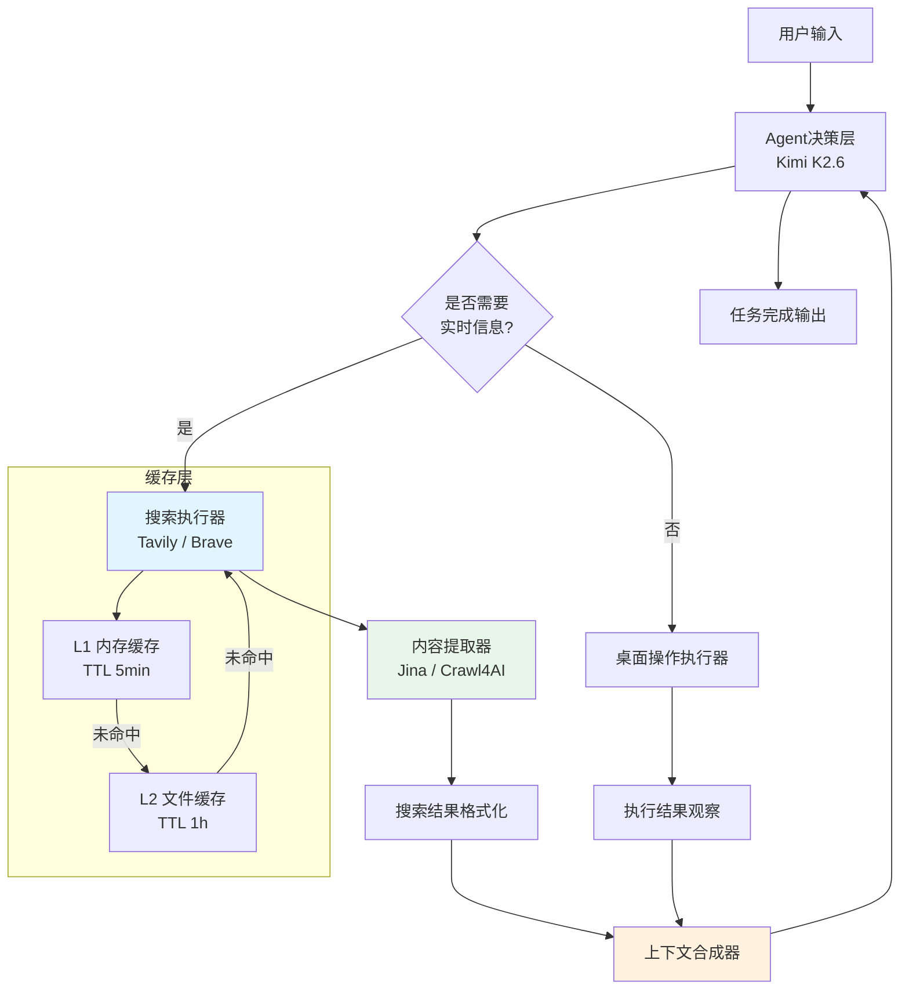

上述架构图揭示了搜索触发的核心决策点：每次LLM决策前，Agent评估当前任务上下文是否包含信息缺口——具体表现为需要时效性数据（汇率、天气、新闻）、遇到超出训练知识范围的专业问题、或上一轮桌面操作未能获得预期结果。当判定需要外部信息时，搜索请求优先查询多级缓存，缓存未命中再发起实际搜索调用 [^1^]。

#### 11.3.2 搜索结果融入上下文

搜索返回的结构化数据必须经过格式化和截断处理，才能在不超过LLM上下文窗口限制的前提下被有效利用。搜索结果通常按以下优先级融入对话上下文：首先呈现AI生成的摘要答案（Tavily的answer字段），其次依次列出各条结果的标题、URL和摘要内容。每条结果的原始内容截断至500字符以内，总搜索上下文控制在2,000 token以下，确保为桌面操作指令和对话历史保留充足的token空间。

#### 11.3.3 搜索缓存策略

搜索缓存是控制API调用成本的关键机制。采用两级缓存架构：L1内存缓存使用Python字典实现，TTL（Time To Live，生存时间）设为5分钟，适用于高频重复查询（如多次汇率换算使用同一汇率基准）；L2本地文件缓存以JSON格式持久化，TTL设为1小时，覆盖跨会话的常用查询（如"北京天气"、"美元人民币汇率"）。缓存键通过对查询文本进行小写化和MD5哈希生成，确保语义相同但表述差异的查询命中同一缓存条目。对于"今日汇率"、"天气预报"等常见查询类别，系统实施预缓存策略，在Agent启动时异步填充热门查询结果，进一步降低首次搜索的延迟。

### 11.4 外部工具生态

除搜索能力外，桌面Agent还需集成多种专用外部工具以应对特定领域的实时数据需求。这些工具通过统一的接口抽象被纳入Agent的工具调用体系。

天气查询通过OpenWeatherMap API实现，免费套餐提供每月1,000,000次调用额度（限60次/分钟），完全覆盖个人使用场景 [^7^]。汇率查询采用ExchangeRate-API的免费端点，无需API Key即可获取每日更新的150+货币对汇率数据，免费额度为1,500次/月 [^8^]。翻译需求优先通过Kimi API自身能力满足，避免引入额外的DeepL API Key配置；当需要文档级翻译时，可降级至DeepL免费版的500,000字符/月额度。文件格式转换基于Pandoc命令行工具实现，支持Markdown、Word、PDF、HTML等格式之间的互转，作为纯本地工具不产生任何网络成本。

这些工具的集成遵循MCP（Model Context Protocol，模型上下文协议）标准。MCP由Anthropic提出，将工具连接抽象为"AI应用的USB-C接口"，通过JSON-RPC over stdio实现LLM应用与外部工具之间的标准化通信 [^9^]。Agent作为MCP Host，通过MCP Client连接到提供搜索、汇率、天气等能力的MCP Server，工具的发现、调用和结果返回全部通过协议自动完成，消除了为每种工具编写专属集成代码的重复劳动。

### 11.5 工具注册与发现

Agent的能力边界由其可访问的工具集合定义。工具注册中心（Tool Registry）提供了动态注册、自动发现和统一输出格式的完整机制，使Agent能够根据任务需求灵活加载和调用外部能力。

#### 11.5.1 动态工具注册

工具注册中心采用基于Python装饰器（decorator）的注册模式，将函数声明与注册逻辑解耦。开发者只需在工具函数上添加`@agent_tool`装饰器，即可自动完成向注册中心的登记：

```python
from dataclasses import dataclass
from typing import Dict, Callable, Any, List
import inspect


@dataclass
class Tool:
    """工具定义，包含LLM所需的完整Schema信息"""
    name: str
    description: str
    parameters: Dict[str, Any]
    func: Callable
    category: str = "general"
    examples: List[str] = None

    def to_openai_schema(self) -> Dict:
        """转换为OpenAI Function Calling格式"""
        return {
            "type": "function",
            "function": {
                "name": self.name,
                "description": self.description,
                "parameters": self.parameters,
            }
        }


class ToolRegistry:
    """动态工具注册中心——Agent的能力目录"""

    def __init__(self):
        self._tools: Dict[str, Tool] = {}
        self._categories: Dict[str, List[str]] = {}

    def register(self, tool: Tool) -> None:
        """注册工具，按分类索引便于后续筛选"""
        self._tools[tool.name] = tool
        self._categories.setdefault(tool.category, [])
        if tool.name not in self._categories[tool.category]:
            self._categories[tool.category].append(tool.name)

    def get_schemas(self) -> List[Dict]:
        """获取所有工具的OpenAI Function Calling Schema"""
        return [tool.to_openai_schema() for tool in self._tools.values()]

    def get_tool(self, name: str) -> Tool | None:
        """根据工具名称获取工具实例"""
        return self._tools.get(name)

    def filter_by_task(self, task: str) -> List[Dict]:
        """根据任务描述关键词筛选相关工具，减少LLM上下文占用"""
        keywords = task.lower().split()
        relevant = []
        for tool in self._tools.values():
            text = f"{tool.name} {tool.description}"
            if any(kw in text for kw in keywords):
                relevant.append(tool.to_openai_schema())
        return relevant if relevant else self.get_schemas()


# ===== 全局注册中心实例 =====
_registry = ToolRegistry()


def agent_tool(description: str, category: str = "general",
               examples: List[str] | None = None):
    """装饰器：将函数自动注册为Agent工具"""
    def decorator(func: Callable) -> Callable:
        sig = inspect.signature(func)
        properties: Dict[str, Any] = {}
        required: List[str] = []

        for pname, param in sig.parameters.items():
            if pname in ("self", "cls"):
                continue
            ptype = "string"
            if param.annotation == int:
                ptype = "integer"
            elif param.annotation == float:
                ptype = "number"
            elif param.annotation == bool:
                ptype = "boolean"
            properties[pname] = {"type": ptype}
            if param.default == inspect.Parameter.empty:
                required.append(pname)
            else:
                properties[pname]["default"] = param.default

        _registry.register(Tool(
            name=func.__name__,
            description=description,
            parameters={"type": "object", "properties": properties,
                        "required": required},
            func=func,
            category=category,
            examples=examples or [],
        ))
        return func
    return decorator


# ===== 使用示例 =====
@agent_tool(
    description="搜索网络获取实时信息。当需要最新数据、当前事件、"
                "产品价格、汇率等时效性信息时调用。",
    category="search",
    examples=["搜索最新iPhone价格", "查天气预报"],
)
async def search_web(query: str, max_results: int = 5) -> Dict[str, Any]:
    """使用Tavily执行网络搜索"""
    return await tavily_client.search(query=query, max_results=max_results)


@agent_tool(
    description="获取两种货币之间的最新汇率。支持USD, CNY, EUR, JPY, GBP等。",
    category="finance",
    examples=["查美元兑人民币汇率"],
)
async def get_exchange_rate(from_currency: str, to_currency: str) -> Dict[str, Any]:
    """查询实时汇率"""
    url = f"https://open.er-api.com/v6/latest/{from_currency.upper()}"
    async with httpx.AsyncClient() as client:
        resp = await client.get(url, timeout=10)
    data = resp.json()
    return {
        "from": from_currency,
        "to": to_currency,
        "rate": data["rates"][to_currency.upper()],
    }
```

上述代码展示了工具注册中心的三个核心设计决策。其一，`ToolRegistry`维护了两个索引结构：以工具名称为键的字典`self._tools`支持O(1)时间的工具查找，以分类名称为键的分类索引`self._categories`支持按领域筛选工具集合。其二，`filter_by_task`方法通过关键词匹配实现了工具集合的动态缩减——当任务描述为"查一下汇率"时，仅返回`category="finance"`的工具Schema，将LLM的tools参数从完整的5-10个工具缩减至1-2个，显著降低LLM的决策噪声和token消耗。其三，`agent_tool`装饰器通过`inspect.signature`自动解析函数的参数签名和类型注解，将Python函数元数据转换为OpenAI Function Calling所需的JSON Schema，消除了手工维护工具描述与函数签名一致性的维护负担。

#### 11.5.2 统一输出格式

工具调用的返回值通过`ToolResultFormatter`统一格式化为LLM可读的文本结构。字典和列表类型自动序列化为JSON字符串，超长结果（超过2,000字符）自动截断并附加长度提示，每个工具的返回结果以`【工具名称结果】`的标题格式包裹，确保在多工具连续调用的场景中LLM能够清晰区分各工具的输出边界。

#### 11.5.3 成本分析

基于上述架构和工具选型，一个典型的个人桌面Agent月度运营成本可控制在¥1-2范围内。Kimi K2.6 API按100K tokens输入和50K tokens输出的使用量估算，月度成本约¥0.9 [^10^]。Tavily搜索的1,000次/月免费额度完全覆盖日常搜索需求。OpenWeatherMap和ExchangeRate-API的免费额度分别提供1,000,000次/月和1,500次/月的调用上限，个人使用场景下不会产生任何费用 [^7^][^8^]。Jina AI Reader的10M tokens/月免费额度足以支持数百次网页内容提取 [^6^]。当Agent使用频率显著增长、月度搜索量突破1,000次时，Tavily的付费方案（$30/月含5,000 credits）将月度搜索成本提升至约¥200/月，此时仍可通过引入Brave Search API（$5/1K requests）作为部分搜索的替代渠道进行成本优化。

---

## 12. GUI界面与交互设计

桌面Agent的GUI（Graphical User Interface，图形用户界面）与交互系统直接决定了用户体验的质感与日常使用的便捷度。一个优秀的桌面Agent应当像操作系统原生组件一样轻量、随时可达，同时具备多模态交互能力——文本、语音、截图、通知四位一体。本章围绕系统托盘、全局快捷键、对话面板、语音交互和桌面通知五大子系统展开设计，提供完整的技术选型依据与工程化实现方案。

### 12.1 系统托盘应用

系统托盘（System Tray）是桌面Agent的"常驻哨兵"。Agent以后台方式运行，托盘图标既是状态指示器，也是用户触达Agent的首要入口。

| 特性 | pystray | wxPython | PyQt6 (QSystemTrayIcon) |
|------|---------|----------|------------------------|
| 安装体积 | 小（纯Python） | 中等（~15MB） | 大（~60MB+） |
| 内存占用 | ~10MB | ~30MB | ~50MB |
| 跨平台 | 优秀 | 优秀 | 优秀 |
| 气泡通知 | 支持 | 支持 | 支持 |
| 图标动态更新 | 支持 | 支持 | 支持 |
| 与Web UI集成 | 容易 | 需桥接 | 需桥接 |
| 学习曲线 | 平缓 | 中等 | 较陡 |

推荐选择 **pystray**[^1^]。该库纯Python实现，内存占用仅约10MB，对后台Agent影响微乎其微；API设计简洁，与FastAPI等异步服务框架集成无障碍；维护活跃，社区文档完善。对于以Windows 10/11为主要目标平台的桌面Agent而言，pystray在功能覆盖和开发效率上达到最优平衡。

托盘图标需承载五种核心状态：**空闲**（蓝色圆点，机器人微笑脸）、**工作中**（绿色旋转动画，10fps）、**暂停**（黄色暂停符号）、**错误**（红色叉号）、**需确认**（橙色问号）。五种状态通过PIL动态绘制生成64x64像素RGBA图标，状态切换时实时更新图标与悬停提示文本[^1^]。工作中状态的旋转动画由独立线程驱动，三个白色圆点围绕中心做行星式运动，形成直观的"正在运转"视觉语义。

右键菜单采用分层结构：顶层为"显示对话面板"（默认双击项）、"开始任务"；中间层为状态子菜单（带勾选标记）、暂停/继续、设置；底层为退出。菜单回调通过依赖注入注册，保持托盘类与业务逻辑解耦。气泡通知按类型设定驻留时长——普通信息3秒、警告5秒、错误8秒、需确认则不自动消失[^1^]。

### 12.2 全局快捷键

全局快捷键（Global Hotkey）是桌面Agent"即时可达"设计原则的核心支撑。用户无论当前焦点在何种应用中，都能通过快捷键瞬间唤出对话面板。

| 特性 | pynput | keyboard | ctypes (RegisterHotKey) |
|------|--------|----------|------------------------|
| 安装依赖 | 纯Python | 需root/admin | 无需安装 |
| 跨平台 | 优秀 | Linux需root | Windows only |
| 管理员权限 | 不需要 | 需要 | 不需要 |
| 热键冲突 | 可能 | 可能 | 系统级注册，冲突少 |
| 释放事件 | 支持 | 支持 | 不支持 |
| 复杂度 | 低 | 低 | 高 |

推荐选择 **pynput**[^2^]。该库通过`pynput.keyboard.GlobalHotKeys`实现全局热键监听，无需管理员权限即可注册Ctrl+Shift+A等组合键，跨平台兼容Windows、macOS和Linux。作为备选，当需要系统级热键注册以避免与其他应用冲突时，可使用Windows原生`RegisterHotKey` API，该方案通过Windows消息循环接收热键事件，冲突率显著降低[^2^]。

默认快捷键配置：Ctrl+`（唤出/隐藏面板）、Ctrl+Shift+V（语音输入）、Ctrl+Shift+S（截图）、Ctrl+Shift+P（暂停/继续）、Ctrl+Shift+Esc（紧急停止）。其中Ctrl+`的选择考虑了与VS Code终端快捷键的差异化，降低冲突概率。快捷键管理器内置冲突检测机制，配置持久化存储于`~/.ai_agent/hotkey_config.json`，支持UI界面实时修改与热重载[^2^]。

### 12.3 对话界面

对话界面是用户与Agent交互的主战场，需同时满足美观度、开发效率、资源占用和可扩展性四重约束。

| 维度 | FastAPI+React+pywebview | pywebview+HTML | Gradio | PyQt6 |
|------|------------------------|---------------|--------|-------|
| 开发速度 | 中等 | 快 | 极快 | 慢 |
| UI美观度 | 极高 | 高 | 中等 | 高 |
| 资源占用 | 中（系统WebView） | 低-中 | 中 | 高 |
| 打包体积 | 中 | 小 | 中 | 大 |
| 启动速度 | 中等 | 快 | 快 | 中等 |
| 自定义程度 | 极高 | 高 | 低 | 高 |
| 维护成本 | 高（前后端分离） | 低 | 极低 | 中等 |

推荐方案为 **pywebview + FastAPI + React**[^3^]。pywebview使用系统自带的Edge WebView2渲染前端，无需内嵌Chrome，内存占用约30MB，远低于Electron方案；FastAPI提供高性能异步Web服务和原生WebSocket支持；React赋予前端极高的UI自定义能力与丰富组件生态。

后端采用FastAPI的WebSocket端点（`/ws`）实现实时全双工通信，`ConnectionManager`维护活跃连接集合，支持消息广播、断线清理和历史记录回放（保留最近100条，新连接推送最近20条）[^3^]。消息协议采用JSON格式，核心类型包括：`chat`（用户消息）、`chat_stream_start/chunk/end`（流式回复）、`voice`（语音控制）、`screenshot`（截图数据）、`command`（控制指令）。

前端React组件采用浮动面板风格，消息气泡区分用户（右侧深蓝底）与助手（左侧灰蓝底），支持附件预览、流式文本渲染和输入状态指示。输入区域集成语音按钮（录音时红色脉冲）、截图按钮和文本输入框[^3^]。

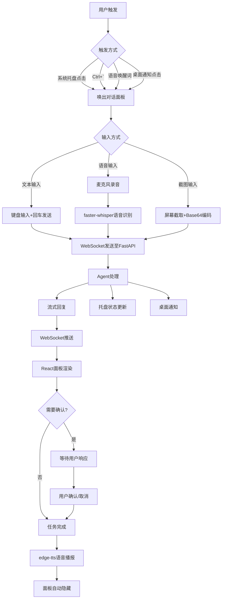

上述流程图展示了从用户触发到任务完成的完整链路。三种唤出方式汇聚至同一面板；三种输入方式经WebSocket统一发送至后端；Agent处理过程中同时驱动流式回复、托盘状态变化和桌面通知三条并行反馈路径；最终通过TTS语音播报结果，面板自动隐藏等待下次唤醒[^1^][^3^]。

### 12.4 语音交互

语音交互是桌面Agent区别于传统ChatBot的核心差异化能力，技术链路由三个依次衔接的模块构成：唤醒词检测（Wake Word Detection）、语音识别（ASR, Automatic Speech Recognition）和语音合成（TTS, Text-to-Speech）。

| 模块 | 推荐方案 | 安装体积 | 延迟 | 离线 | 中文支持 |
|------|---------|---------|------|------|----------|
| 唤醒词 | Porcupine (pvporcupine) | ~5MB | 极低（<200ms） | 是 | 支持自定义 |
| 语音识别 | faster-whisper (small) | ~500MB | 中（RTF<0.5） | 是 | 优秀 |
| 语音合成 | edge-tts | 极小 | 低 | 否 | 优秀 |

**唤醒词检测**选用Porcupine（`pvporcupine`），专为唤醒词场景优化的轻量级引擎，本地推理延迟低于200毫秒，支持自定义唤醒词训练（如"Hey Agent"）[^4^]。音频采集通过`sounddevice`库以16kHz单声道格式流式输入。

**语音识别**选用`faster-whisper`，OpenAI Whisper的CTranslate2加速版本。small模型约500MB，在NVIDIA GPU上配合float16精度可实现实时因子（RTF, Real-Time Factor）低于0.5[^4^]。识别采用VAD（Voice Activity Detection，语音活动检测）预处理，实时模式通过音量阈值判断说话起止，静音持续2秒后自动触发转录。

**语音合成**选用`edge-tts`，调用微软Edge浏览器在线TTS服务，无需API Key，支持中文"XiaoxiaoNeural"等高质量神经语音。离线回退方案可选用MeloTTS[^4^]。

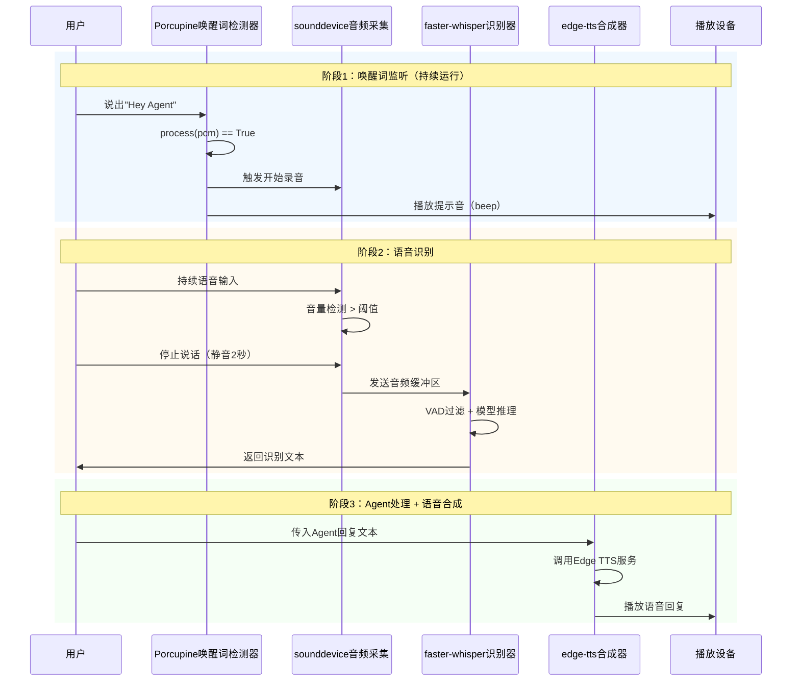

`VoiceInteractionManager`类维护四个状态：`idle`（监听唤醒词）、`listening`（录音中）、`processing`（识别/推理中）、`speaking`（播报中），状态变更通过回调同步至UI层。系统同时支持手动控制接口，用户可通过面板麦克风按钮直接开始/停止录音，绕过唤醒词环节[^4^]。

### 12.5 桌面通知

桌面通知是Agent主动触达用户的核心通道，用于报告任务进度、请求人工确认和提示异常状态。

| 特性 | win10toast | plyer | win11toast |
|------|-----------|-------|-----------|
| Windows 10 | 支持 | 支持 | 支持 |
| Windows 11 | 支持 | 支持 | 支持（更美观） |
| 通知按钮 | 不支持 | 不支持 | 支持 |
| 进度通知 | 不支持 | 不支持 | 支持 |
| 回调处理 | 有限 | 有限 | 支持 |

推荐 **win11toast** 作为Windows 11主选方案[^5^]。该库完整支持Windows 11通知系统的交互式按钮、进度条和点击回调，API保持简洁。Windows 10环境自动回退至`win10toast`，最终回退到`plyer`，三级降级策略确保各版本Windows下通知功能正常工作。

通知系统采用分级设计，定义六种级别：**INFO**（5秒自动消失）、**SUCCESS**（5秒）、**WARNING**（8秒，带提示音）、**ERROR**（不自动消失，带提示音）、**CONFIRM**（需确认，不自动消失）、**PROGRESS**（由调用方控制生命周期）[^5^]。`NotificationHelper`类封装常用场景的快捷方法：`task_started`、`task_completed`（附"打开面板"按钮）、`task_failed`（附"重试"按钮）、`need_confirm`（附"确认/取消"按钮）、`task_progress`（支持百分比进度条）。通知点击行为通过回调注册，用户点击可自动唤出对话面板并定位到对应任务上下文[^5^]。

通知历史保留最近50条记录，支持按级别筛选，在对话面板的"通知中心"中可回溯Agent的历史提醒。这一设计借鉴了手机系统通知中心的交互模式，帮助用户追踪Agent的自主行为和决策轨迹。

综合来看，桌面Agent的GUI与交互系统由五个紧密协作的子系统构成：pystray提供轻量常驻入口（~10MB），pynput实现全局即时可达，pywebview+FastAPI+React构建现代化对话界面，faster-whisper+edge-tts+Porcupine打通语音交互全链路，win11toast完成主动通知闭环。五者的总基础内存占用约110MB（不含Whisper模型），启动时间控制在3秒以内，构成了资源高效、体验流畅的桌面Agent交互基础设施[^1^][^2^][^3^][^4^][^5^]。

---

## 13. 内部架构细化与插件系统

Desktop Agent 的长期运行特性决定了其内部架构必须同时满足高内聚与低耦合的双重要求。本章将系统性地展开六大核心子系统的设计细节：数据流通过自定义 EventBus 实现组件间松耦合通信；状态机以 11 个显式状态驱动 Agent 全生命周期；并发模型采用 asyncio 主循环加三线程池的混合架构；错误处理引入四层分层与断路器模式保障系统韧性；插件系统提供动态扩展能力；数据存储层则以 SQLite + ChromaDB + 文件系统的三元组合支撑持久化需求。每个子系统的设计均附带可运行的 Python 3.11+ 伪代码与 Mermaid 架构图，确保工程落地的可操作性。

### 13.1 数据流设计

#### 13.1.1 自定义 EventBus 架构

在 Agent 系统中，MetaAgent、DesktopAgent、BrowserAgent、插件系统以及存储层之间每秒可能产生数十到数百个事件。若采用直接调用（synchronous direct call），组件间将形成稠密的依赖网络，任何单点故障都可能级联扩散。为此，系统采用自定义 EventBus（事件总线）作为核心通信基础设施，其架构融合了优先级队列（Priority Queue，基于 `heapq` 的最小堆实现）、发布-订阅（Pub/Sub）模式与中间件链（Middleware Chain）三种机制[^1^]。

```mermaid
graph TB
    subgraph Publisher["发布端"]
        P1[MetaAgent]
        P2[DesktopAgent]
        P3[BrowserAgent]
        P4[PluginSystem]
    end

    subgraph EventBusCore["EventBus 核心"]
        PQ["优先级队列<br/>(heapq)"]
        SR["订阅者注册表<br/>defaultdict"]
        RT["路由分发器"]
        MW["中间件链<br/>logging | metrics | persist"]
    end

    subgraph Subscriber["订阅端"]
        S1[状态机更新]
        S2[审计日志写入]
        S3[UI通知]
        S4[插件钩子触发]
    end

    P1 -->|publish(Event)| PQ
    P2 -->|publish(Event)| PQ
    P3 -->|publish(Event)| PQ
    P4 -->|publish(Event)| PQ
    PQ --> RT
    RT -->|按event_type路由| SR
    MW -->|前置处理| PQ
    SR -->|并行通知| S1
    SR -->|并行通知| S2
    SR -->|并行通知| S3
    SR -->|并行通知| S4
```

EventBus 的核心数据结构为 `asyncio.PriorityQueue`，队列项采用三元组 `(priority, seq, event)` 的形式入队。`seq` 为单调递增序列号，确保同优先级事件按 FIFO 顺序处理，避免堆排序破坏时间线。队列容量上限设置为 10,000，当队列满载时，CRITICAL 和 HIGH 级别的事件通过 `_overflow_persist` 写入溢出日志文件，保证系统级事件零丢失[^1^]。

中间件链采用洋葱模型（Onion Model）设计，每个中间件可对事件进行读取、修改或拦截。系统预置三类中间件：日志中间件记录所有事件的 `event_type` 与 `source`；指标中间件统计每秒事件吞吐量（Events Per Second, EPS）；持久化中间件将事件异步写入 SQLite 审计日志表。中间件执行异常被捕获并隔离，不会阻断后续中间件或事件分发[^1^]。

订阅者注册表使用 `defaultdict(list)` 实现，以 `EventType` 为键，值为 `(priority, handler)` 元组列表。分发时，`EventBus._notify_subscribers` 为每个 handler 创建独立 `asyncio.Task`，通过 `asyncio.gather(..., return_exceptions=True)` 实现异常隔离——单个 handler 的失败不会影响同事件的其他订阅者。每个 handler 调用还附加 30 秒超时保护，防止慢消费端阻塞整个分发循环[^1^]。

#### 13.1.2 事件类型体系

系统将事件划分为七大域（Domain），共 28 种具体事件类型。下表列出核心事件类型及其优先级与典型载荷：

| 事件域 | 事件类型 | 优先级 | 典型载荷 |
|--------|----------|--------|----------|
| 生命周期 | `SESSION_STARTED` / `SESSION_ENDED` | CRITICAL | `session_id`, `timestamp` |
| 任务 | `TASK_RECEIVED` / `TASK_PLANNED` / `TASK_STEP_STARTED` / `TASK_COMPLETED` / `TASK_FAILED` | HIGH ~ NORMAL | `task_id`, `subtasks[]`, `step_number` |
| 动作 | `ACTION_STARTED` / `ACTION_EXECUTED` / `ACTION_FAILED` / `ACTION_RETRIED` | NORMAL | `action_id`, `action_type`, `target` |
| Agent 状态 | `AGENT_STATE_CHANGED` | HIGH | `old_state`, `new_state`, `reason` |
| 感知 | `SCREEN_CAPTURED` / `UI_PARSED` / `OCR_COMPLETED` | NORMAL | `screenshot_path`, `ui_elements[]`, `ocr_text` |
| LLM | `LLM_REQUEST_STARTED` / `LLM_REQUEST_COMPLETED` / `LLM_REQUEST_FAILED` | NORMAL | `model`, `prompt_tokens`, `latency_ms` |
| 插件 | `PLUGIN_LOADED` / `PLUGIN_UNLOADED` / `PLUGIN_ERROR` | NORMAL ~ HIGH | `plugin_name`, `version`, `error` |
| 系统 | `ERROR_OCCURRED` / `HEARTBEAT` / `CONFIG_CHANGED` | HIGH / LOW / NORMAL | `error_type`, `severity`, `config_key` |
| 人机协作 | `HUMAN_INPUT_REQUESTED` / `HUMAN_INPUT_RECEIVED` | HIGH | `question`, `timeout` |

事件优先级分为五级：CRITICAL(0) 用于系统崩溃与安全事件；HIGH(1) 用于用户输入与中断；NORMAL(2) 用于任务状态变更；LOW(3) 用于指标与心跳；BACKGROUND(4) 用于技能学习与数据清理。这种分级确保在用户点击"停止"按钮时，`CANCELLED` 事件能够以最高优先级被处理，而非滞排在日志事件之后[^1^]。

每个 `Event` 数据模型携带 `correlation_id` 与 `parent_id` 两个追踪字段，支持分布式链路追踪（Distributed Tracing）。当 MetaAgent 分解任务时，所有子任务事件继承同一 `correlation_id`，使得事后审计可以完整还原"用户输入 → 任务分解 → 子任务执行 → 动作序列 → 结果返回"的全链路时序[^1^]。

#### 13.1.3 数据流时序

以下 Mermaid 时序图展示了典型任务"打开 Chrome 并搜索 XXX"的完整数据流：

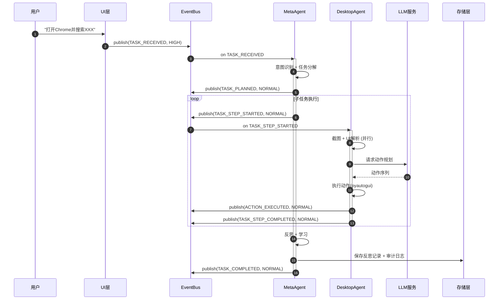

该时序展示了 EventBus 的解耦价值：MetaAgent 无需持有 DesktopAgent 的直接引用，只需发布 `TASK_STEP_STARTED` 事件；DesktopAgent 订阅该事件类型后自主完成感知-推理-执行循环。反射引擎（ReflectionEngine）则在任务完成后通过 `TASK_COMPLETED` 事件触发，将反思记录写入存储层，整个流程形成"感知 → 决策 → 执行 → 学习"的闭环[^1^]。

### 13.2 状态机设计

#### 13.2.1 11 状态模型

Agent 的生命周期由显式有限状态机（Finite State Machine, FSM）管理，共定义 11 个状态：`IDLE`（空闲）、`PLANNING`（规划中）、`EXECUTING`（执行中）、`RETRYING`（重试中）、`WAITING_HUMAN`（等待人工输入）、`PAUSED`（已暂停）、`REFLECTING`（反思中）、`LEARNING`（学习中）、`COMPLETED`（已完成）、`FAILED`（已失败）、`CANCELLED`（已取消）。相较于自由流转的无状态模型，FSM 将合法转换限制在预定义集合内，从根本上杜绝了"执行中直接跳到已完成"等非法状态跃迁[^2^]。

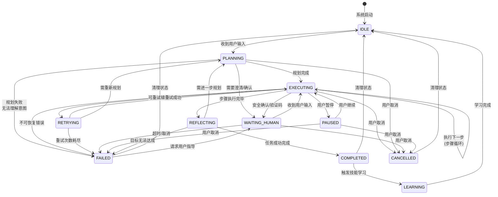

`EXECUTING --> EXECUTING` 是自循环转换，表示单步动作完成后的下一步推进。`REFLECTING --> PLANNING` 则是反射引擎评估后判定"当前结果不足以完成任务，需要重新规划"的回退路径。`CANCELLED` 状态接受来自 `EXECUTING`、`PLANNING`、`WAITING_HUMAN` 和 `PAUSED` 四个状态的转入，确保用户随时可取消进行中的任务[^2^]。

#### 13.2.2 转换条件与超时配置

状态转换通过 `VALID_TRANSITIONS` 字典显式声明，任何不在白名单中的转换请求均被拒绝并记录错误日志。每个合法转换还可附加守卫条件（Guard Condition）与转换动作（Transition Action）：守卫条件用于检查前置约束（如当前步骤数是否小于上限），转换动作则执行状态变更后的副作用（如进入 `PLANNING` 时自动触发 LLM 调用）[^2^]。

超时机制防止 Agent 无限期滞留于某一状态。各状态超时配置如下表所示：

| 状态 | 超时时间 | 超时后行为 | 设计理由 |
|------|----------|-----------|----------|
| `IDLE` | 无限制 | — | 等待用户输入，不可超时 |
| `PLANNING` | 60 秒 | → `FAILED` | LLM 推理通常在 10-30 秒内完成 |
| `EXECUTING` | 无限制 | — | 由单步超时控制，避免全局超时误杀长任务 |
| `RETRYING` | 30 秒 | → `FAILED` | 重试等待窗口，包含退避延迟 |
| `WAITING_HUMAN` | 300 秒 | → `FAILED` | 用户 5 分钟未响应视为放弃 |
| `PAUSED` | 无限制 | — | 用户主动暂停，尊重用户控制权 |
| `REFLECTING` | 30 秒 | → `FAILED` | 反思 LLM 调用超时保护 |
| `LEARNING` | 120 秒 | → `IDLE` | 技能提取与向量嵌入写入的时限 |

超时处理通过 `asyncio.create_task` 创建睡眠任务实现。状态转换发生时，旧超时任务被取消，新状态的超时任务被创建。这种设计避免了多状态并发超时的竞态条件[^2^]。

#### 13.2.3 崩溃恢复机制

状态持久化通过 `StatePersistence` 类实现。每次状态转换时，`persist_callback` 将 `(session_id, current_state, context_json)` 写入 SQLite 的 `session_state` 表。`context_json` 以 JSON 序列化保存当前任务的完整上下文（包括子任务列表、当前步骤、错误信息等），确保恢复后可精确续接[^2^]。

系统启动时，`StatePersistence.recover(session_id)` 查询 `session_state` 表。若存在记录，则根据 `current_state` 的值决定恢复策略：若状态为 `EXECUTING` 或 `RETRYING`，自动转换到 `PLANNING` 重新规划（因为执行状态无法安全续接）；若状态为 `WAITING_HUMAN` 或 `PAUSED`，保持原状态等待用户交互；若状态为 `REFLECTING`，重新触发反射流程。这种"安全恢复"策略避免了从任意执行点续接可能引发的不确定性行为[^2^]。

为进一步提升恢复粒度，系统还支持检查点（Checkpoint）机制。`StatePersistence.checkpoint` 在每次动作执行前后将状态快照写入 `state_checkpoints` 表，形成可回溯的状态历史链。当 DesktopAgent 在执行第 N 步动作后崩溃，恢复时可从最近的检查点而非任务起点重新开始[^2^]。

### 13.3 并发模型

#### 13.3.1 asyncio 主事件循环与三线程池

Agent 系统的并发架构遵循"asyncio 为主、线程池为辅"的原则。`asyncio` 事件循环运行于主线程，承载 EventBus 分发循环、MetaAgent 状态机驱动、PluginManager 生命周期管理等核心协程。对于阻塞性操作（CPU 密集型推理、同步 IO 调用），系统通过三个独立的 `ThreadPoolExecutor` 将其卸载到工作线程[^3^]。

| 线程池 | max_workers | 职责范围 | 线程名前缀 |
|--------|-------------|----------|-----------|
| 视觉推理池 | 2 | 截图捕获(mss)、OCR识别(easyocr/paddleocr)、UI元素检测 | `vision_` |
| LLM 推理池 | 4 | 本地 Embedding 模型推理、小模型推理 | `inference_` |
| IO 操作池 | 8 | 文件读写、编码转换、网络请求同步封装 | `io_` |

视觉推理池仅配置 2 个工作线程，原因是截图与 OCR 操作受限于单屏幕物理约束，过多线程不会提升吞吐量反而增加上下文切换开销。LLM 推理池配置 4 线程用于本地 Embedding 模型的并行计算，API 调用（Kimi）则使用 `httpx.AsyncClient` 的纯异步接口，不经过线程池。IO 操作池配置 8 线程以应对高并发的文件读写需求，如同时保存多张截图、写入审计日志与读取技能文件[^3^]。

`ConcurrencyManager` 提供统一的线程池访问接口：`run_in_vision_thread`、`run_in_inference_thread` 与 `run_in_io_thread`。所有接口内部通过 `asyncio.get_event_loop().run_in_executor()` 将同步函数包装为可等待对象，调用方以 `await` 语法获取结果，无需关心底层线程切换细节[^3^]。

#### 13.3.2 并行感知流水线

DesktopAgent 的感知模块采用并行流水线架构，将截图捕获、OCR 文字识别与 UI 元素检测三个操作并发执行。传统串行模式下，假设截图耗时 200ms、OCR 300ms、UI 解析 150ms，总耗时约 650ms；并行模式下总耗时降至 max(200, 300, 150) = 300ms，感知延迟降低约 54%[^3^]。

`ParallelPerception.capture_and_parse()` 内部通过 `asyncio.gather(..., return_exceptions=True)` 同时调度三个任务，任一任务失败时返回 `None` 而非整体失败。这种部分容忍（Partial Tolerance）设计确保即使 OCR 服务异常，截图与 UI 元素仍可被 LLM 推理使用，只是损失了文字信息[^3^]。

对于多 Agent 协作场景，`MultiAgentOrchestrator` 按依赖关系将子任务分组。无依赖的子任务（如"在 Excel 中整理数据"与"从网页下载补充信息"）被分配到同一执行组，通过 `asyncio.gather` 并行执行。有依赖的子任务则按组串行执行，形成 DAG（有向无环图）调度模式[^3^]。

### 13.4 错误处理与重试

#### 13.4.1 四层错误分层

Agent 系统采用四级错误分层架构，每级对应不同的恢复策略与影响范围[^4^]：

| 层级 | 错误类 | 典型场景 | 恢复策略 | 影响范围 |
|------|--------|----------|----------|----------|
| 工具级 | `ToolLevelError` | HTTP 超时、文件权限不足、进程异常 | 底层重试 + 超时控制 | 单个工具调用 |
| 动作级 | `ActionLevelError` | 点击失败、元素未找到、输入无效 | 单步重试 + 策略替换 | 单个动作步骤 |
| 任务级 | `TaskLevelError` | 任务无法分解、目标不明确、依赖缺失 | 任务降级 + 重新规划 | 当前任务 |
| 会话级 | `SessionLevelError` | API 密钥失效、系统崩溃、认证失败 | 会话终止 + 状态保存 + 通知用户 | 整个会话 |

层级之间形成错误传播链：工具级错误向上冒泡为动作级错误（如 HTTP 超时导致点击操作失败），动作级错误可能升级为任务级错误（连续多个动作失败后判定任务无法完成），任务级错误最终可能触发会话级错误（LLM API 密钥全面失效）。`ErrorReporter` 在每一层拦截错误，生成包含完整上下文（当前截图、状态、历史操作）的 `ErrorReport`，同时写入 SQLite `error_logs` 表并发布 `ERROR_OCCURRED` 事件[^4^]。

#### 13.4.2 断路器模式

针对 LLM API 等外部依赖，`CircuitBreaker` 实现标准的三态断路器模式：`CLOSED`（正常通路）→ `OPEN`（快速失败）→ `HALF_OPEN`（试探恢复）。关键参数为 `failure_threshold=5`（连续失败 5 次后触发断路）与 `recovery_timeout=60` 秒（断路后等待 60 秒进入半开状态）。在半开状态下，最多允许 3 次试探请求，全部成功后断路器关闭，任一失败则重新打开[^4^]。

断路器状态转换通过 `@property` 实现惰性检查：`state` 属性被访问时自动判断冷却时间是否已过，无需独立定时器线程。这种设计减少了并发状态管理的复杂度，但要求调用方在每次请求前检查 `circuit_breaker.state`[^4^]。

#### 13.4.3 指数退避重试

`@async_retry_with_backoff` 装饰器为异步函数提供指数退避重试能力。延迟计算公式为 `delay = min(base_delay * (exponential_base ^ attempt), max_delay)`，默认参数为 `base_delay=1.0` 秒、`exponential_base=2.0`、`max_delay=60` 秒、`max_retries=3`。抖动（Jitter）选项通过 `delay * (0.5 + random() * 0.5)` 在 [0.5delay, delay] 范围内随机化，防止多个并发请求同时重试引发的"惊群效应"（Thundering Herd）[^4^]。

该装饰器支持通过 `retryable_exceptions` 参数指定可重试异常类型。对于 Kimi API 客户端，配置为 `(httpx.HTTPStatusError, httpx.TimeoutException)`，仅在网络层错误时触发重试，4xx 客户端错误（如 401 Unauthorized）则直接失败，避免无效重试浪费 token[^4^]。

#### 13.4.4 优雅降级

`DegradationStrategy` 类提供三种降级路径。模型降级路径在主力 LLM（如 Kimi-latest）不可用时切换至备用模型或简化 prompt；规则降级路径在 LLM 完全不可用时切换至预定义规则引擎（如正则匹配 + 模板动作）；部分完成路径则在全量任务失败后返回已完成的子任务结果，而非完全空白。三种策略可组合使用——当 LLM 断路器打开时，先尝试模型降级，再尝试规则降级，最后返回部分结果[^4^]。

### 13.5 插件系统

#### 13.5.1 Plugin ABC 基类与生命周期

插件系统的核心抽象为 `Plugin` ABC（Abstract Base Class，抽象基类），定义了完整的六阶段生命周期：`__init__`（实例化，仅保存 manifest 与 context）→ `initialize`（异步初始化，注册 EventBus 钩子）→ `run`（启动后台任务）→ `stop`（停止后台任务）→ `destroy`（清理资源、取消注册）→ `handle`（处理调用请求，抽象方法，子类必须实现）。`SkillPlugin` 作为 `Plugin` 的子类，额外定义 `trigger_pattern` 与 `actions` 属性，封装可复用的操作序列[^5^]。

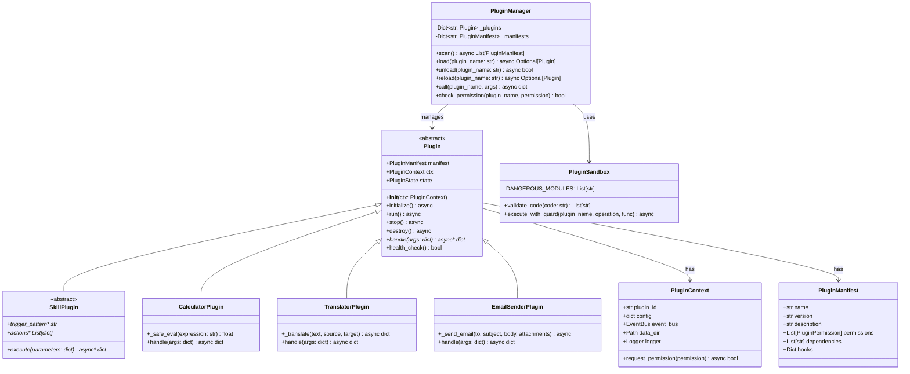

`PluginManifest` 数据类描述插件元信息，包括名称、版本、权限声明（`permissions` 字段，如 `FILE_READ`、`NETWORK_ACCESS`）、依赖列表（`dependencies`）以及 EventBus 钩子注册表（`hooks` 字段，映射事件类型到 handler 方法名）。权限采用显式声明 + 运行时检查的双重机制：插件必须在 manifest 中声明所需权限，`PluginSandbox` 在执行敏感操作前再次校验[^5^]。

#### 13.5.2 PluginManager 全生命周期管理

`PluginManager` 负责插件的扫描、加载、卸载与热重载。`scan()` 方法遍历 `plugin_dirs` 目录，通过解析 `manifest.json` 发现可用插件。`load()` 方法使用 `importlib.util.spec_from_file_location` 动态加载插件模块，避免将插件目录加入 `sys.path` 导致命名空间污染。加载流程遵循依赖自动解析：若插件 A 声明依赖插件 B，`load(A)` 会自动先调用 `load(B)`，确保依赖就绪[^5^]。

热重载（Hot Reload）通过 `reload()` 方法实现，其流程为 `unload` → 重新读取 manifest → `load`。为避免频繁重载导致的资源抖动，生产环境建议附加 5 秒冷却间隔。`PluginManager` 还可通过文件系统监视器（如 `watchdog`）监听插件目录变更，自动触发 `reload()`[^5^]。

#### 13.5.3 安全沙箱

`PluginSandbox` 采用渐进式安全模型（Progressive Security Model），当前实现为 Level 1（权限声明 + 运行时检查），后续可扩展至 AST 静态分析（Level 2）、子进程隔离 + IPC 通信（Level 3）以及容器化隔离（Level 4）。`validate_code()` 方法通过 `ast.parse` 与 `ast.walk` 扫描插件源码，检测 `os.system`、`subprocess`、`eval`、`exec` 等危险调用，返回发现的问题列表[^5^]。

`execute_with_guard()` 在执行敏感操作前检查插件权限映射。操作名到权限的映射关系为：`file_read` → `FILE_READ`、`file_write` → `FILE_WRITE`、`network` → `NETWORK_ACCESS`、`shell` → `SHELL_EXEC`、`system` → `SYSTEM_CONTROL`。权限不足时抛出 `PermissionError`，阻断操作执行并记录审计日志[^5^]。

#### 13.5.4 示例插件

**计算器插件（CalculatorPlugin）** 无外部依赖，权限为空。`handle()` 接收 `{"expression": "sqrt(256) + pi"}` 参数，通过 `_safe_eval` 在受限命名空间中执行数学运算。`allowed_names` 白名单仅包含 `math` 模块的数学函数与常量，`__builtins__` 被设为空字典，彻底杜绝代码注入风险[^5^]。

**翻译器插件（TranslatorPlugin）** 声明 `NETWORK_ACCESS` 权限，通过外部翻译 API 实现多语言互译。`initialize()` 从插件配置中读取 `api_key` 与默认目标语言，体现了插件配置与主系统隔离的设计——每个插件拥有独立的 `data_dir` 与 `config.json`[^5^]。

### 13.6 数据存储层

#### 13.6.1 SQLite 关系模型

SQLite 作为本地嵌入式数据库，以 WAL（Write-Ahead Logging）模式运行，支持读写并发。数据库包含 11 张表，覆盖配置、会话、任务、动作、审计、反思、错误、插件配置与性能指标九大域。以下 ER 图展示核心实体关系：

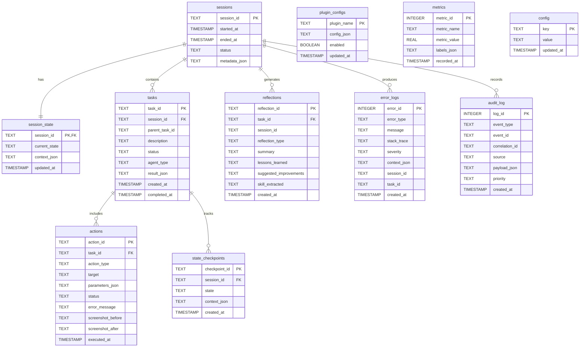

`sessions` 表为所有其他表的外键锚点，`session_state` 与 `sessions` 为一对一关系，用于崩溃恢复。`tasks` 支持自引用（`parent_task_id`），允许嵌套子任务。`audit_log` 表设置三个索引：`idx_audit_correlation` 加速链路追踪查询、`idx_audit_event_type` 加速事件类型过滤、`idx_audit_created` 加速时间范围查询。`actions` 表存储动作执行前后的截图路径，支持事后回放与错误诊断[^6^]。

#### 13.6.2 ChromaDB 向量存储

ChromaDB 以本地持久化模式运行，`StorageManager` 初始化时创建三个 Collection：`skills`（技能向量，用于相似技能匹配）、`memories`（长期记忆，存储用户偏好与常见操作）、`reflections`（反思记录向量，用于经验检索）。`VectorStore.search_skills()` 接收查询 Embedding 与 `top_k` 参数，返回距离小于阈值（默认 0.7）的匹配结果。距离阈值的可调性使系统能够在"精确匹配"与"宽泛召回"之间灵活切换[^6^]。

向量存储与关系存储形成互补：SQLite 保存结构化元数据（时间、状态、配置），ChromaDB 保存语义向量（技能 Embedding、记忆 Embedding）。当 MetaAgent 的反射引擎提取新技能时，技能文本被同时写入 SQLite `reflections` 表（结构化审计）与 ChromaDB `skills` collection（语义检索），两种写入通过 `StorageManager.save_reflection()` 在同一方法内协调完成[^6^]。

#### 13.6.3 文件系统存储

`FileSystemStore` 管理三类二进制/大对象数据：截图存档按 `screenshots/<task_id>/step_<NNNN>_<timestamp>.png` 的层级结构组织；技能文件以 Markdown 格式保存于 `skills/` 目录，便于人工审阅与版本控制；用户画像以 JSON 格式保存于 `profiles/` 目录。所有文件操作通过 `asyncio.to_thread()` 卸载到 IO 线程池，避免阻塞主事件循环[^6^]。

`StorageManager` 作为统一入口，向上层提供 `save_event`、`save_reflection`、`backup` 等高层接口，向下协调 `sqlite`、`vector`、`fs` 三个后端。全量备份通过 `shutil.copy2`/`copytree` 实现，同时复制 SQLite 数据库文件、ChromaDB 持久化目录与文件系统根目录，并附加 Unix 时间戳命名，确保备份版本的可追溯性[^6^]。